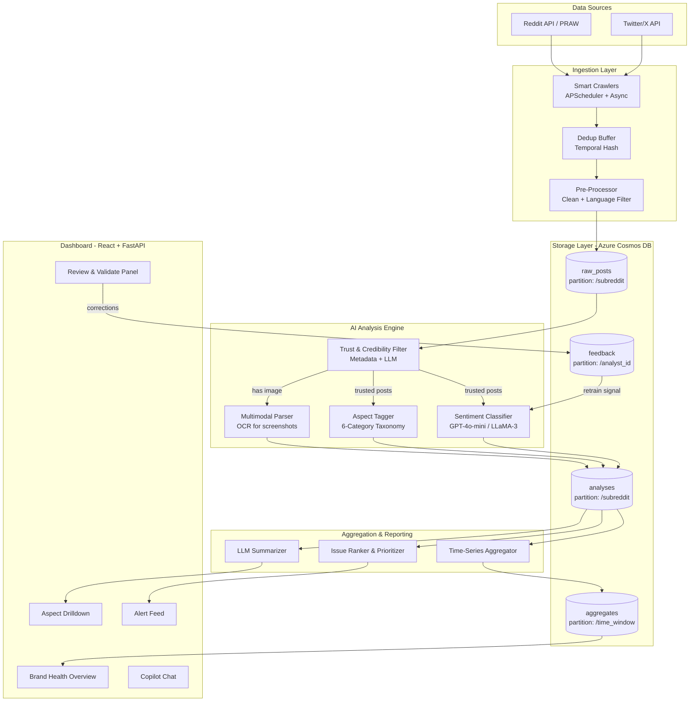
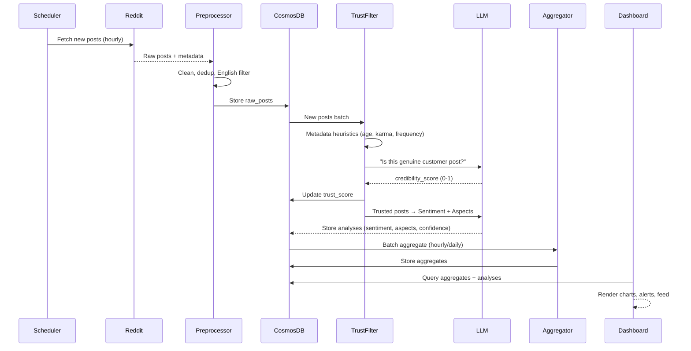

# Retail Sentiment Intelligence — System Architecture

## High-Level Architecture



## Pipeline Flow (Step-by-Step)



## Cosmos DB Data Model

### Container: `raw_posts`
```json
{
    "id": "reddit_abc123",
    "source": "reddit",
    "subreddit": "walmart",
    "author": "user_xyz",
    "title": "OGP order was completely wrong",
    "body": "Ordered 20 items, got 5 substitutions...",
    "score": 45,
    "num_comments": 23,
    "created_utc": "2026-06-01T14:30:00Z",
    "ingested_at": "2026-06-01T15:00:00Z",
    "author_metadata": {
        "account_age_days": 1200,
        "total_karma": 5600,
        "post_frequency_7d": 3
    },
    "processing_status": "analyzed",
    "partition_key": "walmart"
}
```

### Container: `analyses`
```json
{
    "id": "analysis_abc123",
    "post_id": "reddit_abc123",
    "subreddit": "walmart",
    "trust_score": 0.87,
    "trust_flags": ["genuine_account", "specific_details"],
    "sentiment": "negative",
    "sentiment_confidence": 0.92,
    "aspects": [
        {"aspect": "product_quality", "sentiment": "negative", "confidence": 0.88},
        {"aspect": "delivery", "sentiment": "negative", "confidence": 0.75}
    ],
    "key_phrases": ["wrong items", "substitutions", "no notification"],
    "summary": "Customer received 5 incorrect substitutions in OGP order without notification",
    "model_used": "gpt-4o-mini",
    "analyzed_at": "2026-06-01T15:05:00Z",
    "partition_key": "walmart"
}
```

### Container: `aggregates`
```json
{
    "id": "agg_2026-06-01_daily",
    "time_window": "2026-06-01",
    "window_type": "daily",
    "total_posts": 342,
    "trusted_posts": 289,
    "sentiment_distribution": {
        "positive": 0.31,
        "negative": 0.48,
        "neutral": 0.21
    },
    "aspect_breakdown": {
        "delivery": {"count": 98, "avg_sentiment": -0.45},
        "product_quality": {"count": 72, "avg_sentiment": -0.32},
        "returns": {"count": 45, "avg_sentiment": -0.61},
        "customer_support": {"count": 38, "avg_sentiment": -0.55},
        "pricing": {"count": 52, "avg_sentiment": 0.12},
        "app_website": {"count": 27, "avg_sentiment": -0.38}
    },
    "top_issues": [...],
    "trending_topics": [...],
    "partition_key": "2026-06-01"
}
```

### Container: `feedback` (Human-in-the-Loop)
```json
{
    "id": "fb_001",
    "post_id": "reddit_abc123",
    "analyst_id": "analyst_01",
    "original_sentiment": "negative",
    "corrected_sentiment": "negative",
    "original_aspects": ["product_quality"],
    "corrected_aspects": ["product_quality", "delivery"],
    "trust_override": null,
    "notes": "Also involves delivery issue - wrong items delivered",
    "created_at": "2026-06-02T10:00:00Z",
    "partition_key": "analyst_01"
}
```

## Model Recommendation

### Primary: Azure OpenAI `gpt-4o-mini`

| Factor | Why gpt-4o-mini |
|--------|-----------------|
| **Cost** | ~$0.15/1M input tokens, ~$0.60/1M output — 60x cheaper than GPT-4o |
| **Speed** | ~3x faster than GPT-4o (critical for batch processing) |
| **Quality** | 82-86% on social media sentiment benchmarks with few-shot prompts |
| **Sarcasm** | Handles Reddit-style sarcasm, slang, abbreviations well |
| **Multi-task** | Single call can do sentiment + aspects + trust check |
| **Azure** | Available on Azure OpenAI (Walmart has Azure enterprise) |
| **Structured Output** | Supports JSON mode for reliable parsing |

### Comparison Matrix

| Model | Sentiment F1 | Aspect F1 | Cost/1K posts | Latency | Local? |
|-------|-------------|-----------|---------------|---------|--------|
| **gpt-4o-mini** ⭐ | ~0.84 | ~0.78 | ~$0.08 | 200ms | No |
| gpt-4o | ~0.88 | ~0.82 | ~$2.50 | 600ms | No |
| LLaMA-3.1-8B-Instruct | ~0.76 | ~0.70 | Free (GPU) | 150ms | Yes |
| Mistral-7B-Instruct | ~0.74 | ~0.68 | Free (GPU) | 120ms | Yes |
| cardiffnlp/twitter-roberta | ~0.72 | N/A | Free | 20ms | Yes |
| DeBERTa-v3 (fine-tuned) | ~0.80 | ~0.74 | Free | 30ms | Yes |

### Recommended Strategy (Hybrid):
1. **gpt-4o-mini** — Primary analysis engine (sentiment + aspects + trust LLM check)
2. **cardiffnlp/twitter-roberta-base-sentiment-latest** — Fast baseline comparison + fallback
3. **LLaMA-3.1-8B** — Optional fine-tuning experiment for dissertation bonus points

## 6-Aspect Retail Taxonomy

| Aspect | What it Captures | Example Posts |
|--------|-----------------|---------------|
| `delivery` | OGP, shipping, Spark driver, timing, missing items | "My spark driver left groceries at wrong door" |
| `product_quality` | Freshness, damage, substitutions, brand quality | "Great Value chips taste like cardboard now" |
| `returns` | Return process, refunds, exchange policy | "Tried to return online order in-store, denied" |
| `customer_support` | Associate interactions, phone/chat support, responsiveness | "Called 3 times, no one could find my order" |
| `pricing` | Price accuracy, rollbacks, competitor comparison, value | "Same item is $3 cheaper at Target" |
| `app_website` | App crashes, website UX, Walmart+ features, checkout bugs | "App crashed during checkout, lost my cart" |
