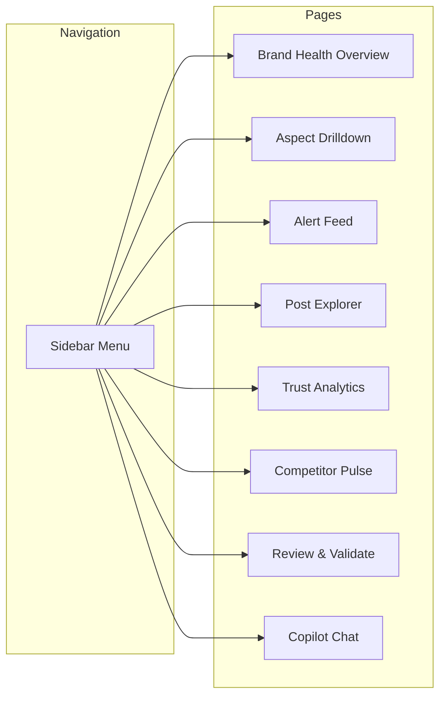

# Dashboard Design — Retail Sentiment Intelligence

## Dashboard Pages & Components



---

## Page 1: Brand Health Overview (Home)

**Purpose:** At-a-glance brand health for leadership and product owners.

| Component | Type | Data |
|-----------|------|------|
| Sentiment Score Gauge | Radial gauge | Overall sentiment (-1 to +1) with trend arrow |
| Volume Ticker | Stat card | Posts today / this week / trend % |
| Sentiment Trend Line | Line chart | Daily sentiment over 30 days |
| Aspect Heatmap | Heatmap grid | 6 aspects × 7 days, color = sentiment |
| Top 3 Emerging Issues | Alert cards | Auto-detected spikes with example quotes |
| Trust Quality Bar | Progress bar | % of posts passing trust threshold |
| Subreddit Activity | Bar chart | Volume by subreddit (top 10) |

**Wireframe Layout:**
```
┌─────────────────────────────────────────────────────────────┐
│  [Sentiment: -0.23 ↓]  [Volume: 342 today ↑12%]  [Trust: 84%] │
├─────────────────────────────────────────────────────────────┤
│  ┌──────────────────────────┐  ┌──────────────────────────┐ │
│  │   Sentiment Trend (30d)  │  │    Aspect Heatmap        │ │
│  │   ~~~~~~~~~/\~~~         │  │  Del  ■■■■□□□            │ │
│  │   ~~~~~/       \~~       │  │  PQ   ■■■□□□□            │ │
│  │                          │  │  Ret  ■■■■■□□            │ │
│  └──────────────────────────┘  └──────────────────────────┘ │
├─────────────────────────────────────────────────────────────┤
│  🔴 Spike: "delivery" mentions +45% in last 6hrs            │
│  🟡 Trend: "app crash" appearing in r/walmart (12 posts)    │
│  🟢 Improving: "returns" sentiment up +0.15 this week       │
└─────────────────────────────────────────────────────────────┘
```

---

## Page 2: Aspect Drilldown

**Purpose:** Deep-dive into each of the 6 retail aspects.

| Component | Type | Data |
|-----------|------|------|
| Aspect Selector | Tab bar / pills | delivery, product_quality, returns, support, pricing, app |
| Sentiment Distribution | Donut chart | Pos/Neg/Neutral split for selected aspect |
| Trend Over Time | Area chart | Aspect sentiment over 14/30 days |
| Top Sub-Topics | Word cloud / bar chart | Key phrases within aspect |
| Representative Posts | Card list | Top 5 posts (highest confidence + engagement) |
| Subreddit Breakdown | Stacked bar | Which subreddits mention this aspect most |
| Volume vs Sentiment Scatter | Scatter plot | Subreddit volume vs avg sentiment |

---

## Page 3: Alert Feed (Real-Time)

**Purpose:** Operational early warning system for product owners and customer support.

| Component | Type | Data |
|-----------|------|------|
| Alert Stream | Live feed | Auto-detected anomalies (sorted by severity) |
| Spike Detector | Timeline | Unusual volume/sentiment changes |
| Critical Posts | Highlighted cards | High-engagement negative posts (score > 50, negative, trusted) |
| Alert Rules | Config panel | Custom thresholds (e.g., "alert if delivery sentiment < -0.6") |
| Response Status | Status badges | Acknowledged / Investigating / Resolved |

**Alert Types:**
- 🔴 **Volume Spike**: Aspect mentions > 2σ above daily mean
- 🔴 **Sentiment Crash**: Aspect sentiment drops > 0.3 in 6 hours
- 🟡 **Emerging Topic**: New phrase cluster appearing (≥5 posts in 2 hours)
- 🟡 **Competitor Mention**: Walmart mentioned alongside competitor in negative context
- 🟢 **Positive Surge**: Praise spike (potential viral positive moment)

---

## Page 4: Post Explorer

**Purpose:** Analysts can search, filter, and read individual posts.

| Component | Type | Data |
|-----------|------|------|
| Search Bar | Full-text search | Search post content |
| Filters Panel | Multi-select | Subreddit, sentiment, aspect, trust score range, date range |
| Results Table | Data table | Post title, subreddit, sentiment, aspects, trust, engagement |
| Post Detail Modal | Slide-out panel | Full post text + AI analysis + Reddit link |
| Bulk Actions | Button group | Export CSV, mark for review, override sentiment |
| Sort Controls | Dropdown | By date, engagement, trust score, confidence |

---

## Page 5: Trust Analytics

**Purpose:** Monitor the credibility filter's behavior and data quality.

| Component | Type | Data |
|-----------|------|------|
| Trust Distribution | Histogram | Distribution of trust scores (0-1) |
| Filtered vs Kept | Pie chart | Posts filtered out vs kept (above/below threshold) |
| Bot Detection Rate | Stat card | % flagged as likely bot/spam per day |
| Low-Trust Examples | Table | Recent posts flagged as untrusted (for analyst review) |
| Trust Impact | Before/After comparison | Sentiment distribution with vs without trust filter |
| Flag Breakdown | Bar chart | Why posts were flagged (new account, repeated text, etc.) |

---

## Page 6: Competitor Pulse

**Purpose:** Benchmark Walmart sentiment against competitors.

| Component | Type | Data |
|-----------|------|------|
| Competitor Comparison | Multi-line chart | Sentiment trends: Walmart vs Target vs Costco vs Amazon |
| Share of Voice | Stacked area | Volume proportions across competitor subs |
| Aspect Comparison | Radar chart | 6-aspect radar overlaying Walmart + 2 competitors |
| Cross-Mention Analysis | Network graph | Posts mentioning multiple retailers |
| Competitor-Specific Issues | Table | What competitors are being praised/criticized for |

---

## Page 7: Review & Validate (HITL)

**Purpose:** Human-in-the-loop validation — analysts correct AI outputs to improve the model.

| Component | Type | Data |
|-----------|------|------|
| Review Queue | Card stack | Posts needing human validation (low confidence or flagged) |
| AI Prediction | Display | Shown sentiment + aspects + confidence scores |
| Correction Controls | Form | Override sentiment, add/remove aspects, adjust trust |
| Agreement Rate | Stat card | % of AI predictions confirmed by humans |
| Feedback History | Table | All past corrections (for retraining data) |
| Model Accuracy Tracker | Line chart | Accuracy trend as more feedback is incorporated |

**Review Priority Logic:**
1. High engagement + low AI confidence → Review first
2. Analyst-flagged from Alert Feed
3. Random sample for quality monitoring
4. Posts where sentiment + trust disagree

---

## Page 8: Copilot Chat (NL Query Interface)

**Purpose:** Natural language querying over the data — like ChatGPT for your retail insights.

| Component | Type | Description |
|-----------|------|-------------|
| Chat Interface | Message thread | Ask questions in English |
| Suggested Queries | Chip buttons | "What's trending today?", "Why is delivery sentiment down?" |
| Auto-Generated Charts | Inline visualization | Copilot generates charts from queries |
| Source Attribution | Post links | Shows which posts support the answer |

**Example Queries:**
- "What are customers complaining about this week?"
- "Compare delivery sentiment between r/walmart and r/Sparkdriver"
- "Show me the most upvoted negative posts about OGP in the last 3 days"
- "Summarize the top 3 issues for the product team"

---

## Tech Stack for Dashboard

```
Frontend:    React + TypeScript + TailwindCSS
Charts:      Recharts or Apache ECharts
State:       React Query (server state) + Zustand (UI state)
Backend:     FastAPI (Python) — same language as AI pipeline
Auth:        Azure AD / SSO
API Layer:   REST + WebSocket (for real-time alerts)
Hosting:     Azure App Service or Static Web Apps
```

---

## Dashboard Access Levels

| Role | Pages Accessible | Actions |
|------|-----------------|---------|
| **Executive** | Brand Health, Competitor Pulse | View only |
| **Product Owner** | All except Review & Validate | View + Export + Set Alerts |
| **Analyst** | All pages | View + Review + Validate + Override |
| **Engineer** | All pages + system metrics | Full access + config |
