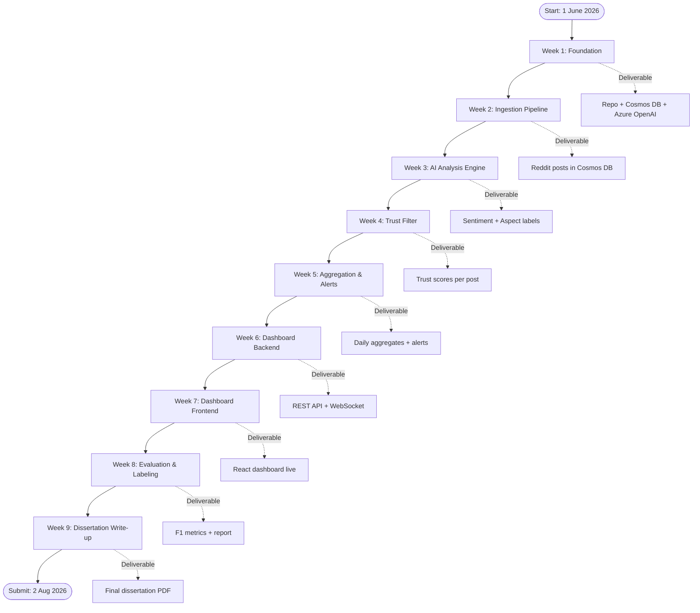
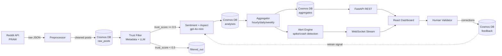
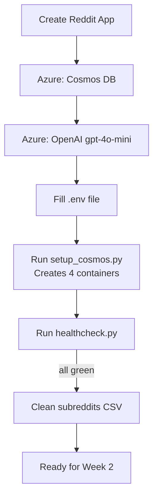
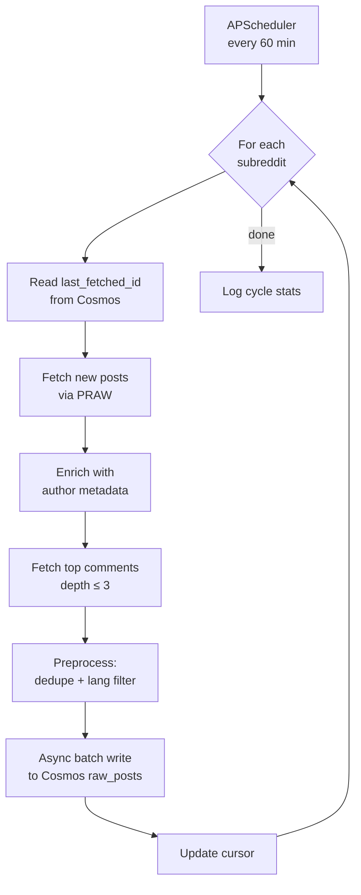
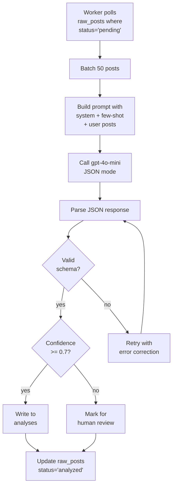
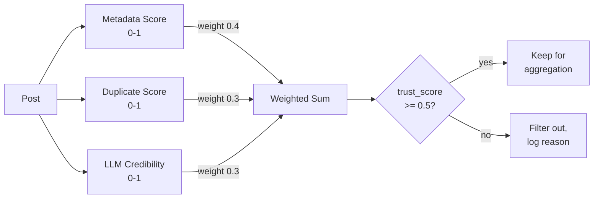
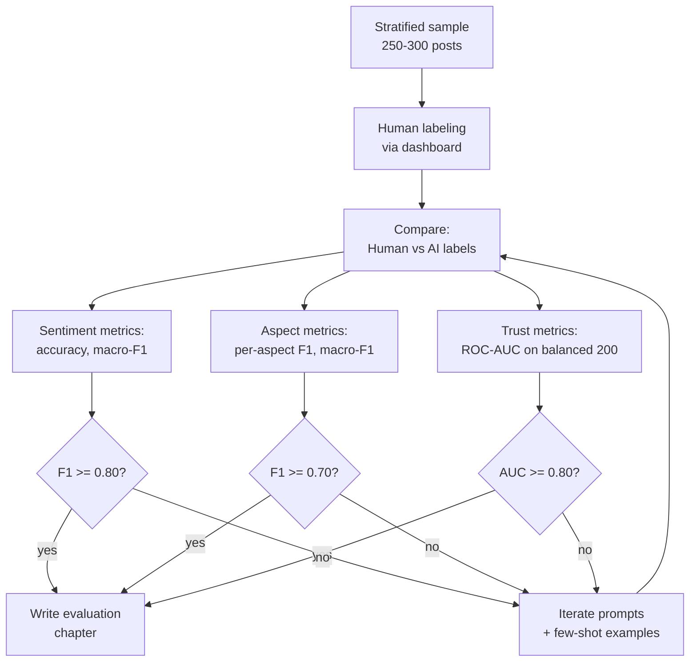

# Implementation Plan — Retail Sentiment Intelligence

Step-by-step guide aligned to dissertation timeline (1 June – 2 Aug 2026).

---

## Master Flow Chart

---

## Pipeline Data Flow

---

## Week 1 — Foundation (Jun 1–7)

**Goal:** Repo setup + cloud resources provisioned + first "Hello World" data flowing.

### Steps:

| # | Task | Tool/Command | Output |
|---|------|--------------|--------|
| 1.1 | Initialize Git repo | `git init && git add . && git commit -m "init"` | `.git/` directory |
| 1.2 | Create Python venv | `python -m venv .venv && source .venv/bin/activate` | Isolated env |
| 1.3 | Install dependencies | `pip install -r requirements.txt` | Packages installed |
| 1.4 | Create Reddit app | Go to reddit.com/prefs/apps → "create app" → "script" type | `client_id`, `client_secret` |
| 1.5 | Provision Cosmos DB | Azure Portal → Create Cosmos DB (NoSQL API, free tier) | `COSMOS_ENDPOINT`, `COSMOS_KEY` |
| 1.6 | Provision Azure OpenAI | Azure Portal → Create resource → Deploy `gpt-4o-mini` | `AZURE_OPENAI_ENDPOINT`, key |
| 1.7 | Fill `.env` file | Copy `.env.example` → `.env`, paste credentials | Working secrets file |
| 1.8 | Create Cosmos containers | Run `scripts/setup_cosmos.py` | 4 containers created |
| 1.9 | Test connections | Run `scripts/healthcheck.py` | All three "✓ connected" |
| 1.10 | Fix the malformed CSV | Run `scripts/clean_subreddit_csv.py` | `data/subreddits_clean.csv` |

### Week 1 Flow:

---

## Week 2 — Ingestion Pipeline (Jun 8–14)

**Goal:** Scheduled job pulling Reddit posts → Cosmos DB.

### Steps:

| # | Task | File | What to Build |
|---|------|------|---------------|
| 2.1 | Reddit client wrapper | `src/ingestion/reddit_client.py` | Async PRAW client, rate-limit handling |
| 2.2 | Post fetcher | `src/ingestion/fetcher.py` | Fetch new posts since last cursor per subreddit |
| 2.3 | Comment fetcher | `src/ingestion/comments.py` | Fetch top comments (depth ≤ 3) |
| 2.4 | Author metadata | `src/ingestion/author.py` | Account age, karma, posting frequency |
| 2.5 | Preprocessor | `src/ingestion/preprocess.py` | Clean, dedupe (hash), English filter (langdetect) |
| 2.6 | Cosmos writer | `src/storage/cosmos_writer.py` | Async batch upsert to `raw_posts` |
| 2.7 | Cursor tracking | `src/storage/cursor.py` | Store last_fetched_id per subreddit |
| 2.8 | Scheduler | `src/scheduler.py` | APScheduler — runs every 60 min |
| 2.9 | Logging setup | `src/utils/logger.py` | structlog JSON logs |
| 2.10 | First end-to-end run | Run `python -m src.scheduler --once` | ~500 posts in Cosmos |

### Ingestion Flow:

---

## Week 3 — AI Analysis Engine (Jun 15–21)

**Goal:** gpt-4o-mini producing sentiment + aspect tags per post.

### Steps:

| # | Task | File | What to Build |
|---|------|------|---------------|
| 3.1 | Azure OpenAI client | `src/analysis/llm_client.py` | Async client with retry (tenacity) |
| 3.2 | Sentiment + aspect analyzer | `src/analysis/analyzer.py` | Uses prompts from `prompts.py`, JSON mode |
| 3.3 | Batch processor | `src/analysis/batch.py` | Process 50 posts per LLM call |
| 3.4 | Result parser | `src/analysis/parser.py` | Validate JSON schema, handle failures |
| 3.5 | Cosmos writer for analyses | `src/storage/analysis_writer.py` | Write to `analyses` container |
| 3.6 | Baseline comparator | `src/analysis/baseline.py` | cardiffnlp roberta for benchmarking |
| 3.7 | Confidence routing | `src/analysis/router.py` | Flag low-confidence (<0.7) for HITL queue |
| 3.8 | Worker daemon | `src/workers/analysis_worker.py` | Polls raw_posts → calls analyzer → writes analyses |
| 3.9 | Cost monitor | `src/utils/cost_tracker.py` | Track tokens spent per cycle |
| 3.10 | First batch test | Process 100 posts, manually inspect 10 | Quality sanity check |

### Analysis Flow:

---

## Week 4 — Trust Filter (Jun 22–28)

**Goal:** Each post has a 0–1 trust score; spam/bots filtered out before aggregation.

### Steps:

| # | Task | File | What to Build |
|---|------|------|---------------|
| 4.1 | Metadata heuristics | `src/trust/heuristics.py` | Score: account_age, karma, posting_freq |
| 4.2 | Duplicate detector | `src/trust/dedup.py` | Sentence embeddings + cosine similarity |
| 4.3 | LLM credibility check | `src/trust/credibility.py` | Uses TRUST_SYSTEM_PROMPT |
| 4.4 | Combined scorer | `src/trust/scorer.py` | `0.4*meta + 0.3*dedup + 0.3*llm` |
| 4.5 | Trust worker | `src/workers/trust_worker.py` | Runs before analysis worker |
| 4.6 | Filter integration | Update analysis_worker to skip if trust<0.5 | Filtered posts logged |
| 4.7 | Trust impact metric | `src/trust/impact.py` | Sentiment delta with/without filter |
| 4.8 | Balanced credibility sample | `scripts/build_trust_eval.py` | 100 genuine + 100 spam for eval |
| 4.9 | ROC-AUC evaluation | `notebooks/trust_eval.ipynb` | Target ≥ 0.80 ROC-AUC |

### Trust Flow:

---

## Week 5 — Aggregation & Alerts (Jun 29 – Jul 5)

**Goal:** Hourly/daily/weekly rollups + anomaly detection.

### Steps:

| # | Task | File | What to Build |
|---|------|------|---------------|
| 5.1 | Aggregator | `src/aggregation/aggregator.py` | Group by window + aspect, compute stats |
| 5.2 | Trend calculator | `src/aggregation/trends.py` | Rolling means, sentiment deltas |
| 5.3 | Issue ranker | `src/aggregation/ranker.py` | Rank issues by volume × negativity × engagement |
| 5.4 | LLM summarizer | `src/aggregation/summarizer.py` | Uses SUMMARIZE_SYSTEM_PROMPT |
| 5.5 | Volume spike detector | `src/alerts/spike.py` | > 2σ above 7-day mean |
| 5.6 | Sentiment crash detector | `src/alerts/crash.py` | Drop > 0.3 in 6 hours |
| 5.7 | Emerging topic detector | `src/alerts/emerging.py` | Cluster new phrases (≥5 in 2h) |
| 5.8 | Alert writer | `src/alerts/writer.py` | Write alerts to Cosmos + WebSocket queue |
| 5.9 | Aggregation worker | `src/workers/aggregation_worker.py` | Runs hourly via APScheduler |

---

## Week 6 — Dashboard Backend (Jul 6–12)

**Goal:** FastAPI exposing all dashboard data + real-time alerts.

### Steps:

| # | Task | File | Endpoint |
|---|------|------|----------|
| 6.1 | FastAPI app skeleton | `src/dashboard/api/main.py` | `/health` |
| 6.2 | Brand health endpoint | `src/dashboard/api/brand_health.py` | `GET /api/brand-health` |
| 6.3 | Aspect drilldown | `src/dashboard/api/aspects.py` | `GET /api/aspects/{aspect}` |
| 6.4 | Post search/filter | `src/dashboard/api/posts.py` | `GET /api/posts?filters=...` |
| 6.5 | Alerts endpoint | `src/dashboard/api/alerts.py` | `GET /api/alerts` |
| 6.6 | Trust analytics | `src/dashboard/api/trust.py` | `GET /api/trust-stats` |
| 6.7 | Competitor pulse | `src/dashboard/api/competitors.py` | `GET /api/competitors` |
| 6.8 | HITL queue + submit | `src/dashboard/api/review.py` | `GET/POST /api/review` |
| 6.9 | Copilot chat | `src/dashboard/api/copilot.py` | `POST /api/copilot/query` |
| 6.10 | WebSocket alerts | `src/dashboard/api/ws.py` | `WS /ws/alerts` |
| 6.11 | Auth middleware | `src/dashboard/api/auth.py` | Bearer token or Azure AD |

---

## Week 7 — Dashboard Frontend (Jul 13–19)

**Goal:** React dashboard with all 8 pages, even if some are minimal.

### Steps:

| # | Task | Priority |
|---|------|----------|
| 7.1 | Vite + React + TypeScript scaffold | P0 |
| 7.2 | TailwindCSS + Recharts setup | P0 |
| 7.3 | API client (React Query) | P0 |
| 7.4 | Layout + sidebar nav | P0 |
| 7.5 | Page 1: Brand Health Overview | **P0** |
| 7.6 | Page 2: Aspect Drilldown | **P0** |
| 7.7 | Page 3: Alert Feed (with WebSocket) | P1 |
| 7.8 | Page 4: Post Explorer | P1 |
| 7.9 | Page 7: Review & Validate | **P0** (needed for HITL evaluation) |
| 7.10 | Page 5, 6, 8: Trust / Competitor / Copilot | P2 (if time permits) |

---

## Week 8 — Evaluation & Manual Labeling (Jul 20–26)

**Goal:** Hit dissertation targets: ≥80% sentiment F1, ≥0.70 aspect F1, ≥0.80 trust ROC-AUC.

### Steps:

| # | Task | Output |
|---|------|--------|
| 8.1 | Sample 250–300 posts from Cosmos (stratified) | `data/eval_sample.jsonl` |
| 8.2 | Build labeling notebook (use Review page) | Manual labels via dashboard |
| 8.3 | Compute confusion matrix (sentiment) | `notebooks/eval_sentiment.ipynb` |
| 8.4 | Compute per-aspect F1 | `notebooks/eval_aspects.ipynb` |
| 8.5 | Trust ROC-AUC on balanced sample | `notebooks/eval_trust.ipynb` |
| 8.6 | Before/after trust filter sentiment comparison | Chart for dissertation |
| 8.7 | Baseline comparison (cardiffnlp vs gpt-4o-mini) | Performance table |
| 8.8 | Error analysis | Sample failures by category |

### Evaluation Flow:

---

## Week 9 — Dissertation Write-up & Submission (Jul 27 – Aug 2)

| # | Task | Section |
|---|------|---------|
| 9.1 | Methodology chapter | System architecture + pipeline diagrams |
| 9.2 | Implementation chapter | Code structure + key decisions |
| 9.3 | Results chapter | Metrics, tables, charts from Week 8 |
| 9.4 | Discussion | Limitations, comparison to baselines |
| 9.5 | Conclusion + future work | Honest scoping |
| 9.6 | Format per WILP guidelines | Title page, abstract, refs |
| 9.7 | Supervisor review | Submit draft to Varunendra + Suhas |
| 9.8 | Incorporate feedback | Final revisions |
| 9.9 | Final submission | Upload PDF to BITS WILP portal |

---

## Quick Reference: Daily Standup Questions

For your own focus during the project:

1. **What did I implement yesterday?**
2. **What stage is blocking me right now?**
3. **Am I on track for this week's deliverable?**
4. **Do I have data flowing end-to-end yet?** (huge milestone)

---

## Risk Mitigation

| Risk | Mitigation |
|------|-----------|
| Reddit API rate limits | Use async PRAW, cache results, respect 60 req/min |
| Azure OpenAI cost overrun | Monitor tokens, use gpt-4o-mini (not gpt-4o), batch posts |
| Cosmos DB throughput | Start with serverless tier; switch to provisioned only if needed |
| Manual labeling takes too long | Use Review dashboard from Day 1; label as you go |
| Dashboard scope creep | P0/P1/P2 priorities — ship P0 only if needed |
| Fine-tuning failure | It's optional; skip if any time pressure |
| Twitter/X access blocked | Already optional in scope; skip entirely if not free |

---

## Definition of "Done" (per dissertation)

✅ Reddit ingestion runs hourly without manual intervention  
✅ Each post has sentiment + aspects + trust score in Cosmos DB  
✅ Dashboard shows aggregated brand health view  
✅ Manual evaluation hits: ≥80% sentiment F1, ≥0.70 aspect F1, ≥0.80 trust AUC  
✅ Honest documentation of what works and what doesn't  
✅ Dissertation PDF submitted by 2 Aug 2026
