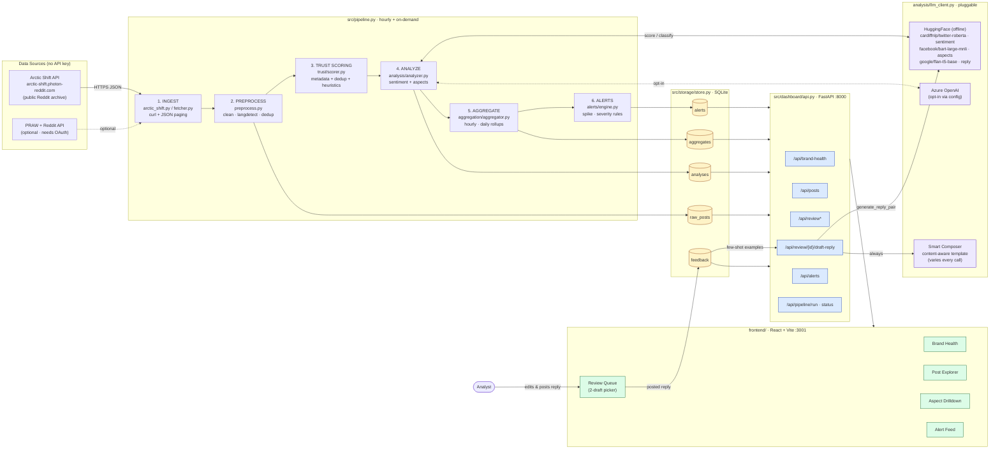
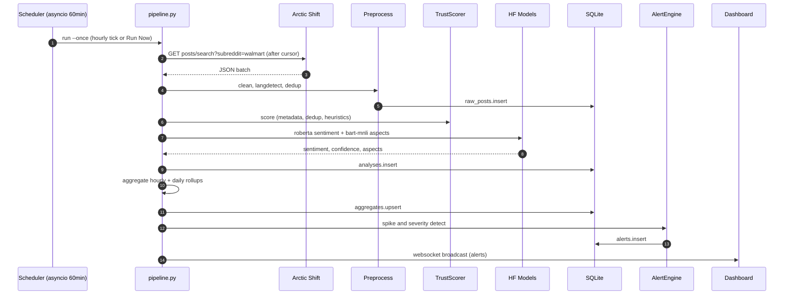
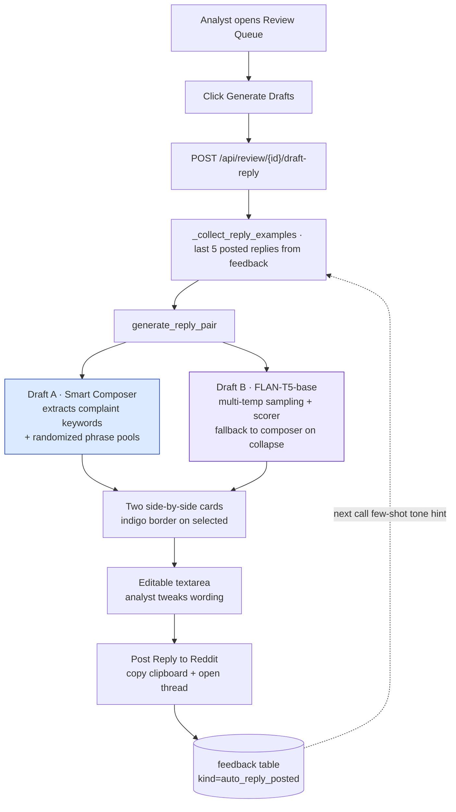
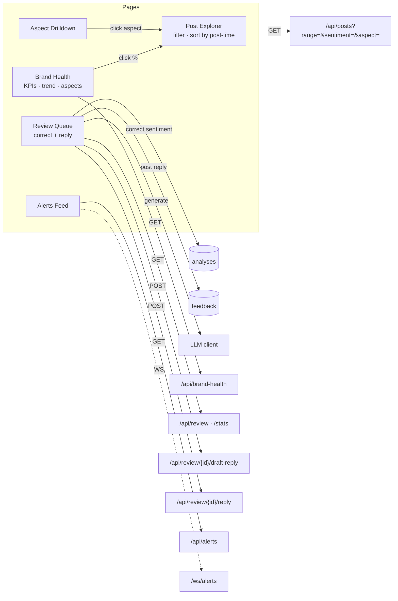

# Retail Sentiment Intelligence — Architecture, Pipeline & Tools

> Living reference for how data flows through the system, which tools we use at each layer, and how the LLM "learning loop" works for analyst replies.

---

## 1. End-to-end data flow

---

## 2. Pipeline stages (sequence)

---

## 3. Reply-generation learning loop

---

## 4. Tools & libraries by layer

| Layer | Tool / Library | Purpose |
|---|---|---|
| **Ingestion** | `arctic-shift.photon-reddit.com` (HTTPS + `curl` subprocess) | Free, key-less Reddit data |
| | `praw` 7.7+ | Optional official Reddit API path |
| | `langdetect` | English-only filter |
| | `sentence-transformers` (MiniLM-L6-v2) | Semantic dedup |
| **Storage** | `sqlite3` (built-in) → `data/local.db` | Local dev store |
| | `azure-cosmos` | Production store (configurable) |
| **NLP / LLM** | `transformers` + `torch` | Local model runtime (offline cache) |
| | `cardiffnlp/twitter-roberta-base-sentiment-latest` | Sentiment classification |
| | `facebook/bart-large-mnli` | Zero-shot aspect classification |
| | `google/flan-t5-base` | Reply text generation (Draft B) |
| | `openai` SDK | Azure OpenAI opt-in path |
| | Custom **Smart Composer** | Always-varied, content-aware reply (Draft A) |
| **API** | `fastapi` + `uvicorn` + `websockets` | REST + live alert push (port 8000) |
| | `pydantic` | Request / response schemas |
| **Scheduling** | `asyncio` event loop (lifespan) | 60-min cron + manual Run Now |
| | `subprocess` (`python -m src.pipeline --once`) | Detached pipeline runs |
| **Frontend** | `React 18` + `TypeScript` + `Vite` (port 3001) | SPA |
| | `react-router-dom` v6 | Routing (Brand Health · Posts · Review · Alerts · Aspects) |
| | `recharts` | Sentiment pie, trend lines |
| | `tailwindcss` | Styling |
| **Observability** | `structlog` | Structured JSON logs |
| | `data/llm_costs.jsonl` (`CostTracker`) | Per-call cost ledger |
| **Config** | `pyyaml` (`config/pipeline_config.yaml`) + `python-dotenv` | Pluggable provider switches |
| **Testing** | `pytest`, `pytest-asyncio`, `scikit-learn` (metrics) | Unit + integration + F1 / AUC eval |

---

## 5. Request paths through the dashboard

---

## 6. TL;DR

- **No Reddit key** — Arctic Shift public archive over plain HTTPS via `curl`.
- **All LLMs run locally** — three HF models cached in `~/.cache/huggingface/`, started with `TRANSFORMERS_OFFLINE=1 HF_HUB_OFFLINE=1`.
- **One Python orchestrator** ([src/pipeline.py](src/pipeline.py)) runs the 6-stage flow hourly and on-demand.
- **FastAPI** ([src/dashboard/api.py](src/dashboard/api.py)) exposes the dashboard data + manual pipeline triggers; **React/Vite** renders 5 pages.
- **Closed feedback loop**: every analyst-posted reply lands in the `feedback` table and becomes a few-shot tone hint for the next draft.

---

## 7. Key files

| Area | File |
|---|---|
| Pipeline orchestrator | [src/pipeline.py](src/pipeline.py) |
| Arctic Shift fetcher | [src/ingestion/arctic_shift.py](src/ingestion/arctic_shift.py) |
| PRAW fetcher (optional) | [src/ingestion/reddit_client.py](src/ingestion/reddit_client.py), [src/ingestion/fetcher.py](src/ingestion/fetcher.py) |
| Preprocess + dedup | [src/ingestion/preprocess.py](src/ingestion/preprocess.py), [src/trust/dedup.py](src/trust/dedup.py) |
| Trust scoring | [src/trust/scorer.py](src/trust/scorer.py), [src/trust/heuristics.py](src/trust/heuristics.py) |
| Sentiment + aspects + reply | [src/analysis/analyzer.py](src/analysis/analyzer.py), [src/analysis/llm_client.py](src/analysis/llm_client.py) |
| Aggregation + alerts | [src/aggregation/aggregator.py](src/aggregation/aggregator.py), [src/alerts/engine.py](src/alerts/engine.py) |
| Storage | [src/storage/store.py](src/storage/store.py), [src/storage/cursor.py](src/storage/cursor.py) |
| API | [src/dashboard/api.py](src/dashboard/api.py) |
| Config | [config/pipeline_config.yaml](config/pipeline_config.yaml) |
| Frontend pages | [frontend/src/pages/BrandHealth.tsx](frontend/src/pages/BrandHealth.tsx), [frontend/src/pages/PostExplorer.tsx](frontend/src/pages/PostExplorer.tsx), [frontend/src/pages/ReviewQueue.tsx](frontend/src/pages/ReviewQueue.tsx), [frontend/src/pages/AspectDrilldown.tsx](frontend/src/pages/AspectDrilldown.tsx), [frontend/src/pages/AlertFeed.tsx](frontend/src/pages/AlertFeed.tsx) |
