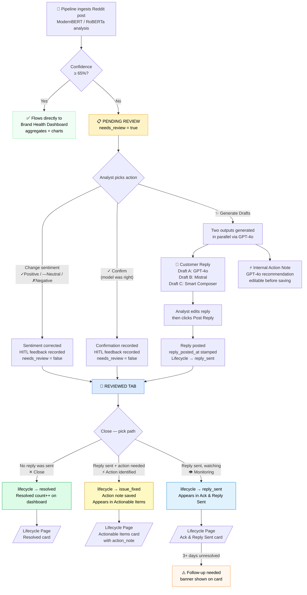

# Review & Validate — Complete Flow

## Overview

Posts enter the Review Queue when the sentiment model's confidence is below the threshold (65%).  
An analyst works through them using the **Review & Validate** page.

---

## Flow Diagram

---

## Action Reference

| Button | What happens | Lifecycle state |
|--------|-------------|-----------------|
| `✓ Positive` / `— Neutral` / `✗ Negative` | Corrects model label, marks reviewed | — |
| `✓ Confirm` | Agrees with model label, marks reviewed | — |
| `✨ Generate Drafts` | Generates customer reply (GPT-4o/Mistral/Smart) + internal action note | — |
| `Post Reply` | Saves reply to audit log, posts to Reddit (if OAuth live) | `reply_sent` |
| `✕ Close` (no reply sent) | Direct resolve, no response needed | `resolved` |
| `⚡ Action identified` (after reply) | Action note sent to ops team | `issue_fixed` |
| `👁 Monitoring` (after reply) | Reply sent, watching for resolution | `reply_sent` |

---

## Where results appear

| Lifecycle state | Lifecycle kanban column | Dashboard counter |
|----------------|------------------------|-------------------|
| `reply_sent` | Ack & Reply Sent | Addressed & replied |
| `issue_fixed` | Actionable Items | — |
| `resolved` | Resolved | Resolved count |

---

## Key data fields (SQLite `analyses` table)

| Field | Meaning |
|-------|---------|
| `needs_review` | `true` = still in Pending queue |
| `human_validated` | `true` = analyst has acted on this post |
| `reply_posted_at` | ISO timestamp when reply was posted |
| `close_reason` | `no_reply` / `issue_fixed` / `reply_sent` |
| `action_note` | GPT-generated internal action recommendation |
