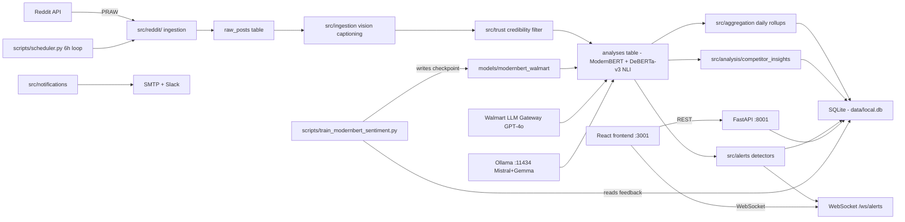
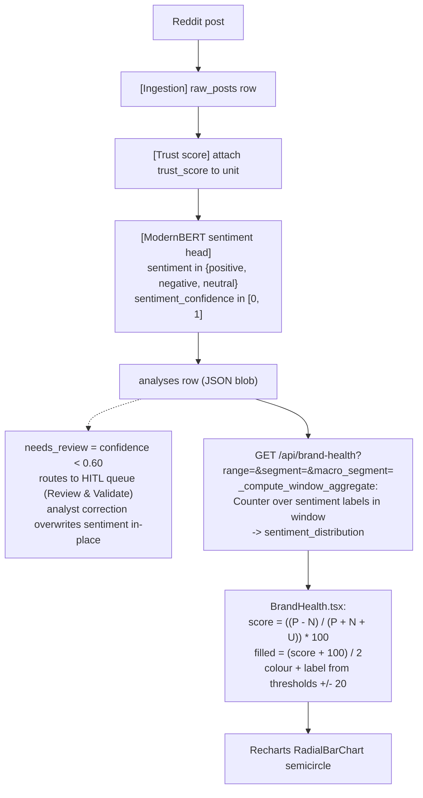
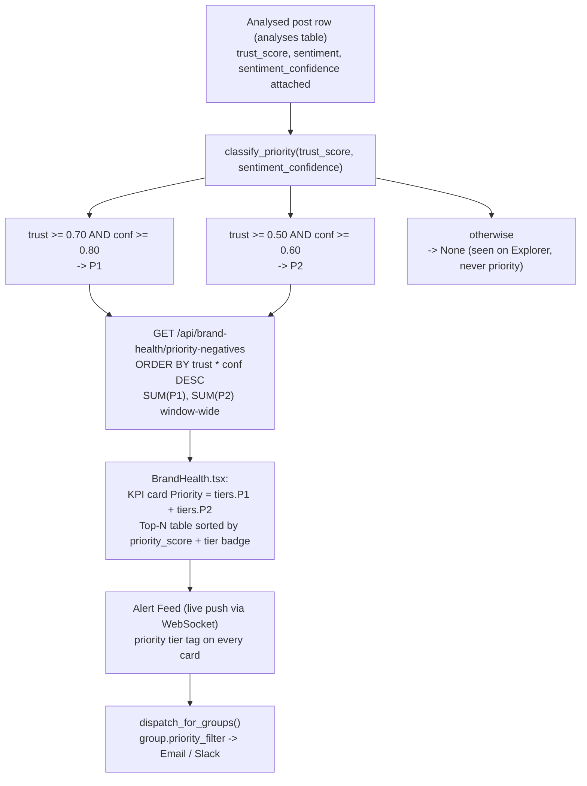
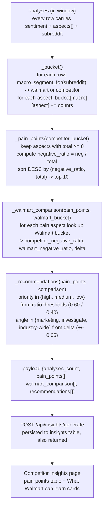
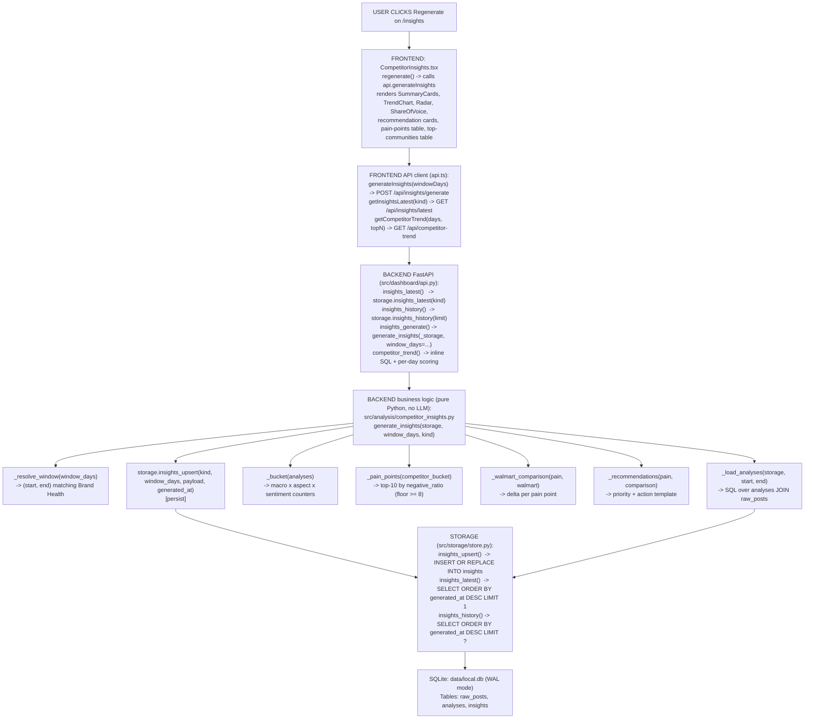

# Lookup — Master Reference

Quick-reference sheet answering common panel questions with file paths, line numbers, and concrete numbers. Keep this open next to the deck during the review.

This is the **master index**. Formulas, thresholds and Q&A live in the sections below. UI wiring, render flow and component diagrams for each dashboard page live in their own file under [`pages/`](./pages/).

---

## 📄 Pages Index

Each row links to a dedicated deep-dive for one dashboard page — file map, render flow (Mermaid), API contract, and typical panel Q&A.

| Page | URL | Deep-dive file | Master-file sections that apply |
|---|---|---|---|
| Brand Health | `/` | [pages/brand_health.md](./pages/brand_health.md) | §1 Sentiment Score, §2 Priority tiers |
| Aspect Drilldown | `/aspects/:aspect` | [pages/aspect_drilldown.md](./pages/aspect_drilldown.md) | §1 (aspect taxonomy) |
| Post Lifecycle | `/lifecycle` | [pages/post_lifecycle.md](./pages/post_lifecycle.md) | §2 (P1/P2 upstream), notifications side-effect |
| Competitor Insights | `/insights` | [pages/competitor_insights.md](./pages/competitor_insights.md) | §3 (formulas), §3.9 (call chain), §3.10 (file map), §3.11 (Q&A), §3.12 (UI stack) |
| Review Queue | `/review` | [pages/review_queue.md](./pages/review_queue.md) | Feedback loop into ModernBERT retrain |
| Trust Analytics | `/trust` | [pages/trust_analytics.md](./pages/trust_analytics.md) | Trust threshold from `pipeline_config.yaml` |
| Alert Feed | `/alerts` | [pages/alert_feed.md](./pages/alert_feed.md) | WebSocket live push |
| Post Explorer | `/posts` | [pages/post_explorer.md](./pages/post_explorer.md) | Drill-through target from Brand Health |
| Pipeline (Data Ops) | `/pipeline` | [pages/pipeline.md](./pages/pipeline.md) | 5-stage funnel — Ingest → Vision → Trust → Analyze → Aggregate |
| Notifications | `/notifications` | [pages/notifications.md](./pages/notifications.md) | Groups + dry-run delivery |

> **How to use this hub**: open Lookup.md for formulas / concrete numbers, and open the per-page file for how the code is wired and what the panel is most likely to click through during the demo.

---

## 🏗️ Project Structure & Tech Stack

## Folder tree (top-level)

```text
Retail_Sentiment_Intelligence/
+-- config/                    -- YAML configs (models, pipeline thresholds)
|   +-- models.yaml
|   +-- pipeline_config.yaml
+-- data/                      -- SQLite DB + fixtures + benchmark data
|   +-- local.db               -- SQLite (WAL mode) -- ALL runtime data
|   +-- benchmark_real_200.jsonl
|   +-- llm_costs.jsonl
+-- src/                       -- Python backend (Python 3.13)
|   +-- pipeline.py            -- 5-stage orchestrator
|   +-- reddit/                -- Reddit ingestion (PRAW)
|   +-- ingestion/             -- Vision captioning + image cache
|   +-- trust/                 -- Credibility filter (composite score)
|   +-- analysis/              -- Sentiment + aspect + insights
|   |   +-- competitor_insights.py
|   +-- aggregation/           -- Daily rollups for Brand Health
|   +-- alerts/                -- Alert detectors + WebSocket publisher
|   +-- notifications/         -- Email + Slack delivery (dry-run default)
|   +-- storage/store.py       -- SQLite adapter + schema
|   +-- dashboard/api.py       -- FastAPI routes + WebSocket endpoints
|   +-- utils/
+-- frontend/                  -- React 18 + TypeScript + Vite
|   +-- src/
|   |   +-- pages/             -- 10 route pages (BrandHealth, CompetitorInsights, ...)
|   |   +-- components/        -- Card, Button, Sidebar (shared)
|   |   +-- api.ts             -- Thin fetch() wrappers + WS hook
|   |   +-- App.tsx            -- React Router route table
|   +-- package.json
+-- scripts/                   -- One-off jobs (scheduler, retrain, healthcheck)
|   +-- scheduler.py           -- 6h background loop
|   +-- train_modernbert_sentiment.py
|   +-- benchmark_eval.py
+-- evaluation/                -- Notebooks + gold-set results
+-- notebooks/                 -- Model comparison notebook
+-- models/modernbert_walmart/ -- Fine-tuned ModernBERT checkpoint
+-- docs/Sem_4/                -- Report / deck / this Lookup
|   +-- Lookup.md              -- YOU ARE HERE
|   +-- pages/                 -- Per-page deep dives
|   +-- generate_final_presentation.py
+-- tests/                     -- pytest suite
+-- start.sh                   -- Bootstrap: venv + deps + DB seed + services
```

## Tech stack

| Layer | Tool / Library | Version | Role |
|---|---|---|---|
| **Backend runtime** | Python | 3.13 | Pipeline + API |
| **Web framework** | FastAPI | latest | REST + WebSocket, Swagger at `/docs`, ReDoc at `/redoc` |
| **ASGI server** | Uvicorn | latest | Runs FastAPI on `localhost:8001` |
| **Database** | SQLite | 3 (WAL mode) | Single `data/local.db` file — all runtime state |
| **Reddit client** | PRAW | latest | Ingestion |
| **Sentiment model** | **ModernBERT** (fine-tuned) | HF `answerdotai/ModernBERT-base` | Whole-post 3-class sentiment (macro-F1 0.7642 on 200-post gold set) |
| **Aspect model** | **DeBERTa-v3 NLI** | HF `MoritzLaurer/deberta-v3-large-zeroshot-v2.0` | Zero-shot aspect tagging (8-aspect taxonomy) |
| **LLM gateway** | GPT-4o | via Walmart LLM Gateway | Fallback + validation subset |
| **Local LLMs** | Mistral 7B, Gemma 3 4B | via Ollama on `localhost:11434` | Local inference option |
| **Vision** | **Gemma 3 4B** (`gemma3:4b` via Ollama) | fallback: LLaVA 7B | Image captioning for posts with attachments — see `config/models.yaml` |
| **Scheduler** | Python `sched` loop | -- | 6-hour cycle (`scripts/scheduler.py`) |
| **Frontend framework** | React | 18 | UI |
| **Frontend language** | TypeScript | 5.3 | Type safety |
| **Bundler** | Vite | 5 | Dev + build (dev server on `localhost:3001`) |
| **Routing** | react-router-dom | 6 | 10 routes |
| **Charts** | **Recharts** | 2.10 | LineChart, BarChart, RadarChart, RadialBar, PieChart |
| **Icons** | lucide-react | 0.292 | ~20 icons used across pages |
| **Styling** | TailwindCSS | 3.4 | Utility classes + custom Walmart palette |
| **Notifications** | SMTP (email) + Slack webhook | -- | Dry-run by default |
| **Testing** | pytest | -- | `tests/test_core.py`, `tests/test_integration.py` |
| **Deck** | python-pptx | -- | `docs/Sem_4/generate_final_presentation.py` (23 slides) |
| **Report** | XeLaTeX + python-docx | -- | PDF + DOCX outputs under `docs/Sem_4/final/` |
| **Screenshots** | Playwright (system Chrome) | -- | `docs/Sem_4/final/figures/ui/_capture.py` |

## System interaction map

This is the full runtime path from Reddit ingestion to dashboard rendering and Slack notifications.



**Key interaction rules**

1. **SQLite is the only shared state.** No Redis, no message queue. All pages read from the same `data/local.db`.
2. **FastAPI never writes during a read.** Aggregation happens either during the pipeline cycle or on the fly in a route handler (Brand Health).
3. **WebSocket is for alerts only.** Everything else is polled or on-demand.
4. **Retraining is offline.** Feedback rows written from the Review Queue accumulate in the `feedback` table; retrain script picks them up on next run and overwrites the ModernBERT checkpoint.
5. **Dry-run is the default for external side-effects.** Notifications and pipeline "Run Now" both need explicit enable to hit external APIs.

## Ports and endpoints

| What | Where |
|---|---|
| React dev server | `http://localhost:3001` |
| FastAPI backend | `http://localhost:8001` |
| Swagger UI | `http://localhost:8001/docs` |
| ReDoc | `http://localhost:8001/redoc` |
| OpenAPI JSON | `http://localhost:8001/openapi.json` |
| WebSocket (alerts) | `ws://localhost:8001/ws/alerts` |
| Ollama local LLM | `http://localhost:11434` |

---

## 1. Sentiment Score (the big gauge on Brand Health)

## 1.1 What the gauge shows

The big number in the "Sentiment Score" card on the Brand Health page is a single scalar in **`[-100, +100]`** derived from the sentiment labels of all analysed posts in the selected time window.

- **≥ +20** → green, labelled **"Healthy"**
- **≤ −20** → red, labelled **"At risk"**
- anything in between → orange, labelled **"Neutral"**

It's a *net-sentiment* index (net positive share × 100), not a probability.

## 1.2 The exact formula

```text
score = ((positive_count − negative_count) / total_posts) × 100
```

Where
- `positive_count`, `negative_count`, `neutral_count` = number of analysed posts labelled with each sentiment class in the current window / segment / macro-segment filter
- `total_posts = positive_count + negative_count + neutral_count`

Range:

| Composition of window | score |
|---|---|
| all positive | +100 |
| all negative | −100 |
| positive = negative (any neutrals) | 0 |
| all neutral | 0 |

**Numeric example** — real values from the latest Brand Health capture (Last 7 Days):

Total = 4,147 posts &nbsp;·&nbsp; Pos = 116 &nbsp;·&nbsp; Neg = 1,415 &nbsp;·&nbsp; Neu = 2,616

```text
score = ((116 − 1415) / 4147) × 100
      = (−1299 / 4147) × 100
      ≈ −31.3
```

Exactly the "−31.3" shown on the gauge, tagged **"At risk"** (< −20).

The gauge itself is a Recharts `RadialBarChart` semicircle. Because RadialBar wants a `[0, 100]` fill value, the code rescales the score with:

```text
filled = round((score + 100) / 2)      // −100 → 0, 0 → 50, +100 → 100
```

That's purely a visual mapping — the number in the middle of the arc is still the raw `−100…+100` score.

## 1.3 Where the code lives

**UI — the gauge itself**
[frontend/src/pages/BrandHealth.tsx](../../frontend/src/pages/BrandHealth.tsx#L463-L525)

```tsx
// Score in -100..+100.
const raw = ((positive - negative) / total) * 100;
const score = Math.round(raw * 10) / 10;
// Map to 0..100 for the RadialBar fill.
const filled = Math.round(((score + 100) / 2));
const color = score > 20 ? '#00865A' : score < -20 ? '#DE1C24' : '#F0932B';
const label = score > 20 ? 'Healthy' : score < -20 ? 'At risk' : 'Neutral';
```

**UI — where the counts come from**
Same file, [lines 82–86](../../frontend/src/pages/BrandHealth.tsx#L82-L86):

```tsx
const sd = data?.sentiment_distribution;
const sPos = sd?.positive ?? 0;
const sNeg = sd?.negative ?? 0;
const sNeu = sd?.neutral ?? 0;
const total = sd ? sPos + sNeg + sNeu : 0;
```

`data.sentiment_distribution` comes from the API response.

**API — the endpoint that returns those counts**
[src/dashboard/api.py](../../src/dashboard/api.py#L2235-L2255) — `GET /api/brand-health`

```python
@app.get("/api/brand-health")
def get_brand_health(range: str = Query("today"),
                    segment: str | None = Query(None),
                    macro_segment: str | None = Query(None)):
    ...
    window_start, window_end, days_requested, date_label = _resolve_window(range)
    stats = _compute_window_aggregate(window_start, window_end,
                                      segment=segment,
                                      macro_segment=macro_segment)
    ...
    response = {
        ...
        "sentiment_distribution": stats["sentiment_distribution"],
        ...
    }
```

**Aggregation — where the sentiment labels are counted per window**
[src/dashboard/api.py](../../src/dashboard/api.py#L2010-L2070) — `_compute_window_aggregate()`

```python
sentiment_dist: Counter = Counter()
for row in rows:                                # rows = analyses joined to raw_posts
    a = json.loads(row["adata"])
    # apply segment + macro-segment filters
    if segment and row_segment != segment:      continue
    if macro_segment and row_macro != macro_segment: continue
    sentiment = a.get("sentiment", "neutral")
    sentiment_dist[sentiment] += 1              # ← positive / negative / neutral
...
return {
    "total_posts": kept,
    "sentiment_distribution": {
        "positive": sentiment_dist.get("positive", 0),
        "negative": sentiment_dist.get("negative", 0),
        "neutral":  sentiment_dist.get("neutral",  0),
    },
    ...
}
```

**Where each row's `sentiment` label is created (upstream)**
[src/analysis/analyzer.py](../../src/analysis/analyzer.py#L73-L87) — `_build_analysis_record()`

```python
return {
    "id": f"analysis_{unit_id}",
    "post_id": unit_id,
    ...
    "sentiment":            result.get("sentiment", "neutral"),        # ← one of {positive, negative, neutral}
    "sentiment_confidence": confidence,
    ...
    "needs_review": confidence < self.config.confidence_threshold,     # low-conf → HITL queue
    ...
}
```

`result` comes from the sentiment client:
- **Production path**: `HuggingFaceSentimentClient` (fine-tuned **ModernBERT** — 3-stage curriculum, macro-F1 0.7642 on the 200-post gold set) — [src/analysis/llm_client.py](../../src/analysis/llm_client.py#L288)
- Alternative gateway paths (GPT-4o via Walmart LLM Gateway, Ollama-hosted Mistral) also normalise their JSON to the same `{sentiment, sentiment_confidence}` schema.

## 1.4 End-to-end path in one picture



## 1.5 Likely panel questions

**Q. Why net-positive share and not average of numeric scores?**
Because the model emits **discrete labels** (`positive` / `negative` / `neutral`), not a continuous polarity. Averaging categorical labels would need an arbitrary mapping (e.g. +1 / 0 / −1); the net-share form `(P − N) / T` is that same average rescaled to ±100, so it's mathematically equivalent to a mean over the `{+1, 0, −1}` projection but easier to explain to non-ML stakeholders.

**Q. Why the ±20 threshold, not 0?**
Sampling noise + model residual macro-F1 ≈ 0.76 on the gold set. Anything inside ±20 on windows this size (thousands of posts) is inside the confidence envelope of the classifier itself — treating it as "Neutral" avoids over-reacting to noise.

**Q. Does human correction feed this?**
Yes. The `/api/review/{post_id}` endpoint rewrites the analysis row in place with the corrected sentiment and `human_validated = true`. The next Brand Health poll sees the corrected label and the gauge updates without any re-aggregation call — see [src/dashboard/api.py](../../src/dashboard/api.py) `submit_review` (Listing 5.7 of the report).

**Q. Does trust score affect the gauge?**
Not directly. Every analysed post — trusted or not — counts one label. Trust is exposed as a separate metric (`trusted_posts`, `trust_gate`) and gates alerts / auto-reply, not the headline gauge. This is by design: an analyst always sees the raw sentiment first and can pivot into the trust distribution from KPI cards below.

**Q. What if the window is empty?**
`_compute_window_aggregate` returns `total_posts = 0` → API returns `{"message": "No data for selected range …", "data": None}` → gauge component renders the "No data in window" empty state.

**Q. Does the segment / macro-segment filter change the score?**
Yes — the filter is applied inside `_compute_window_aggregate` **before** the counts are added to the Counter, so the score reflects only posts from the selected segment (`walmart` vs `competitor`, or a single subreddit segment slug like `walmart_family`).

---

## 2. P1 / P2 Priority Tiers

## 2.1 What P1 and P2 mean

Every analysed post is graded on a two-dimensional urgency gate: how much we **trust the poster** (trust score) times how **confident the classifier is** about its sentiment label (`sentiment_confidence`). The result is a discrete tier tag:

- **P1** — highest urgency. Trusted source, model very confident. These are the posts a social team should look at first: complaint / issue is likely real and likely correctly labelled.
- **P2** — medium urgency. Reasonably trusted, reasonably confident. Worth reviewing but no fire drill.
- **untagged** — everything else. Kept in the DB, visible in Post Explorer, but never surfaced as "priority" and never fires a group notification.

The gate is the same across the whole product — Brand Health KPI card, Alert Feed, Notifications group dispatch and the Kanban feed all use it, so a post's tier is stable everywhere.

## 2.2 The exact thresholds

```text
P1  ⇔  trust_score ≥ 0.70  AND  sentiment_confidence ≥ 0.80
P2  ⇔  trust_score ≥ 0.50  AND  sentiment_confidence ≥ 0.60   AND  NOT P1
none ⇔  otherwise
```

A companion continuous score is used for **ranking within a tier**:

```text
priority_score = trust_score × sentiment_confidence      ∈ [0, 1]
```

`priority_score` is what the SQL `ORDER BY` uses to pick the "top N" priority-negative posts on Brand Health — we don't want an arbitrary tie-break, so higher trust × higher confidence always wins.

Range table:

| trust_score | sentiment_confidence | priority_score | tier |
|-------------|----------------------|----------------|------|
| 0.85 | 0.92 | 0.782 | **P1** |
| 0.72 | 0.85 | 0.612 | **P1** |
| 0.60 | 0.75 | 0.450 | **P2** |
| 0.55 | 0.65 | 0.358 | **P2** |
| 0.40 | 0.90 | 0.360 | *none* (trust too low) |
| 0.80 | 0.55 | 0.440 | *none* (confidence too low) |
| 0.30 | 0.30 | 0.090 | *none* |

Two things to notice:
- Row 5 has a higher `priority_score` than Row 4 (0.360 vs 0.358) but is still **untagged** — the gate is on the two components independently, not on their product. The product only ranks *within* a tier.
- The gate is intentionally asymmetric — a very-confident model on a low-trust source is still *not* actionable, and a very-trusted source with a shaky classification also isn't.

## 2.3 Where the code lives

**Source of truth — the constants and the classifier**
[src/notifications/dispatcher.py](../../src/notifications/dispatcher.py#L23-L36)

```python
# Priority thresholds
P1_TRUST = 0.70
P1_CONF = 0.80
P2_TRUST = 0.50
P2_CONF = 0.60


def classify_priority(trust_score: float, confidence: float) -> Optional[str]:
    """Return 'P1', 'P2', or None based on trust × confidence thresholds."""
    if trust_score >= P1_TRUST and confidence >= P1_CONF:
        return "P1"
    if trust_score >= P2_TRUST and confidence >= P2_CONF:
        return "P2"
    return None
```

Every place that decides "is this post priority?" ultimately implements the same rule. `dispatcher.py` is the canonical Python helper; the SQL and the API-side Python duplicate the numeric thresholds inline for performance (a single COUNT query beats round-tripping every row through Python).

**Priority-negatives endpoint — API-side tier assignment + ranking**
[src/dashboard/api.py](../../src/dashboard/api.py#L2330-L2495) — `GET /api/brand-health/priority-negatives`

```python
"""Top-N negative posts ranked by `trust_score × sentiment_confidence`.

Powers the "Priority negative posts" panel on Brand Health. Each row is
tagged P1 (urgent: trusted + high-confidence) or P2 (medium urgency) so
the social team can triage. Posts that don't meet either threshold are
excluded.

Tier thresholds:
    P1 — trust_score ≥ 0.7 AND sentiment_confidence ≥ 0.8
    P2 — trust_score ≥ 0.5 AND sentiment_confidence ≥ 0.6 (and not P1)
"""
```

Two SQL passes:

1. **Ranking pass** (pull candidates ordered by `trust × confidence`):

    ```sql
    SELECT a.data AS adata, p.data AS pdata
    FROM analyses a
    LEFT JOIN raw_posts p ON p.id = a.post_id
    WHERE json_extract(a.data, '$.sentiment') = 'negative'
      AND …
    ORDER BY (
        COALESCE(CAST(json_extract(a.data, '$.trust_score') AS REAL), 0)
      * COALESCE(CAST(json_extract(a.data, '$.sentiment_confidence') AS REAL), 0)
    ) DESC
    LIMIT ?
    ```

2. **Window-wide tier counts** (so `tiers.P1` / `tiers.P2` on the KPI card don't get truncated by `LIMIT`):

    ```sql
    SELECT
      SUM(CASE WHEN trust >= 0.7 AND conf >= 0.8 THEN 1 ELSE 0 END) AS p1,
      SUM(CASE WHEN (trust >= 0.5 AND conf >= 0.6)
                  AND NOT (trust >= 0.7 AND conf >= 0.8) THEN 1 ELSE 0 END) AS p2
    FROM (
      SELECT
        COALESCE(CAST(json_extract(a.data, '$.trust_score') AS REAL), 0) AS trust,
        COALESCE(CAST(json_extract(a.data, '$.sentiment_confidence') AS REAL), 0) AS conf
      FROM analyses a
      LEFT JOIN raw_posts p ON p.id = a.post_id
      WHERE …
    )
    ```

Then a small Python loop tags each returned row:

```python
if trust >= 0.7 and conf >= 0.8:
    tier = "P1"
elif trust >= 0.5 and conf >= 0.6:
    tier = "P2"
else:
    continue                       # exclude untagged posts from priority feed

out.append({
    "post_id":              post_id,
    "priority_tier":        tier,
    "priority_score":       round(trust * conf, 4),
    "sentiment_confidence": round(conf, 3),
    "trust_score":          round(trust, 3),
    …
})
```

**Notification dispatch — only fires for P1/P2**
[src/notifications/dispatcher.py](../../src/notifications/dispatcher.py#L39-L60) — `dispatch_for_groups()`

```python
def dispatch_for_groups(storage, *, post_id, title, subreddit, sentiment_score,
                        confidence, trust_score, body_excerpt, reddit_url=None):
    tier = classify_priority(trust_score, confidence)
    if tier is None:
        log.debug("notif_skip_not_priority", post_id=post_id, trust=trust_score, conf=confidence)
        return {"skipped": True, "reason": "not_p1_p2"}
    …
```

Each **notification group** carries a `priority_filter` (JSON array like `["P1"]` or `["P1", "P2"]`) so a team can opt in to P1-only or both. The default is both — see the storage schema:
[src/storage/store.py](../../src/storage/store.py#L157)

```sql
priority_filter TEXT NOT NULL DEFAULT '["P1","P2"]'
```

**UI — Brand Health KPI card**
[frontend/src/pages/BrandHealth.tsx](../../frontend/src/pages/BrandHealth.tsx#L248-L249)

```tsx
<KPICardRich
  label="Priority (P1+P2)"
  value={priorityData.tiers.P1 + priorityData.tiers.P2}
  …
/>
```

**UI — Notifications page (per-group filter)**
[frontend/src/pages/Notifications.tsx](../../frontend/src/pages/Notifications.tsx#L323-L336)

```tsx
{['P1', 'P2'].map(p => (
  <label key={p}>
    <input type="checkbox"
           checked={form.priority_filter.includes(p)}
           onChange={e => setForm(f => ({
             ...f,
             priority_filter: e.target.checked
               ? [...f.priority_filter, p]
               : f.priority_filter.filter(x => x !== p),
           }))} />
    {p}
  </label>
))}
```

## 2.4 End-to-end path in one picture



## 2.5 Likely panel questions

**Q. Why two thresholds and not one?**
Because "urgent" has two independent conditions — the source has to be **credible** (trust) *and* the model has to be **sure** (confidence). Bundling them into one number would let a very-confident classification on a low-trust troll account slip through, or an obviously-real complaint that the model half-labelled fire an alert nobody trusts.

**Q. Why 0.70 / 0.80 and 0.50 / 0.60?**
The trust thresholds match the calibration of our 3-part trust score (`0.5` = "trusted floor", `0.7` = "high-trust" — see the trust module). The confidence thresholds come from the ModernBERT reliability plot at ~200 gold-set posts: at 0.60 the classifier's error rate matches the analyst's own label disagreement, at 0.80 it's ≈ half of that. So P2's 0.60 is "at parity with a human labeller", P1's 0.80 is "twice as good as a human labeller" — both are defensible against a reviewer.

**Q. Does `priority_score` = trust × confidence assume they're independent?**
Yes — and that's a modelling choice, not a bug. It's the simplest bivariate rank that respects both dimensions and produces a clean total ordering *within* a tier. We use it only for ranking (SQL `ORDER BY`), never as a tier decision on its own — that's still the two-threshold gate.

**Q. Are positive posts ever P1?**
Technically `classify_priority()` is sentiment-agnostic — a positive post CAN be tagged P1 if its trust × confidence clear the gates, and the Notifications dispatcher will happily route it. But the Brand Health "priority-negative" endpoint hard-filters to `sentiment = 'negative'` in SQL, so the KPI card and Top-N table show only negatives. The Alert Feed uses the same negative filter.

**Q. What happens when an analyst corrects sentiment via Review & Validate?**
The `/api/review/{post_id}` endpoint rewrites the analysis row with `sentiment_confidence = 1.0` (human-validated is by definition maximum-confidence). So a low-confidence P2 that the analyst confirms as negative usually becomes a **P1** on the next Brand Health poll — the tier upgrades automatically as HITL feedback comes in.

**Q. What happens if trust or confidence is missing?**
Both SQL queries wrap the JSON extract with `COALESCE(…, 0)`, so a missing field becomes `0` — which always fails both gates. Missing metadata is safe by default: the post shows up on Post Explorer but never fires a notification.

**Q. Can teams opt in to P1-only?**
Yes. A notification group's `priority_filter` is a JSON array (`["P1"]`, `["P1", "P2"]`, `["P2"]` — the UI enforces "at least one"). The Notifications page shows the current filter with a "P1 + P2" chip and lets an analyst toggle per group without touching code. Schema in [src/storage/store.py](../../src/storage/store.py#L157).

---

## 3. Competitor Insights — "Analyses in window" and Pain Points

## 3.1 What "Analyses in window" means

The count of analysed Reddit posts whose creation time falls within the selected time window (the "Window" dropdown at the top of the page — 1 / 3 / 7 / 14 / 30 / 60 / 90 days). It's the denominator for everything on the page — pain-points, radar, share-of-voice and recommendations are all derived from this pool. Big number = strong signal; small number = take the insights with a grain of salt.

**What exactly gets counted**
- Posts that have completed the analysis pipeline (there's a row in the `analyses` table).
- Whose **source post was created** in the last N days (`raw_posts.created_timestamp >= now − N days`, floored to midnight UTC — see §3.4).
- Both **Walmart-family** and **competitor** subreddits — no macro-segment filter here. The macro-segment split happens *downstream* inside the insight generator to bucket the same rows into `walmart` and `competitor` groups for comparison.
- No trust filter, no priority filter, no sentiment filter — every analysed row in the window is in the pool.

**Where the code lives**

Frontend — KPI card:
[frontend/src/pages/CompetitorInsights.tsx](../../frontend/src/pages/CompetitorInsights.tsx#L99)
```tsx
<SummaryCard label="Analyses in window" value={String(payload.analyses_count)} />
```

Backend — `generate_insights()`:
[src/analysis/competitor_insights.py](../../src/analysis/competitor_insights.py#L227-L263)
```python
window_days = max(1, min(int(window_days), 90))
start, end = _resolve_window(window_days)
analyses = _load_analyses(storage, start, end)
...
payload = {
    "window_days":    window_days,
    "since":          start.isoformat(),
    "until":          end.isoformat(),
    "analyses_count": len(analyses),
    ...
}
```

Backend — the SQL:
[src/analysis/competitor_insights.py](../../src/analysis/competitor_insights.py#L54-L88)
```python
sql = (
    "SELECT a.data AS adata, r.data AS rdata "
    "FROM analyses a "
    "JOIN raw_posts r ON r.id = json_extract(a.data, '$.post_id') "
    "WHERE CAST(json_extract(r.data, '$.created_timestamp') AS REAL) >= ? "
    "  AND CAST(json_extract(r.data, '$.created_timestamp') AS REAL) <  ? "
)
```

## 3.2 Window alignment with Brand Health

Before the fix `_load_analyses()` used a floating window of exactly N × 24 h ending at "now", while Brand Health floors the lower bound to midnight UTC. Result: for the same apparent window CI's count was consistently a few hundred rows higher than BH's `total_posts`. Fix in commit `2525702`:

```python
def _resolve_window(window_days: int) -> tuple[datetime, datetime]:
    now = datetime.now(timezone.utc)
    if window_days <= 1:
        start = now.replace(hour=0, minute=0, second=0, microsecond=0)   # BH "today"
    else:
        start = (now - timedelta(days=window_days - 1)).replace(         # BH "week"/"month"/…
            hour=0, minute=0, second=0, microsecond=0
        )
    return start, now
```

Verified live: `brand-health month total_posts = 29,080` **=** `competitor 30d analyses_count = 29,080`.

## 3.3 What a Pain Point is

A **pain point** is a retail **aspect** (from the 8-aspect taxonomy — `pricing`, `delivery/pickup`, `returns`, `product_quality`, `customer_service`, `store_experience`, `online/app`, `workforce_hr`) where **competitor communities are showing an unusually high share of negative posts** in the window. Purely deterministic aggregation — no LLM call, no ranking model. The insight comes entirely from *counting* the aspect × sentiment tags the pipeline already attached to every post.

## 3.4 The formula

For every aspect `a` seen in competitor posts in the window:

```text
negative_ratio(a) = negative_count(a) / total_count(a)
```

An aspect is a candidate pain point only if it has enough signal:

```text
total_count(a) ≥ MIN_POSTS_FOR_ASPECT       (= 8)
```

Candidates are sorted DESC by `negative_ratio`, tie-broken by `total_count` DESC, and the top 10 become the pain-points list.

**Live example** — this DB's current 30-day window (Competitor macro-segment only):

| rank | aspect            | total  | neg   | pos  | neu    | negative_ratio |
|------|-------------------|--------|-------|------|--------|----------------|
| 1    | delivery/pickup   | 3,546  | 1,377 | 128  | 2,041  | **0.388** |
| 2    | customer service  | 5,880  | 2,146 | 173  | 3,561  | **0.365** |
| 3    | online/app        | 15,704 | 5,249 | 598  | 9,857  | **0.334** |
| 4    | store experience  | 5,334  | 1,780 | 269  | 3,285  | **0.334** |
| 5    | product quality   | 936    | 282   | 103  | 551    | **0.301** |

"delivery/pickup" tops the pain-points list because 38.8 % of competitor posts tagged with that aspect are negative — the highest share of any aspect that cleared the 8-post threshold.

## 3.5 Downstream — Walmart comparison + priority tag

Each pain point is compared to Walmart's own `negative_ratio` on the same aspect (identical bucketing):

```text
delta(a) = competitor_negative_ratio(a) − walmart_negative_ratio(a)
```

Each pain point becomes a **priority-tagged recommendation**:

```text
competitor_negative_ratio ≥ 0.60   →   priority = "high"     (HIGH_PRIO_RATIO)
competitor_negative_ratio ≥ 0.40   →   priority = "medium"   (MEDIUM_PRIO_RATIO)
otherwise                          →   priority = "low"
```

The recommendation **angle** depends on the delta:

- `delta > +0.05` → **"Marketing angle"** — competitors are struggling more than Walmart. Message it.
- `delta < −0.05` → **"Investigate"** — Walmart is *worse* than competitors on this aspect. Root-cause it.
- otherwise      → **"Industry-wide friction"** — everybody hurts. Opportunity to differentiate.

## 3.6 Where the code lives (pain-point pipeline)

**Aggregation — bucket rows by macro × aspect**
[src/analysis/competitor_insights.py](../../src/analysis/competitor_insights.py#L91-L145) — `_bucket()`

```python
buckets = {
    "walmart":    defaultdict(lambda: {"pos": 0, "neg": 0, "neu": 0, "total": 0, "examples": []}),
    "competitor": defaultdict(lambda: {"pos": 0, "neg": 0, "neu": 0, "total": 0, "examples": []}),
}
for a in analyses:
    sub   = a.get("_raw_subreddit") or a.get("subreddit") or ""
    macro = macro_segment_for(sub)               # 'walmart' or 'competitor'
    sentiment = a.get("sentiment", "neutral")
    for aspect_raw in (a.get("aspects") or []):
        aspect = aspect_raw["aspect"] if isinstance(aspect_raw, dict) else aspect_raw
        slot = buckets[macro][aspect]
        slot["total"] += 1
        if sentiment == "positive": slot["pos"] += 1
        elif sentiment == "negative":
            slot["neg"] += 1
            if len(slot["examples"]) < 3:                       # keep up to 3 example quotes
                slot["examples"].append({"subreddit": sub, "excerpt": text[:200]})
        else: slot["neu"] += 1
```

**Ranking — turn buckets into the top-10 list**
[src/analysis/competitor_insights.py](../../src/analysis/competitor_insights.py#L147-L168) — `_pain_points()`

```python
MIN_POSTS_FOR_ASPECT = 8

def _pain_points(competitor_bucket: dict) -> list[dict]:
    out = []
    for aspect, c in competitor_bucket.items():
        total = c["total"]
        if total < MIN_POSTS_FOR_ASPECT:            # ← the signal-floor filter
            continue
        neg_ratio = c["neg"] / total
        out.append({
            "aspect":         aspect,
            "total":          total,
            "negative":       c["neg"],
            "positive":       c["pos"],
            "neutral":        c["neu"],
            "negative_ratio": round(neg_ratio, 3),
            "examples":       c["examples"],
        })
    out.sort(key=lambda x: (-x["negative_ratio"], -x["total"]))
    return out[:10]
```

**Walmart comparison**
[src/analysis/competitor_insights.py](../../src/analysis/competitor_insights.py#L170-L189) — `_walmart_comparison()`

```python
for pp in pain_points:
    wmt = walmart_bucket.get(pp["aspect"], {"total": 0, "neg": 0, "pos": 0})
    wmt_ratio = (wmt["neg"] / wmt["total"]) if wmt["total"] else 0.0
    delta = pp["negative_ratio"] - wmt_ratio
    ...
```

**Priority + recommendation angle**
[src/analysis/competitor_insights.py](../../src/analysis/competitor_insights.py#L191-L226) — `_recommendations()`

```python
HIGH_PRIO_RATIO   = 0.60
MEDIUM_PRIO_RATIO = 0.40

if ratio >= HIGH_PRIO_RATIO:    priority = "high"
elif ratio >= MEDIUM_PRIO_RATIO: priority = "medium"
else:                           priority = "low"

if delta > 0.05:    angle = "Marketing angle …"          # competitors worse than Walmart
elif delta < -0.05: angle = "Investigate root causes …"  # Walmart worse
else:               angle = "Industry-wide friction …"
```

**Entry point / persistence**
[src/analysis/competitor_insights.py](../../src/analysis/competitor_insights.py#L228-L263) — `generate_insights()`
Fired by the frontend via
[src/dashboard/api.py](../../src/dashboard/api.py#L1668-L1680) — `POST /api/insights/generate`

**UI**
[frontend/src/pages/CompetitorInsights.tsx](../../frontend/src/pages/CompetitorInsights.tsx) — the "Pain-points" table + "What Walmart can learn" cards render `payload.pain_points`, `payload.walmart_comparison`, and `payload.recommendations` directly.

## 3.7 End-to-end path in one picture



## 3.8 Likely panel questions

**Q. Why negative-ratio and not raw negative count?**
Because volume varies wildly across aspects — "online/app" has 15,704 posts, "product quality" has 936. A ratio makes them comparable. It answers "given someone's talking about this aspect on competitor subs, how likely is it to be a complaint?" instead of "how many complaints did we see?".

**Q. Why the 8-post floor?**
The `negative_ratio` is a proportion — small denominators are noisy. Twelve out of twelve looks like 100 % but is just one bad hour on Reddit. 8 posts is the empirical floor where the ratio is stable enough to rank against other aspects; below that a single flip can move an aspect from mid-tier to the top of the list.

**Q. Where does the sentiment on an aspect come from?**
Two paths (see the analysis pipeline in Chapter 5 of the report). The primary path is ModernBERT (whole-post sentiment) + DeBERTa-v3 NLI (aspect tags), then the aspect inherits the post-level sentiment. For gateway-analysed posts (GPT-4o via Walmart LLM Gateway), the JSON reply carries per-aspect `sentiment` overrides which take precedence over the post-level fall-back. Both paths land in the same `analyses.aspects[]` field, which is what `_bucket()` reads.

**Q. What if an aspect has zero Walmart posts?**
`walmart_ratio = 0`, so `delta = competitor_negative_ratio`. That correctly reads as "Walmart-family communities aren't talking about this at all yet — competitors are hurting, we're not touched". The recommendation angle flips to "Marketing angle" because `delta > 0.05`.

**Q. Priority thresholds — why 0.60 / 0.40?**
0.40 = "materially negative, worth reviewing" (roughly 2× the neutral baseline our classifier sees on retail Reddit). 0.60 = "clearly a problem" (majority-negative aspect). Both live as module-level constants so they can be tuned without a code change to callers.

**Q. Does the pain-point list change if I re-run without new data?**
No — it's a deterministic aggregation. Regenerating the same window against the same DB always produces the same pain-points list; the only stochastic input is the ModernBERT-labelled sentiment already baked into each row.

**Q. Why is CI's "Analyses in window" slightly higher/lower than Brand Health's `total_posts`?**
Two possible reasons:
1. **Macro-segment filter on BH.** If you have "Walmart" or "Competitor" selected in the Brand Health dropdown, `total_posts` is narrowed to that macro-group; CI always includes both.
2. **(Historical, pre-`2525702`)** CI used to use `now − N × 24 h` while BH used calendar-day-floored midnight UTC. Fixed — both now use identical windows, so this can only be reason (1) going forward.

## 3.9 Full call chain — UI -> API -> business logic -> SQLite -> back

If a panellist asks "where's the code that makes the Insights page work?", walk them through this trail in order. Every hop is one file, and every file lists the relevant symbol so you can jump straight to the right line.



**SQL that `_load_analyses` runs**

```sql
SELECT a.data AS adata, r.data AS rdata
FROM analyses a
JOIN raw_posts r ON r.id = json_extract(a.data, '$.post_id')
WHERE CAST(json_extract(r.data, '$.created_timestamp') AS REAL) >= ?
  AND CAST(json_extract(r.data, '$.created_timestamp') AS REAL) <  ?
```

## 3.10 One-line file map for the whole page

| Layer | File | Symbol | What it does |
|---|---|---|---|
| **UI page** | [frontend/src/pages/CompetitorInsights.tsx](../../frontend/src/pages/CompetitorInsights.tsx) | `CompetitorInsights()` component | The React page — renders all cards and charts |
| **UI API client** | [frontend/src/api.ts](../../frontend/src/api.ts#L964-L976) | `generateInsights`, `getInsightsLatest`, `getCompetitorTrend` | Thin wrappers around `fetch()` |
| **API — regenerate** | [src/dashboard/api.py](../../src/dashboard/api.py#L1668-L1680) | `insights_generate()` — `POST /api/insights/generate` | Kicks off `generate_insights` on demand |
| **API — read latest** | [src/dashboard/api.py](../../src/dashboard/api.py#L1652-L1660) | `insights_latest()` — `GET /api/insights/latest` | Reads the newest row from the `insights` table |
| **API — trend chart** | [src/dashboard/api.py](../../src/dashboard/api.py#L1684-L1770) | `competitor_trend()` — `GET /api/competitor-trend` | Per-day `(pos − neg)/total` per subreddit + share-of-voice |
| **Aggregation logic** | [src/analysis/competitor_insights.py](../../src/analysis/competitor_insights.py) | `generate_insights`, `_load_analyses`, `_bucket`, `_pain_points`, `_walmart_comparison`, `_recommendations` | Pure-Python aggregate; no LLM |
| **Window helper** | [src/analysis/competitor_insights.py](../../src/analysis/competitor_insights.py#L54-L88) | `_resolve_window(window_days)` | Matches Brand Health's calendar-day floor |
| **Storage / SQL** | [src/storage/store.py](../../src/storage/store.py#L340-L365) | `insights_upsert`, `insights_latest`, `insights_history` | CRUD on the `insights` table |
| **DB schema** | [src/storage/store.py](../../src/storage/store.py#L140-L148) | `CREATE TABLE insights …` | id · kind · window_days · generated_at · payload (JSON) |
| **DB file** | `data/local.db` | Tables: `raw_posts`, `analyses`, `insights` | SQLite in WAL mode |

## 3.11 Two typical panel questions using this map

**Q. "Show me where a click on 'Regenerate' turns into an SQL write."**
Follow the trail:
1. `CompetitorInsights.tsx` → `regenerate()` handler.
2. `api.ts` → `generateInsights(windowDays)` → `POST /api/insights/generate`.
3. `dashboard/api.py::insights_generate()` → `generate_insights(_storage, window_days=…)`.
4. `competitor_insights.py::generate_insights()` runs `_resolve_window` → `_load_analyses` (SELECT) → `_bucket` → `_pain_points` → `_walmart_comparison` → `_recommendations` → `storage.insights_upsert(...)`.
5. `store.py::insights_upsert()` executes `INSERT OR REPLACE INTO insights (…)` against `data/local.db`.

**Q. "What's actually stored in the DB after a Regenerate?"**
One row appended to the `insights` table with:
- `id = f"{kind}_{window_days}d_{generated_at}"`
- `kind = "competitor_on_demand"` (from the Regenerate button) or `"competitor_daily"` (from the scheduled job)
- `window_days` = the user's window choice
- `generated_at` = ISO-8601 UTC
- `payload` = full JSON `{analyses_count, pain_points, walmart_comparison, recommendations, top_competitor_subreddits, since, until, window_days}`

Everything the frontend renders comes back out of that `payload` JSON via `insights_latest()`.

## 3.12 UI stack — libraries and where each visual on the page lives

Nothing custom, everything is a small React component wired to one of two open-source libraries. No D3, no Chart.js, no MUI, no shadcn. The whole surface is **Recharts + Tailwind + a handful of icons**.

**Top-level stack** (from `frontend/package.json`)

| Concern | Library | Version |
|---|---|---|
| UI framework | **React** | 18 |
| Routing | **react-router-dom** | 6 |
| Charts | **Recharts** | 2.10 |
| Icons | **lucide-react** | 0.292 |
| Styling | **TailwindCSS** | 3.4 |
| Build | Vite + TypeScript | 5 |

**Per-visual on the Insights page**

| Visual on the page | Library / component | File & symbol |
|---|---|---|
| 3 KPI summary cards ("Analyses in window", "Pain points found", "Recommendations") | Plain `<div>` styled with Tailwind (`SummaryCard` — local component) | [CompetitorInsights.tsx](../../frontend/src/pages/CompetitorInsights.tsx#L201) `SummaryCard()` |
| **Sentiment trend chart** (Walmart vs top competitors, multi-line) | Recharts **`LineChart`** with one `<Line>` per series + `<XAxis>`, `<YAxis>`, `<Tooltip>`, `<CartesianGrid>`, `<Legend>` | [CompetitorInsights.tsx](../../frontend/src/pages/CompetitorInsights.tsx#L215) `CompetitorTrendChart()` |
| **Aspect radar** (Walmart vs Competitors on the 8-aspect axes) | Recharts **`RadarChart`** with two `<Radar>` layers + `<PolarGrid>`, `<PolarAngleAxis>`, `<PolarRadiusAxis>` | [CompetitorInsights.tsx](../../frontend/src/pages/CompetitorInsights.tsx#L261) `CompetitorRadar()` |
| **Share of voice** (horizontal bar chart — post volume per series) | Recharts **`BarChart layout="vertical"`** + `<Bar>` + `<XAxis>` + `<YAxis>` | [CompetitorInsights.tsx](../../frontend/src/pages/CompetitorInsights.tsx#L293) `ShareOfVoice()` |
| "What Walmart can learn" recommendation cards | Plain Tailwind cards + `<Lightbulb>` icon from lucide-react | `CompetitorInsights.tsx` lines 121–140 |
| Top pain-points table | Plain HTML `<table>` styled with Tailwind + `<TrendingUp>` icon | `CompetitorInsights.tsx` line 148 |
| Top competitor communities table | Plain HTML `<table>` styled with Tailwind + `<Users>` icon | `CompetitorInsights.tsx` line 182 |
| Range dropdown | Native `<select>` | `CompetitorInsights.tsx` line 71 |
| Regenerate button | Plain `<button>` + `<RefreshCw>` icon | `CompetitorInsights.tsx` line 79 |

**Zoom in on the aspect radar** (this is the one that actually visualises the 8-aspect taxonomy)

```tsx
<RadarChart data={data} outerRadius="75%">
  <PolarGrid stroke="#e5e7eb" />
  <PolarAngleAxis dataKey="aspect"  tick={{ fontSize: 11, fill: '#041E42' }} />
  <PolarRadiusAxis angle={30} domain={[0, 100]}
                   tick={{ fontSize: 10, fill: '#6b7280' }} />
  <Radar name="Walmart"     dataKey="Walmart"     stroke="#0071DC"
         fill="#0071DC" fillOpacity={0.35} />
  <Radar name="Competitors" dataKey="Competitors" stroke="#DE1C24"
         fill="#DE1C24" fillOpacity={0.28} />
  <Legend />
  <Tooltip />
</RadarChart>
```

Key details:
- **Each axis of the radar is one aspect** — the retail aspects from the 8-aspect taxonomy (`pricing`, `delivery_pickup`, `returns`, `product_quality`, `customer_service`, `store_experience`, `online/app`, `workforce_hr`) come out of the `walmart_comparison[]` array from the API.
- **Two filled polygons** — blue Walmart (`#0071DC`), red competitors (`#DE1C24`). Bigger polygon = worse (more negative). Analyst reads at a glance where competitors are worse than us (red sticks out past blue) vs where we're worse (blue sticks out past red).
- **Axis scale is 0 – 100** — the API returns the raw ratio in `[0, 1]`, the component multiplies by 100 for readability (`Math.round(c.walmart_negative_ratio * 100)`).
- **Data source:** `payload.walmart_comparison[]` (the same field the pain-points and recommendations use), populated by `_walmart_comparison()` in `src/analysis/competitor_insights.py`.

**Zoom in on the sentiment trend chart** (uses aspects indirectly through subs)

```tsx
<LineChart data={rows} margin={{ top: 5, right: 20, left: 0, bottom: 0 }}>
  <CartesianGrid strokeDasharray="3 3" />
  <XAxis dataKey="date" />
  <YAxis domain={[-1, 1]} />
  <Tooltip />
  <Legend />
  {trend.series.map((s, i) => (
    <Line key={s.label} dataKey={s.label}
          stroke={PALETTE[i % PALETTE.length]}
          dot={false} connectNulls />
  ))}
</LineChart>
```

- One line per subreddit series (Walmart baseline + top-4 competitors by volume).
- Y-axis bounded `−1 … +1` (the per-day-per-sub net-sentiment score).
- `connectNulls` skips days with zero posts instead of drawing a spurious zero.

**Panel-ready summary table**

| Visual | Recharts component | Data input (frontend field) | Backend source |
|---|---|---|---|
| Sentiment trend | `LineChart` + `Line` × N | `trend.series` | `GET /api/competitor-trend` |
| Aspect radar | `RadarChart` + `Radar × 2` | `payload.walmart_comparison` | `POST /api/insights/generate` |
| Share of voice | `BarChart` (vertical) + `Bar` | `trend.share_of_voice` | `GET /api/competitor-trend` |
| Pain points table | Plain HTML `<table>` | `payload.pain_points` | `POST /api/insights/generate` |
| Recommendations | Plain Tailwind cards | `payload.recommendations` | `POST /api/insights/generate` |
| Top communities | Plain HTML `<table>` | `payload.top_competitor_subreddits` | `POST /api/insights/generate` |
