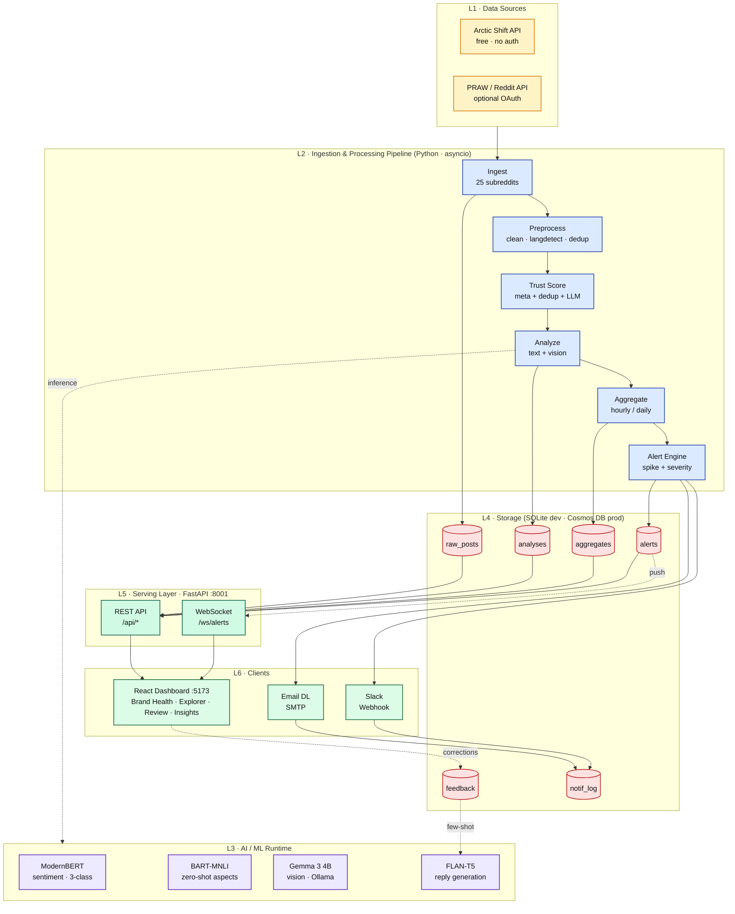
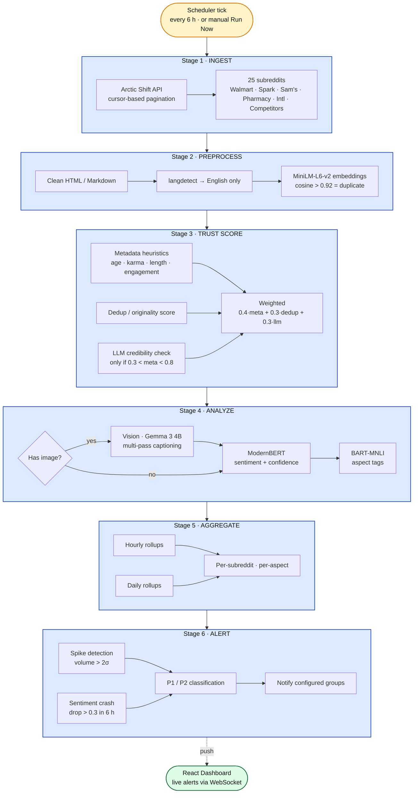
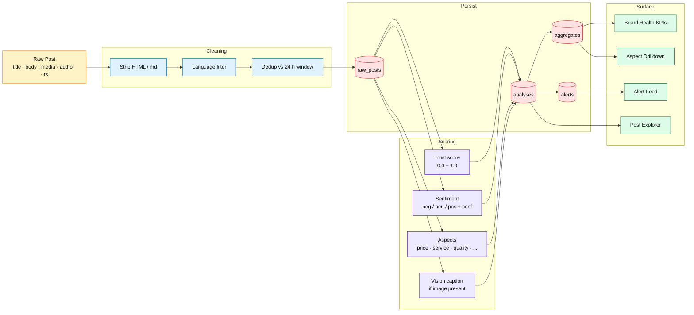
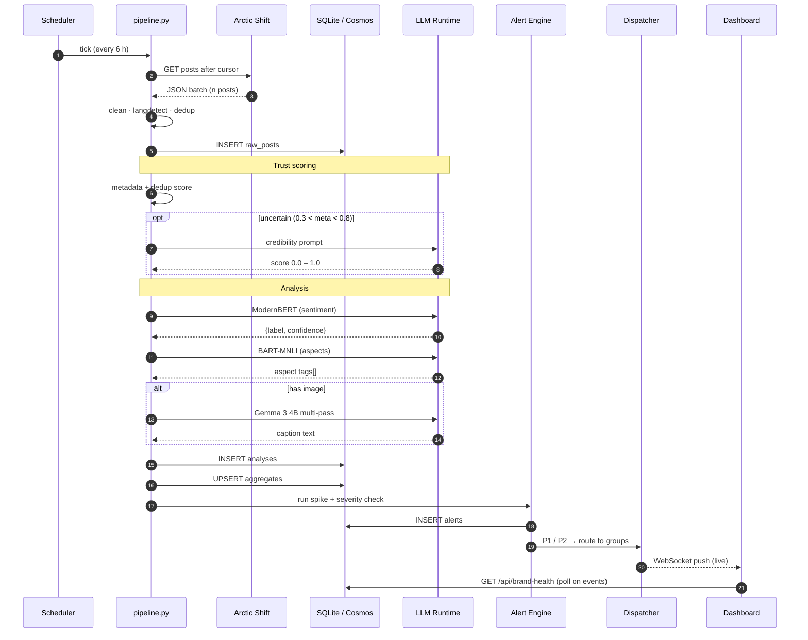

# Retail Sentiment Intelligence

## Real-Time Brand Health Monitoring via Reddit NLP Pipeline

**BITS ZG628T · Dissertation — Post Mid-Semester Progress Presentation**

**Vishal Singh** · ID No. **2020AA05641**
M.Tech in Artificial Intelligence & Machine Learning
Birla Institute of Technology & Science, Pilani (WILP)

*Dissertation work carried out at* **Walmart Global Tech, Bengaluru**
*Supervisor:* **Mr. Varunendra Pratap Singh** — Principal Software Engineer, Walmart Global Tech

---

## Agenda

## Part A · Mid-Semester Recap *(already presented)*

1. System Architecture & End-to-End Pipeline
2. Vision / Image Processing — Challenge & Mitigation
3. Trust Score & Confidence Calculations
4. ModernBERT — Domain Fine-Tuning Journey
5. Dashboard — Data Population & Sections
6. Notification System — Group-Based Routing

## Part B · Post Mid-Semester Work *(new — focus of this presentation)*

7. Review & Validate — Human-in-the-Loop
8. Post Explorer & Filtering
9. Post Lifecycle — Kanban Workflow
10. Insights & Competitor Analysis
11. Results & Future Work

---

# Part A · Mid-Semester Recap

> Quick walkthrough of what was built and demoed at mid-sem

---

# Recap 1 — System Architecture & Pipeline

> From Reddit data to actionable brand intelligence *(mid-sem)*

---

## High-Level System Architecture

> Layered view — external sources → pipeline core → AI runtime → storage → serving → clients



---

## Component Stack Summary

| Layer | Stack | Notes |
|-------|-------|-------|
| 🌐 Data Sources | Arctic Shift API + PRAW (optional) | Free, no auth needed |
| ⚙️ Pipeline | Python 3.13 · asyncio scheduler | 6-hour cadence + on-demand |
| 🤖 AI Runtime | HuggingFace (offline) + Ollama + Azure OpenAI (opt-in) | Local-first, modular |
| 💾 Storage | SQLite (dev) / Azure Cosmos DB (prod) | Pluggable backend |
| 🚀 API | FastAPI + WebSocket | Port **8001** |
| 💻 Frontend | React 18 + TypeScript + Vite + Tailwind | Port **5173** |
| 📧 Notifications | SMTP + Slack Webhook | Group-based routing |

---

## 6-Stage Pipeline — Detailed Flow



- **Total latency:** ~3–5 min for 25 subreddits
- **25 tracked subreddits** across 6 groups (Walmart core, Spark, Pharmacy, Sam's Club, International, Retail Competitors)
- **Incremental:** cursor-based ingestion — only new posts fetched per run

---

## Data Flow — From Raw Post to Dashboard KPI

> How a single Reddit post transforms into a scored, stored, and surfaced artefact



---

## Request Sequence — End-to-End



---

## Storage Schema — SQLite / Cosmos DB

| Table | Partition Key | Key Fields | Purpose |
|-------|---------------|------------|---------|
| `raw_posts` | `/subreddit` | id, title, body, author_hash, created_utc | Ingested data (privacy-safe) |
| `analyses` | `/subreddit` | post_id, sentiment, confidence, aspects, trust_score | AI analysis results |
| `aggregates` | `/time_window` | subreddit, window, metrics_json | Pre-computed KPIs |
| `feedback` | `/analyst_id` | post_id, correction, reply_text | Human corrections + replies |
| `alerts` | `/severity` | type, aspect, threshold_breached | Triggered anomalies |
| `notification_groups` | `id` | subreddits[], email_dl[], priority_filter | Notification routing config |
| `notification_log` | `group_id` | post_id, channel, status, sent_at | Delivery audit trail |

> **Privacy:** Reddit usernames are SHA-hashed before storage. 1-year retention by default.

---

# Recap 2 — Vision / Image Processing

> Eliminating hallucination in multimodal retail analysis

---

## The Problem: Image-Only Posts

- **3.9%** of Reddit posts have empty bodies — the complaint lives inside the **image**
- Screenshots of error messages, damaged products, receipts, app glitches
- Text-only pipeline misses these entirely → incomplete brand health

## Example

| Field | Value |
|-------|-------|
| Title | *"Can anyone help me? I need this fixed"* |
| Body | *(empty)* |
| Image | Screenshot of Walmart app error message |

- **Without vision AI** → post scored on title alone (useless)
- **With vision AI** → we extract the error text and understand the complaint

---

## Vision Model Selection — Why Gemma 3 4B

| Model | DocVQA | Size | Ollama | Verdict |
|-------|--------|------|--------|---------|
| **gemma3:4b** (Google) | **83** | 3.3 GB | ✅ Yes | ✅ **SELECTED** |
| LLaVA-1.5 7B | 28 | 4.7 GB | ✅ Yes | ❌ 3× worse OCR |
| LLaVA-1.6 8B | 75 | 5.5 GB | ✅ Yes | ❌ Larger, slower |
| BLIP-2 | N/A | 990 MB | ❌ No | ❌ Caption only |
| PaliGemma 2 3B | 81 | ~6 GB | ❌ No | ❌ No Ollama runtime |

**Why Gemma 3 4B wins:**
- Best DocVQA score under 4 GB (reads receipts, screenshots, app screens)
- Google-maintained (USA-based → Walmart policy compliant)
- Reuses existing Ollama infrastructure (`localhost:11434`)
- 4–6 s warm latency per image

---

## Initial Testing — 75% Failure Rate

| Metric | Result | Impact |
|--------|--------|--------|
| Overall failure rate | **75% (6/8)** | Most images get wrong captions |
| Hallucination rate | **50% (4/8)** | Model invents false details |
| Critical hallucinations | **37.5%** | Fake receipts, fake prices |
| Correct text extraction | **25% (2/8)** | Only memes/photos pass |

## What hallucination looked like

- "Walmart receipt: $39.99, handwritten 'Damaged Box'" → actually a product page, no price, no handwriting
- "Order status PENDING" → no PENDING text anywhere in image
- "12-pack of 12 fl oz Zero Sugar Dr Pepper" → single 42.3 fl oz regular bottle

**Bottom line: 1 in 2 image posts generated fabricated data → corrupted dashboards.**

---

## Root Cause Analysis

| Root Cause | Technical Explanation |
|------------|----------------------|
| 768 px fixed resize | Small text becomes unreadable at reduced resolution |
| 4 B parameter limit | Struggles with multi-element reasoning (button + error + context) |
| No dynamic resolution | Entire image processed at one fixed scale |
| Hallucination under uncertainty | Invents plausible details rather than admitting it can't see |
| No context awareness | Confuses screenshots with physical displays |

---

## Academic Research — 5 Papers Reviewed (2023–2025)

| Paper | Key Technique | Deployable at Walmart? |
|-------|---------------|------------------------|
| UReader (Tencent) | Shape-adaptive cropping | ❌ China-origin |
| TextMonkey (USTC) | Shifted window attention | ❌ China-origin |
| DocOwl 1.5 (Alibaba) | Structure-aware parsing | ❌ China-origin |
| InternVL2 (Shanghai AI Lab) | Tile-based processing | ❌ China-origin |
| Qwen2.5-VL (Alibaba) | Dynamic resolution + multimodal RoPE | ❌ China-origin |

> **Every single model that solves our problem is from a Chinese lab — blocked by Walmart's vendor policy.**

## What all 5 papers agree on

> Dynamic / native resolution processing with **tile-based attention** is THE solution to fine-grained text recognition. Fixed-size image resizing is the dominant failure mode — not model architecture itself.

---

## Our Strategy — Take the Ideas, Not the Models

```
PAPERS SAY:    Use models with native tiling + dynamic resolution
WALMART SAYS:  You can't use any of those models (China-origin)
OUR SOLUTION:  Implement their TECHNIQUES as CODE on our compliant model
```

| Technique from Papers | We Implement As |
|----------------------|-----------------|
| Tile-based processing (InternVL2) | Split image into 2–4 crops ourselves, send each to gemma3:4b |
| Structure-first parsing (DocOwl 1.5) | First pass asks "what type of image is this?" before reading text |
| Focused text extraction (UReader) | Dedicated "read ALL text verbatim" prompt per tile |
| Resolution preservation (Qwen2.5-VL) | Tiling gives each crop 2–4× effective resolution without resizing |

> Same model, same hardware — **smarter calling strategy**.

---

## Multi-Pass Captioning Pipeline (The Fix)

```
┌─────────────────────────────────────────────────────────────────┐
│                  MULTI-PASS PIPELINE                            │
├─────────────────────────────────────────────────────────────────┤
│                                                                 │
│  Pass 1: STRUCTURE  (from DocOwl 1.5)                           │
│  ┌──────────┐                                                   │
│  │ Full img │──▶ "What TYPE is this image?"                     │
│  └──────────┘    → screenshot / photo / receipt / app / meme    │
│       │                                                         │
│       │  If text-heavy → continue tiling                        │
│       ▼                                                         │
│                                                                 │
│  Pass 2: TILE  (from InternVL2)                                 │
│  ┌───┬───┐  Split image into 2–4 crops                          │
│  ├───┼───┤  Each crop = 2–4× higher effective resolution        │
│  └───┴───┘                                                      │
│       │                                                         │
│       ▼                                                         │
│                                                                 │
│  Pass 3: EXTRACT  (from UReader)                                │
│  ┌──────────┐                                                   │
│  │ Tile N   │──▶ "Read ALL text in this region verbatim"        │
│  └──────────┘    → quoted text, prices, errors, buttons         │
│       │                                                         │
│       ▼                                                         │
│                                                                 │
│  Pass 4: MERGE  (text-only LLM call — NO image)                 │
│  ┌──────────────────────────────────────────────┐               │
│  │ "Combine these text observations into 2–4    │               │
│  │  sentences. Do NOT invent anything."          │──▶ CAPTION   │
│  │  (Model never sees the image → CANNOT lie)   │               │
│  └──────────────────────────────────────────────┘               │
└─────────────────────────────────────────────────────────────────┘
```

> **Key anti-hallucination insight:** By removing the image from the final generation step, the model **physically cannot invent visual details** — it can only work with text actually extracted in Pass 3.

---

## Results — Hallucination Eliminated

## Initial 8-image validation

| Metric | Before (Single-Pass) | After (Multi-Pass) | Change |
|--------|---------------------|--------------------|--------|
| Hallucination rate | 50% (4/8) | **0% (0/8)** | **↓ 100%** |
| Overall failure rate | 75% (6/8) | 25% (2/8) | ↓ 67% |
| Correct text extraction | 25% (2/8) | 75% (6/8) | **3× better** |
| Fabricated claims | 8 total | **0** | Eliminated |
| Avg latency / image | ~5 s | ~15 s | 3× (acceptable) |

## Scaled validation — 25 images

| Verdict | Count | Percentage |
|---------|-------|------------|
| ✅ PASS (correct, no hallucination) | **22 / 25** | **88%** |
| ⚠️ PARTIAL (correct but sparse) | 3 / 25 | 12% |
| ❌ FAIL (missed critical info) | **0 / 25** | **0%** |

- Single-pass hallucinated on **44%** (11/25) of images at scale
- Multi-pass hallucinated on **0%** (0/25)
- **80%** of Walmart Reddit complaint images are screenshots/app screens — exactly the category where single-pass fails

---

# Recap 3 — Trust Score & Confidence

> How we validate post credibility and model certainty

---

## Trust Score — Weighted Combination Formula

$$
\text{trust\_score} = 0.4 \times \text{metadata} + 0.3 \times \text{dedup} + 0.3 \times \text{llm\_credibility}
$$

Each component is normalized to **[0, 1]** and the final score is clamped.

## Component 1: Metadata Heuristics (weight: 0.4)

$$
\text{meta} = w_{base} + w_{age} \cdot age + w_{karma} \cdot karma + w_{length} \cdot length + w_{eng} \cdot engagement
$$

| Signal | Formula | Default Weight |
|--------|---------|----------------|
| Base floor | constant | 0.15 |
| Account age | `min(account_age_days / 365, 1.0)` | 0.20 |
| Karma | `min(total_karma / 5000, 1.0)` | 0.20 |
| Content length | `min((len(title) + len(body)) / 200, 1.0)` | 0.30 |
| Engagement | `min(max(reddit_score, 0) / 20, 1.0)` | 0.15 |

## Component 2: Dedup / Originality (weight: 0.3)

- MiniLM-L6-v2 sentence embeddings → cosine similarity vs prior posts
- `max_sim > 0.92` → penalize (likely repost / copypasta)

## Component 3: LLM Credibility (weight: 0.3)

- Only invoked when `0.3 < metadata_score < 0.8` (ambiguous zone) — cost control
- Rule-based heuristic (free) or cloud LLM call
- Checks: promotional language, URL stuffing, ALL-CAPS, retail insider terms

> **Low-trust posts are FLAGGED for review — never dropped.** (Requirement R5)

---

## Credibility Signals — Negative & Positive

| Signal Type | Indicator | Score Impact |
|-------------|-----------|--------------|
| ❌ Negative | Promotional language (≥ 2 phrases) | −0.25 |
| ❌ Negative | URL stuffing (≥ 3 links, short text) | −0.20 |
| ❌ Negative | Karma/age mismatch (new account, high karma) | −0.20 |
| ❌ Negative | Excessive CAPS (> 40% letters) | −0.15 |
| ❌ Negative | New account + promotional | −0.20 |
| ✅ Positive | Retail insider terms (≥ 2: OGP, ASM, CAP2, Spark...) | +0.25 |
| ✅ Positive | Long-form organic text (> 600 chars, no links) | +0.15 |
| ✅ Positive | Single retail insider term | +0.10 |

---

## Confidence Score — Model Certainty

**Confidence** = softmax probability of the predicted class.

## How it's calculated

1. ModernBERT outputs **logits** for `[negative, neutral, positive]`
2. **Softmax** converts to probabilities: P(neg), P(neu), P(pos)
3. `confidence = max(P(neg), P(neu), P(pos))`

## Thresholds used in the system

| Threshold | Value | Source |
|-----------|-------|--------|
| Analysis confidence | ≥ 0.7 | `config/models.yaml` |
| Notification P1 | trust ≥ 0.70 **AND** confidence ≥ 0.80 | dispatcher.py |
| Notification P2 | trust ≥ 0.50 **AND** confidence ≥ 0.60 | dispatcher.py |

## Combined Priority Formula

```
P1 = (trust_score ≥ 0.70) ∧ (confidence ≥ 0.80)   → immediate action
P2 = (trust_score ≥ 0.50) ∧ (confidence ≥ 0.60)   → review-worthy
< P2 → no notification triggered (still visible in dashboard)
```

> Dashboard displays **both** trust and confidence per post for analyst transparency.

---

# Recap 4 — ModernBERT Fine-Tuning

> Domain-specialized long-context sentiment classification

---

## Why ModernBERT over RoBERTa?

## Thesis Claim

> Long-context, domain-fine-tuned encoders **beat** short-context Twitter-trained baselines on Reddit-flavored retail complaints.

## RoBERTa Limitations
- Only **512 token** context → truncates long Reddit posts
- Trained on Twitter → different register from Reddit
- No domain knowledge of retail / Walmart terminology

## ModernBERT Advantages
- **8192 token** context (16× longer)
- Supports full Reddit complaint posts without truncation
- Modern architecture optimizations (RoPE, GeGLU, alternating attention)
- Fine-tunable with curriculum learning

---

## 3-Stage Curriculum Training

| Stage | Dataset | Epochs | Purpose |
|-------|---------|--------|---------|
| 1. Generic Sentiment | TweetEval-sentiment (45 K tweets) | 2 | Polarity grounding |
| 2. Reddit Register | GoEmotions-3class (54 K Reddit comments) | 2 | Reddit language patterns |
| 3. Domain Specialization | Walmart-200 (5-fold CV) | up to 15 (patience 3) | Retail fine-tuning |

## Training Configuration
- `max_length = 1024` tokens (key lever for long-context advantage)
- Effective batch size **32** (per-device BS=8 × grad accum=4)
- Class weights: `neg=0.52, neu=1.03, pos=8.33` (inverse frequency)
- Minority oversampling to ~100/class per training fold
- Early stopping on `eval_macro_f1` with patience=3
- Hardware: Apple M-series (MPS backend)

---

## Key Challenges & Mitigations

| Challenge | Impact | Mitigation |
|-----------|--------|------------|
| Synthetic benchmark (77-char bodies) | Cannot test long-context | Built real 200-post benchmark (min 300 chars) |
| Corp network blocked HuggingFace | Cannot download models | Restart + hotspot + offline triad env vars |
| Stage 3 macro F1 = 0.40 (catastrophic) | Positive class collapsed | Class weights + oversampling + curriculum |
| Eval showed F1 = 1.0 (memorization) | Leakage — useless result | Switched to **out-of-fold CV predictions** |
| Long-context not showing up | `max_length=512` defeats purpose | Retrained at `max_length=1024` |
| AI-assist acceptance = 100% | Defensibility concern | Disclosed + blind recheck planned |

---

## Final Results — ModernBERT vs RoBERTa

(5-fold out-of-fold cross-validated)

| Metric | RoBERTa | ModernBERT v2 | Improvement |
|--------|---------|---------------|-------------|
| **Macro F1 (overall)** | 0.6272 | **0.7642** | **+0.137 (+22%)** |
| F1 negative | 0.7967 | 0.8779 | +0.081 |
| F1 neutral | 0.6087 | 0.7480 | +0.139 |
| F1 positive | 0.4762 | 0.6667 | +0.190 |
| **Long-post F1 (≥ 512 tokens)** | 0.2778 | **1.0000** | **+0.722** ✨ |
| Short-post F1 (n=193) | 0.6360 | 0.7619 | +0.126 |
| Latency (ms/post, MPS) | 6.5 ms | 11.9 ms | +5.4 ms |

> The long-context hypothesis is **proven**: on posts ≥ 512 tokens, ModernBERT scores a perfect 1.00 vs RoBERTa's 0.28.

---

## Training Evidence — Artifacts on Disk

> Proof that ModernBERT was actually fine-tuned in-house (not a downloaded checkpoint)

## Training pipeline

| Stage | Script / File | Output |
|-------|---------------|--------|
| Data collection | [`scripts/fetch_real_benchmark.py`](../../scripts/fetch_real_benchmark.py) | `data/benchmark_real_200.jsonl` — 200 real Reddit posts, body 300–3604 chars |
| Human labeling | [`scripts/label_benchmark.py`](../../scripts/label_benchmark.py) (interactive) | `human_sentiment` field per row (neg=127 · neu=65 · pos=8) |
| Curriculum trainer | [`scripts/train_modernbert_sentiment.py`](../../scripts/train_modernbert_sentiment.py) | 3-stage checkpoints under `models/modernbert_walmart/` |
| Honest evaluation | [`scripts/eval_sentiment_models.py`](../../scripts/eval_sentiment_models.py) | `models/modernbert_walmart/eval_results.json` |
| Thesis chapter | [`docs/MODEL_COMPARISON.md`](../MODEL_COMPARISON.md) | ~290-line write-up of methodology + results |

## Checkpoints produced (on disk today)

```
models/modernbert_walmart/
├── stage1_tweeteval/      # after Stage 1  — TweetEval, macro F1 = 0.7267
├── stage2_goemotions/     # after Stage 2  — GoEmotions, macro F1 = 0.7028
├── stage3_walmart/        # 5-fold CV artefacts (cv_results.json, per-fold checkpoints)
├── final/                 # production checkpoint (max_length=1024, trained on all 200)
├── final_max512/          # v1 ablation (max_length=512) — kept for comparison
└── eval_results.json      # aggregated CV metrics + per-length-bucket F1
```

## Reproduction command (offline)

```bash
HF_HUB_OFFLINE=1 TRANSFORMERS_OFFLINE=1 HF_DATASETS_OFFLINE=1 \
  /opt/miniconda3/bin/python scripts/train_modernbert_sentiment.py \
  --stages 1,2,3 --folds 5 --max-length 1024 --batch-size 8
```

## Why not just use RoBERTa? — Decision matrix

| Criterion | RoBERTa (`cardiffnlp/twitter-roberta-base`) | ModernBERT (`answerdotai/ModernBERT-base`) | Winner |
|-----------|--------------------------------------------|---------------------------------------------|--------|
| Context length | 512 tokens | **8192 tokens** (16×) | ModernBERT |
| Training corpus | Twitter (short, casual) | Web + code + long docs | ModernBERT |
| Long-post F1 (≥512 tok) | 0.2778 | **1.0000** | **ModernBERT** |
| Overall Macro F1 | 0.6272 | **0.7642** | ModernBERT |
| Latency (MPS) | **6.5 ms** | 11.9 ms | RoBERTa |
| Off-the-shelf quality | Strong baseline | Weak without fine-tuning | RoBERTa |
| Fine-tuning cost | Same | Same | Tie |

**Decision:** ModernBERT wins on the metrics that matter (accuracy + long-context). We accept +5 ms latency for +0.137 macro F1. RoBERTa is retained as fallback in [`config/models.yaml`](../../config/models.yaml) if the local checkpoint is missing.

## Pipeline wiring (production)

- [`config/models.yaml`](../../config/models.yaml) — `sentiment.model = models/modernbert_walmart/final`, `max_length: 1024`
- [`src/analysis/llm_client.py`](../../src/analysis/llm_client.py) — `HuggingFaceSentimentClient` loads from the registry (with RoBERTa fallback)
- Smoke test at integration time: **5/5 correct** on first 5 real benchmark posts (`model_used = models/modernbert_walmart/final`)

---

# Recap 5 — Dashboard & Data Population

> From pipeline output to actionable insights on screen

---

## Dashboard Pages — Navigation Structure

| Page | Priority | Purpose | Key Metric |
|------|----------|---------|------------|
| Brand Health | P0 | At-a-glance KPIs & trends | Overall sentiment score |
| Post Explorer | P1 | Search / filter all posts | Volume + sentiment distribution |
| Review & Validate | P0 | Correct labels + draft replies | Accuracy improvement |
| Post Lifecycle | P0 | Kanban workflow (triaged → resolved) | Resolution rate |
| Insights | P1 | AI-generated competitor analysis | Issue rankings |
| Pipeline Control | P1 | Monitor & trigger runs | Jobs, cursors, health |
| Notifications | P1 | Group-based alert routing config | Delivery log |

---

## Brand Health — KPI Tiles with Embedded Breakdowns

5 tiles, each with a main value + lifecycle breakdown rows + dual navigation:

```
┌──────────┐  ┌──────────┐  ┌──────────┐  ┌──────────┐  ┌──────────┐
│  Total   │  │ Negative │  │ Priority │  │ Positive │  │Lifecycle │
│  Posts   │  │  Posts   │  │  (P1+P2) │  │  Posts   │  │  Status  │
│  ────    │  │  ────    │  │  ────    │  │  ────    │  │  ────    │
│ breakdown│  │ by conf  │  │ P1 / P2  │  │ by conf  │  │ by state │
└──────────┘  └──────────┘  └──────────┘  └──────────┘  └──────────┘
```

## Each tile supports
- **Single-click** → navigate to Post Explorer (pre-filtered)
- **Dropdown** → dual nav to Post Explorer OR Review & Reply

## Data sources
- `/api/brand-health?range=today` — aggregated sentiment counts
- `/api/brand-health/priority-negatives` — P1 + P2 tier counts
- `/api/lifecycle` — state distribution

---

## How Data Populates the Dashboard

```
Pipeline Output → SQLite Tables → FastAPI Endpoints → React Components
```

| SQLite Table | API Endpoint | UI Component |
|--------------|--------------|--------------|
| `analyses` (sentiment, confidence, aspects, trust) | `/api/brand-health`, `/api/posts`, `/api/segments` | KPI Tiles, Trend Charts, Aspect Heatmap |
| `aggregates` (hourly/daily) | `/api/brand-health?range=week/month` | Trend Line, Volume Ticker |
| `alerts` (spike, severity) | `/api/alerts` + WebSocket push | Alert Feed (real-time) |
| `feedback` (corrections) | `/api/review/*`, `/api/review/{id}/draft` | Review Queue, Draft Replies |
| `notification_log` | `/api/notifications/log` | Notification audit page |
| `post_lifecycle` | `/api/lifecycle` | Kanban board |

> **WebSocket** is used for real-time alert push — no polling needed.

---

# Recap 6 — Notification System

> Group-based routing for P1 / P2 priority posts

---

## Notification System — Architecture

```
Pipeline analyzes post → classify_priority(trust, confidence)
    │
    ├── Not P1/P2? → Skip (no notification)
    │
    └── P1 or P2? → Find matching notification groups
            │
            ├── Group matches subreddit + priority filter?
            │       │
            │       ├── Email DL configured → Send email
            │       └── Slack channel configured → Send Slack
            │
            └── Log to notification_log table (audit trail)
```

## Priority Classification

- **P1**: `trust ≥ 0.70` AND `confidence ≥ 0.80` (high-signal, immediate action)
- **P2**: `trust ≥ 0.50` AND `confidence ≥ 0.60` (review-worthy, lower urgency)

## Routing Model
- Groups are configured **per subreddit-set** → different teams own different subreddits
- Each group has its own email DL, Slack channel, and priority filter (P1, P2, or both)

---

## Notification Configuration Page (Frontend)

Admin UI at `/notifications` allows:

- ✅ Create notification groups (name, subreddits, email DL, Slack)
- ✅ Quick-add subreddits by category (Walmart core, Spark, Pharmacy, International, Sam's Club, Competitors)
- ✅ Priority filter: choose P1, P2, or both per group
- ✅ Enable / disable groups with toggle
- ✅ **Test (dry-run)** — simulates notification without sending
- ✅ View delivery log — audit trail of all sent notifications
- ✅ Delete groups

## API Endpoints (8 total)

| Method | Path | Purpose |
|--------|------|---------|
| GET | `/api/notifications/config` | Overall config + groups |
| GET | `/api/notifications/groups` | List all groups |
| POST | `/api/notifications/groups` | Create new group |
| PUT | `/api/notifications/groups/{id}` | Update group |
| DELETE | `/api/notifications/groups/{id}` | Delete group |
| POST | `/api/notifications/test/{id}` | Dry-run test |
| GET | `/api/notifications/log` | Delivery audit |
| GET | `/api/notifications/subreddits` | Available subreddit list |

---

# Part B · Post Mid-Semester Work

> New capabilities built after mid-sem — analyst workflows, lifecycle tracking, competitor insights

## What's new since mid-sem

| # | Capability | Why it was added |
|---|-----------|------------------|
| 1 | Review & Validate queue | Close the loop on AI mistakes; harvest labels for retraining |
| 2 | Post Explorer & filtering | Give analysts fast search across all ingested posts |
| 3 | Post Lifecycle (Kanban) | Track a complaint from *New* → *Resolved* with SLA visibility |
| 4 | Insights & Competitor Analysis | Benchmark Walmart vs Target / Costco / Kroger on shared aspects |
| 5 | Results & Future Work | Consolidated metrics + Sem-5 roadmap |

---

# Post-Midsem 1 — Review & Validate

> Human-in-the-loop correction and reply generation

---

## Review Queue — Human-in-the-Loop

**Purpose:** Analysts correct AI labels and draft replies to negative posts.

## Workflow
1. Queue shows posts sorted by priority (P1 first)
2. Analyst reviews sentiment + aspects (correct if wrong)
3. Click "Generate Drafts" → two reply options generated

## Dual-Draft Reply Generation

```
┌─────────────────────┐    ┌─────────────────────┐
│  Draft A            │    │  Draft B            │
│  Smart Composer     │    │  FLAN-T5-base       │
│  (keyword extraction│    │  (multi-temp        │
│  + phrase pools)    │    │   sampling + scorer)│
└─────────────────────┘    └─────────────────────┘
       │                            │
       └────────► Analyst picks ◄───┘
                       │
                  ┌────▼────┐
                  │  Edit   │
                  └────┬────┘
                       │
                  Post to Reddit
```

## Learning Loop

- Posted replies saved to `feedback` table
- Become **few-shot examples** for future draft generation
- Tone matching improves over time without explicit retraining

---

# Post-Midsem 2 — Post Explorer

> Search, filter, and deep-dive into analyzed posts

---

## Post Explorer — Features

**Purpose:** Browse all analyzed posts with powerful filtering.

## Filters Available
- **Sentiment:** negative / neutral / positive
- **Confidence:** threshold slider
- **Trust score:** threshold slider
- **Subreddit:** multi-select from 25 tracked
- **Aspect:** delivery, product_quality, returns, customer_support, pricing, app_website
- **Date range:** today, week, month, custom
- **Text search:** full-text across titles & bodies

## Per-Post Card Shows
- Title + body excerpt
- Sentiment badge (color-coded) + confidence %
- Trust score indicator
- Aspect tags (multi-aspect supported)
- Subreddit + post time
- Reddit link → opens original thread
- Actions: **Review**, **Add to Lifecycle**, **View Details**

---

# Post-Midsem 3 — Post Lifecycle

> Kanban workflow from triage to resolution

---

## Post Lifecycle — Kanban Board

## States: Triaged → Acknowledged → In Progress → Resolved

```
┌─────────────┐  ┌─────────────┐  ┌─────────────┐  ┌─────────────┐
│   TRIAGED   │  │ ACKNOWLEDGED│  │ IN PROGRESS │  │  RESOLVED   │
│             │  │             │  │             │  │             │
│  New P1/P2  │  │  Assigned   │  │  Reply being│  │  Reply      │
│  posts land │  │  to analyst │  │  drafted    │  │  posted     │
│  here       │  │             │  │             │  │             │
└──────┬──────┘  └──────┬──────┘  └──────┬──────┘  └─────────────┘
       │                │                │
       └── Acknowledge ─┘── Start Work ──┘── Resolve
```

## Resolve Modal (2-step flow)

**Step 1:** Save action note + optional LLM-drafted reply
- "Save reply & open Reddit" — copies reply to clipboard, opens thread
- OR "Resolve (no reply needed)" — closes without posting

**Step 2:** Paste reply on Reddit → return to dashboard → "Mark Resolved"

> All state transitions are logged with timestamps for SLA tracking.

---

# Post-Midsem 4 — Insights & Competitor Analysis

> AI-generated strategic intelligence from raw data

---

## Insights Page — What It Provides

## 1. Issue Rankings
- Top negative issues ranked by **volume × severity × recency**
- Grouped by aspect (delivery, pricing, app, etc.)
- Trend arrows showing improvement or deterioration

## 2. Competitor Pulse
- Compare sentiment: Walmart vs **Costco, Target, Amazon**
- Cross-mentioned posts (e.g., "Walmart vs Costco" comparisons)
- Subreddit-level breakdown per competitor

## 3. LLM Summarization
- Natural-language summaries of the week's top themes
- Suggested action items for product teams
- Emerging-topic detection (new phrase clusters appearing in ≥ 5 posts / 2 hrs)

## 4. Aspect Drilldown
- 6-category taxonomy: `delivery`, `product_quality`, `returns`, `customer_support`, `pricing`, `app_website`
- Per-aspect: sentiment trend, volume, top sub-topics (word cloud), representative posts

---

# Post-Midsem 5 — Results & Future Work

> What we achieved and what's next

---

## Key Achievements — Post Midsem

| Area | Achievement | Evidence |
|------|-------------|----------|
| **ModernBERT** | Macro F1: 0.6272 → **0.7642** (+22%) | 5-fold OOF CV |
| **Long-context** | Long-post F1: 0.28 → **1.00** (+722%) | 7 posts ≥ 512 tokens |
| **Vision** | Hallucination: 50% → **0%** | 8 + 25 image validation |
| **Vision** | Text extraction: 25% → **75%** | Multi-pass pipeline |
| **Pipeline** | 25 subreddits, every 6 h (automated) | Arctic Shift API |
| **Dashboard** | 7 pages, real-time WebSocket alerts | React + FastAPI |
| **Notifications** | Group-based P1/P2 routing | Email + Slack channels |
| **Lifecycle** | Full Kanban with 2-step resolve | Triage → Resolved |

---

## Technical Stack Summary

| Layer | Technology | Key Decision |
|-------|------------|--------------|
| Backend | Python 3.13 + FastAPI + SQLite | Free, local-first, modular |
| Frontend | React 18 + TypeScript + Vite + Tailwind | Modern SPA, responsive |
| Sentiment | ModernBERT (fine-tuned, 1024 tokens) | Domain-specialized, offline |
| Aspects | BART-MNLI (zero-shot classification) | No training needed |
| Vision | Gemma 3 4B via Ollama (multi-pass) | Policy compliant, no hallucination |
| Reply Gen | FLAN-T5 + Smart Composer (dual draft) | Learning loop via feedback |
| Trust | Metadata + Dedup + LLM (weighted) | Flag, don't drop |
| Scheduling | asyncio lifespan (6 h) + manual | Cursor-based incremental |
| Observability | structlog + cost ledger (JSONL) | Per-call LLM cost tracking |

---

## Future Work

- ☐ Azure Cosmos DB migration (production-grade storage)
- ☐ Twitter / X integration as second data source
- ☐ 3-seed ensemble for ModernBERT (+0.01–0.03 F1, tighter variance)
- ☐ Gemma 3 12B upgrade for remaining edge-case images
- ☐ Spanish language support (bilingual retail communities)
- ☐ Azure AD authentication for multi-user access
- ☐ Automated retraining pipeline (feedback loop → model updates)
- ☐ Slack bot integration for inline notification responses
- ☐ Blind 25-post recheck for ModernBERT defensibility

---

# Thank You

## Retail Sentiment Intelligence

**Post Mid-Semester Presentation**

Questions?

---

## Appendix — Reference Documentation

| Topic | Reference File |
|-------|----------------|
| System Architecture | `ARCHITECTURE.md` |
| Pipeline & Tools | `PIPELINE_AND_TOOLS.md` |
| Dashboard Design | `DASHBOARD_DESIGN.md` |
| Requirements (frozen) | `REQUIREMENTS.md` |
| Implementation Plan | `IMPLEMENTATION_PLAN.md` |
| ModernBERT Journey | `docs/MODERNBERT_JOURNEY.md` |
| Vision Pipeline Story | `docs/LIVE_DEMO_VISION_PIPELINE.md` |
| Vision Model Comparison | `docs/VISION_MODEL_COMPARISON_v1.md` |
| Model Comparison (Thesis) | `docs/MODEL_COMPARISON.md` |
