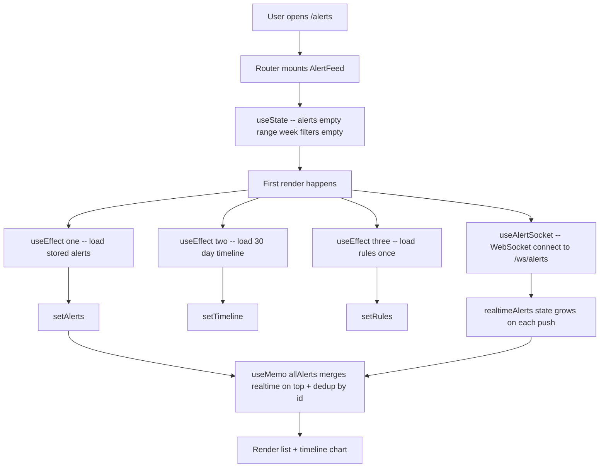
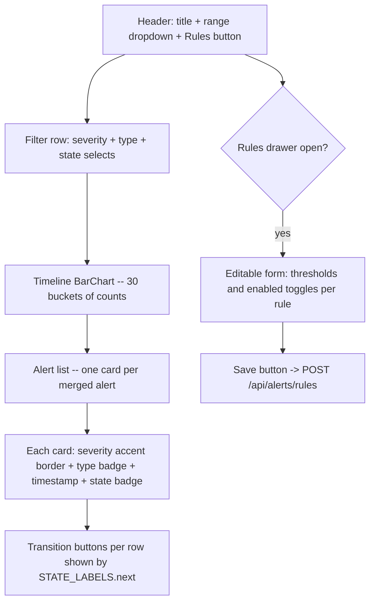
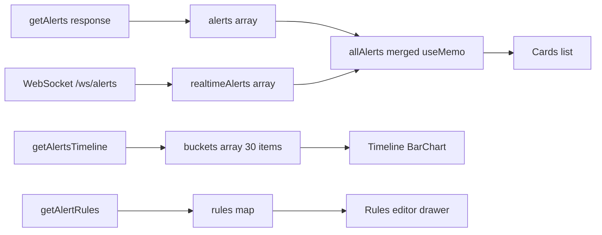
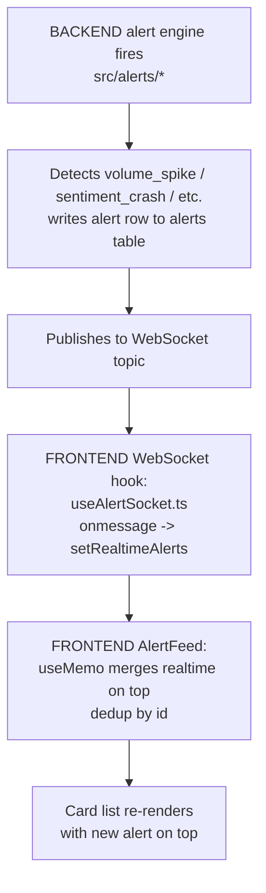

# Alert Feed — Page Deep-Dive

Real-time alerts board at `/alerts`. Combines historical alerts from the DB with **live WebSocket** pushes. Analyst can filter, drill in, transition state (acknowledge / investigate / resolve), and edit the alert rules inline.

- **URL** — `http://localhost:3001/alerts`
- **Frontend page** — [`frontend/src/pages/AlertFeed.tsx`](../../../frontend/src/pages/AlertFeed.tsx)
- **WebSocket hook** — [`frontend/src/useAlertSocket.ts`](../../../frontend/src/useAlertSocket.ts)
- **Backend routes** — [`src/dashboard/api.py`](../../../src/dashboard/api.py) → `/api/alerts/*`, WS `/ws/alerts`
- **Alert engine** — [`src/alerts/`](../../../src/alerts/)

---

<h2>Section 1 — Cheat sheet</h2>

- 4 alert types: `volume_spike`, `sentiment_crash`, `emerging_topic`, `competitor_negative`.
- 3 severities: `high`, `medium`, `low` (+ `critical` shown same as high).
- State machine: `new -> acknowledged -> investigating -> resolved`.
- Historical alerts come via `GET /api/alerts` (filterable by range/severity/type/state).
- Live alerts come via WebSocket `/ws/alerts` and are merged **on top** of the stored list, dedup by `id`.
- Rules are editable inline via `POST /api/alerts/rules` (updates thresholds).

---

<h2>Section 2 — File map</h2>

```
AlertFeed.tsx
+-- AlertFeed()             -- exported page
+-- useAlertSocket()        -- separate hook for WS subscription
+-- inline JSX              -- filter row + timeline BarChart + alert cards list + rules editor drawer
```

---

<h2>Section 3 — Page-load flow</h2>



---

<h2>Section 4 — What React renders</h2>



---

<h2>Section 5 — Data flow</h2>



Merge policy: realtime first (newest state), then stored alerts filling in the gaps (dedup by `id`).

---

<h2>Section 6 — User actions</h2>

- **Range / severity / type / state filters** — refire `getAlerts` and `getAlertsTimeline` (both watch the same dep list).
- **Transition button on a card** — `POST /api/alerts/{id}/state` with next state. Server validates. Optimistically updates the row in place, then a full reload could be added but isn't (single-row update is sufficient).
- **Rules button** — opens the drawer.
- **Save Rules** — `POST /api/alerts/rules` with the full patched rules map. Server writes back and returns the canonical rules.

Follow the code:

- Merge memo — [AlertFeed.tsx#L72-L77](../../../frontend/src/pages/AlertFeed.tsx#L72-L77)
- `handleStateChange` — [AlertFeed.tsx#L79-L88](../../../frontend/src/pages/AlertFeed.tsx#L79-L88)
- `saveRules` — [AlertFeed.tsx#L95-L104](../../../frontend/src/pages/AlertFeed.tsx#L95-L104)

---

<h2>Section 7 — Full call chain (alert engine -> WebSocket -> React -> user)</h2>



---

<h2>Section 8 — File map table</h2>

| Layer | File | Symbol |
|---|---|---|
| **UI page** | [AlertFeed.tsx](../../../frontend/src/pages/AlertFeed.tsx) | `AlertFeed()` |
| **WS hook** | [useAlertSocket.ts](../../../frontend/src/useAlertSocket.ts) | `useAlertSocket()` |
| **API client** | [frontend/src/api.ts](../../../frontend/src/api.ts) | `getAlerts`, `getAlertsTimeline`, `getAlertRules`, `updateAlertState`, `updateAlertRules` |
| **API routes** | [api.py](../../../src/dashboard/api.py) | `/api/alerts`, `/api/alerts/timeline`, `/api/alerts/rules`, WS `/ws/alerts` |
| **Alert engine** | [src/alerts](../../../src/alerts) | Detectors + writers |
| **DB** | `data/local.db` | `alerts` table |

---

<h2>Section 9 — UI stack</h2>

- **Recharts** — `BarChart` for the 30-bucket timeline.
- **lucide-react** — used inside the rules drawer + severity badges (indirectly).
- **WebSocket** — native browser API wrapped in a custom hook.

---

<h2>Section 10 — Common questions</h2>

**Q. Why merge realtime on top of stored?**
The stored list is a snapshot at fetch time. New alerts fire while the page is open. Merging keeps the "just happened" ones visible without a manual refresh, and dedup prevents duplicates when the same alert appears in both sources (WS delivered before stored fetch, or vice versa).

**Q. What triggers the WebSocket?**
Server-side `alerts` module publishes on write. See [`src/alerts/`](../../../src/alerts/) for detectors.

**Q. What if the WebSocket drops?**
The hook auto-reconnects. Even without WS, the page still works — timeline and stored alerts populate normally; live alerts just don't stream in until the socket returns.

**Q. Where are the alert thresholds actually stored?**
`alerts_rules` table (JSON per rule). The drawer edits the same JSON that the alert engine reads at each detection cycle.

**Q. Is `critical` distinct from `high`?**
Visually treated the same. Kept as a separate enum so future work can add a stricter treatment (e.g. paging / auto-escalation) without a schema change.

**Q. How do I know whether a sentiment crash came from Walmart or competitors?**
New `sentiment_crash` alerts now include:

- `affected_macro_group`: `walmart` or `competitor`
- `affected_macro_delta`: larger of Walmart-vs-yesterday and competitor-vs-yesterday delta
- `competitor_delta`, `walmart_delta`: side-by-side WoW change
- `top_subreddits_today`: top subreddits by today's negative share

The alert title also includes the affected group, for example:
`Sentiment crash (Competitors): negative ratio jumped +33% vs yesterday`.

**Q. Competitor negative: what threshold should we use?**
Use week-over-week negative-ratio delta, not sigma.

Default rule values:

- `delta_threshold = 0.15`
- `min_posts_per_window = 25`

Numerical example:

- Previous 7 days in `r/target`: 30 posts, 9 negative -> `prev_ratio = 9/30 = 0.30`
- Last 7 days in `r/target`: 40 posts, 20 negative -> `this_ratio = 20/40 = 0.50`
- Delta: `0.50 - 0.30 = 0.20`

Since `0.20 >= 0.15` and both windows have at least 25 posts, the alert triggers.
Severity is `high` only when delta is `>= 0.25`; otherwise `medium`.
