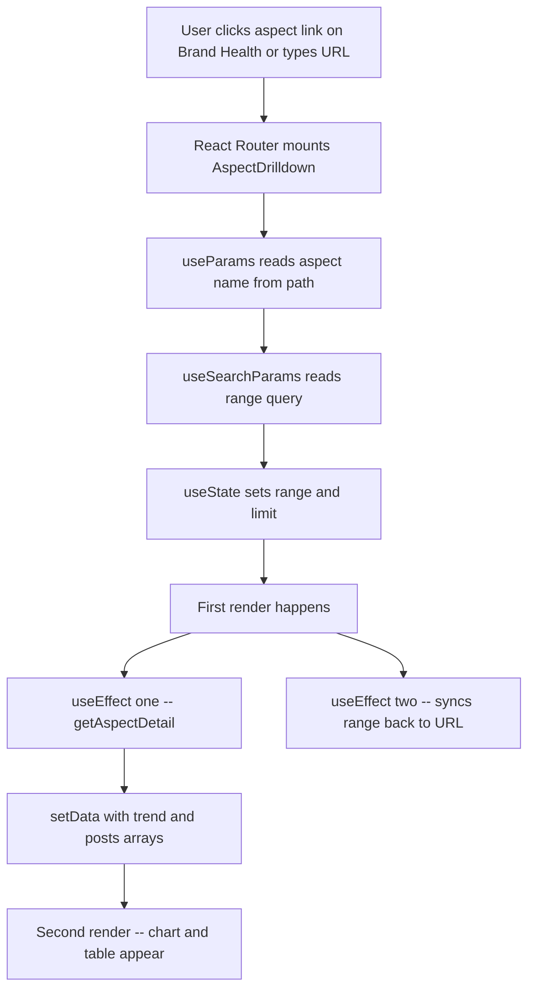
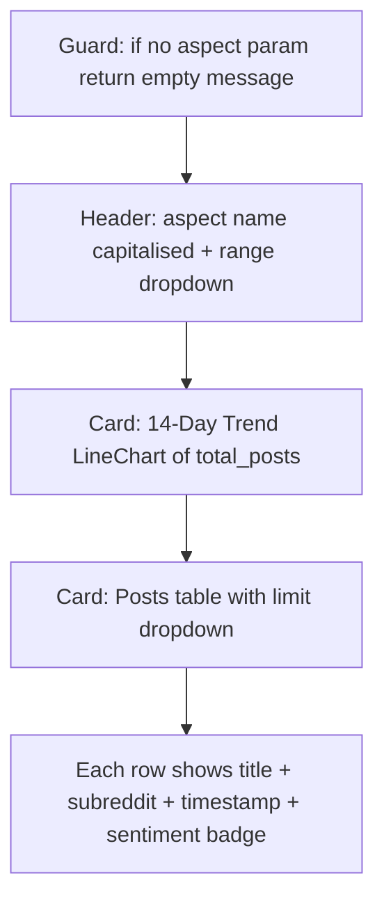
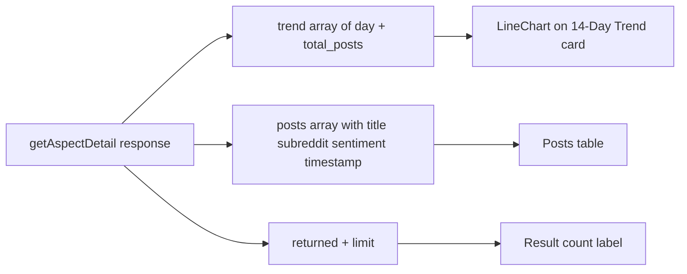
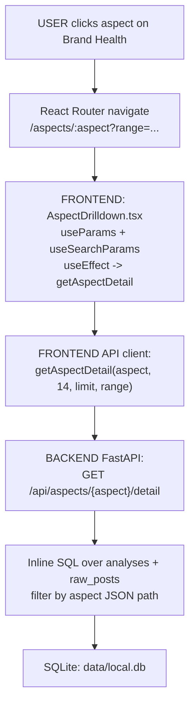

# Aspect Drilldown — Page Deep-Dive

Dynamic route `/aspects/:aspect` — when the analyst clicks an aspect on Brand Health, they land here to see the last 14 days of volume + a paginated post list for that single aspect.

- **URL** — `http://localhost:3001/aspects/delivery_pickup` (example)
- **Frontend page** — [`frontend/src/pages/AspectDrilldown.tsx`](../../../frontend/src/pages/AspectDrilldown.tsx)
- **Backend route** — [`src/dashboard/api.py`](../../../src/dashboard/api.py) → `GET /api/aspects/{aspect}/detail`

---

## Section 1 — Cheat sheet

- Single API call: `getAspectDetail(aspect, days=14, limit, range)`.
- Range is kept in the URL (`?range=week`) so links stay shareable.
- Two visuals: 14-day LineChart of `total_posts` + a table of matching posts (up to `limit`).
- `limit` dropdown lets the analyst load 10 / 25 / 50 / 100 / 200 posts.

---

## Section 2 — File map

```
AspectDrilldown.tsx
+-- AspectDrilldown()   -- exported page component
+-- inline JSX          -- header + range dropdown + trend chart + posts card
```

Recharts primitives used: `LineChart` + `Line` with a yellow active-dot for hover.

---

## Section 3 — What happens on route entry



---

## Section 4 — What React renders



---

## Section 5 — Data flow



Backend origin: [api.py](../../../src/dashboard/api.py) → `GET /api/aspects/{aspect}/detail` runs an inline SQL over `analyses` joined with `raw_posts` filtered by `aspects` JSON-path contains `aspect`.

---

## Section 6 — User actions

- **Range dropdown** — 1h through 90d. On change, the range is written to the URL (`?range=...`) AND the data is reloaded.
- **Limit dropdown** — controls how many posts come back. Reloads immediately.
- **Back button** — browser back returns to Brand Health with all filters intact.

Follow the code:

- Data fetch effect — [AspectDrilldown.tsx#L48-L55](../../../frontend/src/pages/AspectDrilldown.tsx#L48-L55)
- URL sync effect — [AspectDrilldown.tsx#L57-L62](../../../frontend/src/pages/AspectDrilldown.tsx#L57-L62)

---

## Section 7 — Full call chain (Router -> React -> API -> SQL -> back)



---

## Section 8 — File map table

| Layer | File | Symbol |
|---|---|---|
| **UI page** | [AspectDrilldown.tsx](../../../frontend/src/pages/AspectDrilldown.tsx) | `AspectDrilldown()` |
| **API client** | [frontend/src/api.ts](../../../frontend/src/api.ts) | `getAspectDetail` |
| **API route** | [api.py](../../../src/dashboard/api.py) | `GET /api/aspects/{aspect}/detail` |

---

## Section 9 — UI stack

- **Recharts** — `LineChart` + `Line` for 14-day trend
- **react-router-dom** — `useParams`, `useSearchParams` for aspect + range
- **Tailwind** — Card, header, badges
- No icons on this page

---

## Section 10 — Common questions

**Q. Why is the trend always 14 days regardless of the range dropdown?**
Range controls the *post list* filter only. The trend chart is hard-coded to 14 days so the analyst always sees the same time depth for shape comparison across aspects.

**Q. What happens if the aspect param is unknown?**
Backend returns an empty `trend` and empty `posts`. Chart is flat, table shows "0 results". No error.

**Q. Why keep range in the URL?**
Shareable links. Product manager can send a Slack link like `/aspects/delivery_pickup?range=month` and the recipient lands on the exact same view.
