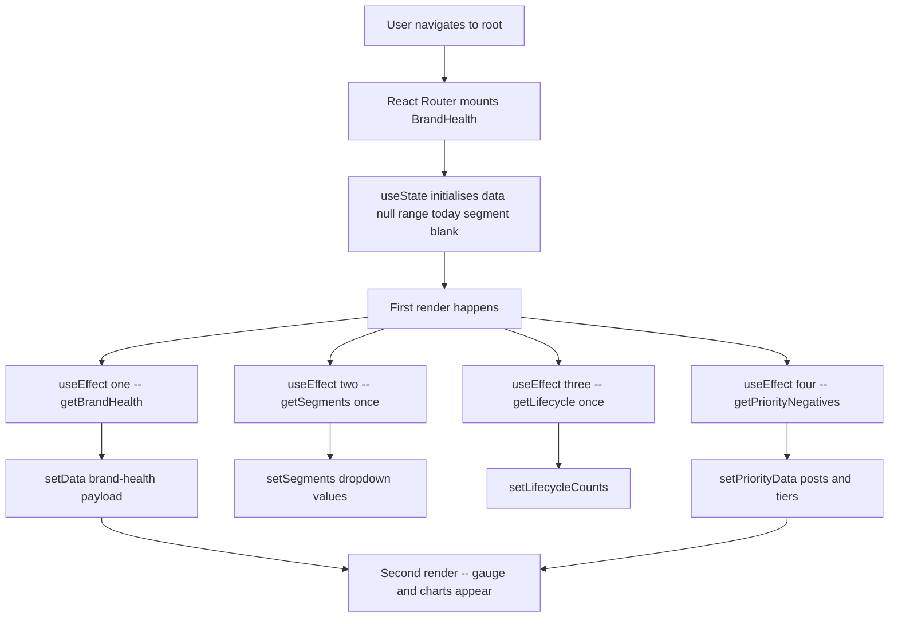
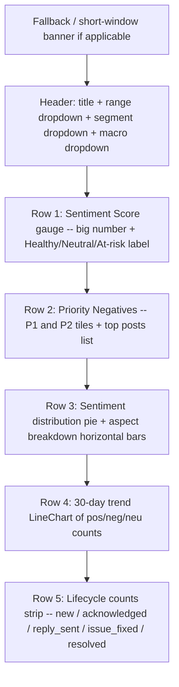
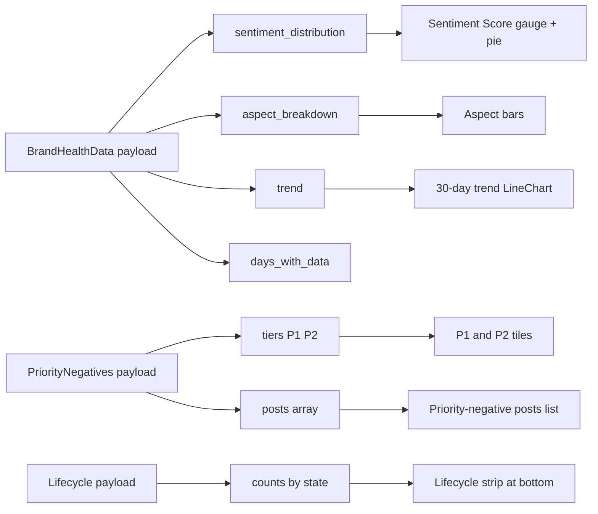
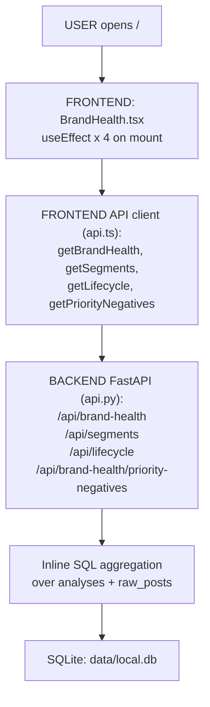

# Brand Health — Page Deep-Dive

The **landing page** of the dashboard at `/`. Shows the single-number sentiment gauge, the P1/P2 priority-negative tiles, sentiment distribution, aspect breakdown, per-segment split, and a 30-day trend line.

- **URL** — `http://localhost:3001/`
- **Frontend page** — [`frontend/src/pages/BrandHealth.tsx`](../../../frontend/src/pages/BrandHealth.tsx)
- **Backend API routes** — [`src/dashboard/api.py`](../../../src/dashboard/api.py)
- **Storage** — [`src/storage/store.py`](../../../src/storage/store.py)
- **DB file** — `data/local.db` (SQLite, WAL mode)

---

## Section 1 — Cheat sheet

- Big gauge = `((positive - negative) / total) * 100`, clamped to `[-100, +100]`.
- **P1 / P2** tiles come from `/api/brand-health/priority-negatives` — same window + segment filter as the rest of the page.
- Four independent API calls fire on mount: brand-health, segments, lifecycle counts, priority-negatives.
- Every filter change (range, segment, macro-segment) re-fires brand-health and priority-negatives — NOT segments and lifecycle (those load once).

---

## Section 2 — File map

```
BrandHealth.tsx
+-- BrandHealth()          -- exported page (default export)
+-- inline JSX             -- gauge, pie, radial-bar, aspect list, trend line, P1/P2 tiles
```

Uses Recharts primitives: `PieChart`, `RadialBarChart` (sentiment score gauge), `LineChart` (30-day trend), `BarChart` (aspect breakdown).

---

## Section 3 — What happens the moment the URL loads `/`



Filter dependencies (which effect fires on which state change):

| State change | Fires | Skips |
|---|---|---|
| `range` | brand-health, priority-negatives | segments, lifecycle |
| `segment` | brand-health, priority-negatives | segments, lifecycle |
| `macroSegment` | brand-health, priority-negatives | segments, lifecycle |

---

## Section 4 — What React renders (top to bottom)



---

## Section 5 — Which API field feeds which visual



Field origins:

- `sentiment_distribution`, `aspect_breakdown`, `trend` — [api.py#L2235-L2321](../../../src/dashboard/api.py#L2235-L2321) (`brand_health`)
- `tiers`, `posts` (priority negatives) — [api.py#L2330-L2495](../../../src/dashboard/api.py#L2330-L2495) (`brand_health_priority_negatives`)
- Lifecycle counts — [api.py](../../../src/dashboard/api.py) → `lifecycle_list()`

---

## Section 6 — User actions

- **Range dropdown** — 1h / 2h / 3h / 6h / 12h / 24h / today / yesterday / week / month / 90d. Triggers brand-health + priority-negatives reload.
- **Segment dropdown** — narrows to a single subreddit (e.g. `walmart`). Empty = all segments.
- **Macro-segment dropdown** — `walmart` vs `competitor`. Empty = both.
- **Click a sentiment slice / row** — navigates to `/posts?sentiment=<x>&range=<r>` (Post Explorer with prefill).

Follow the code:

- Filters and effect dependencies — [BrandHealth.tsx#L36-L82](../../../frontend/src/pages/BrandHealth.tsx#L36-L82)
- `goToPosts()` navigation handler — [BrandHealth.tsx#L92-L97](../../../frontend/src/pages/BrandHealth.tsx#L92-L97)

---

## Section 7 — Full call chain (React -> 4 parallel API calls -> SQL -> back)



---

## Section 8 — File map table

| Layer | File | Symbol | What it does |
|---|---|---|---|
| **UI page** | [BrandHealth.tsx](../../../frontend/src/pages/BrandHealth.tsx) | `BrandHealth()` | Renders gauge, pie, aspect bars, trend, P1/P2 tiles |
| **API client** | [frontend/src/api.ts](../../../frontend/src/api.ts) | `getBrandHealth`, `getSegments`, `getLifecycle`, `getPriorityNegatives` | Thin `fetch()` wrappers |
| **API — health** | [api.py#L2235-L2321](../../../src/dashboard/api.py#L2235-L2321) | `brand_health()` | Aggregates sentiment + aspect + trend |
| **API — P1/P2** | [api.py#L2330-L2495](../../../src/dashboard/api.py#L2330-L2495) | `brand_health_priority_negatives()` | Filters + tags P1/P2 tiers |
| **DB** | `data/local.db` | `raw_posts`, `analyses`, `post_lifecycle` | SQLite WAL |

---

## Section 9 — UI stack

- **Recharts** — `PieChart` (distribution), `RadialBarChart` (gauge), `LineChart` (trend), `BarChart` (aspect breakdown)
- **lucide-react** — no icons on this page directly (child components use them)
- **Tailwind** — layout and colour tokens (`walmart-blue`, `sentiment-positive`, etc.)
- **react-router-dom** — `Link` + `useNavigate` for drill-through to `/posts` and `/aspects/:aspect`

---

## Section 10 — Common questions

**Q. Why does the score sometimes stay at 0?**
When `positive = negative` in the window (e.g. all-neutral day), numerator is 0, so the score is 0. Not a bug.

**Q. Why does "Last 90 Days" look identical to "Last 30 Days" sometimes?**
The `fallback_note` / `days_with_data < days_requested` banner appears when we don't have that much history ingested yet. Both windows show the same tail of data.

**Q. How is P1 / P2 assigned?**
See [Lookup.md §2](../Lookup.md#2-p1--p2-priority-tiers). Deterministic thresholds on `negative_ratio` and volume.

**Q. Why do segment / lifecycle dropdowns not reload on filter change?**
Segments are the *universe* of subreddits (doesn't change with a range filter). Lifecycle counts are a global outbox view. Both are loaded once on mount.
