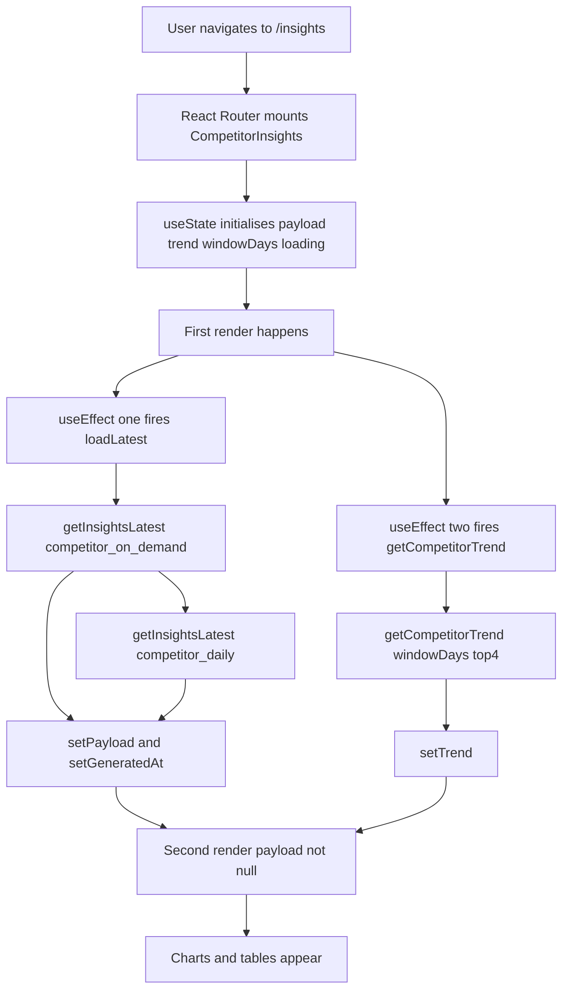
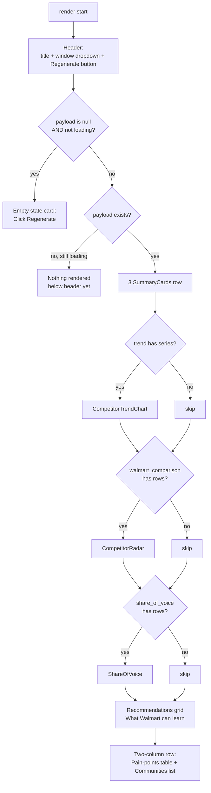
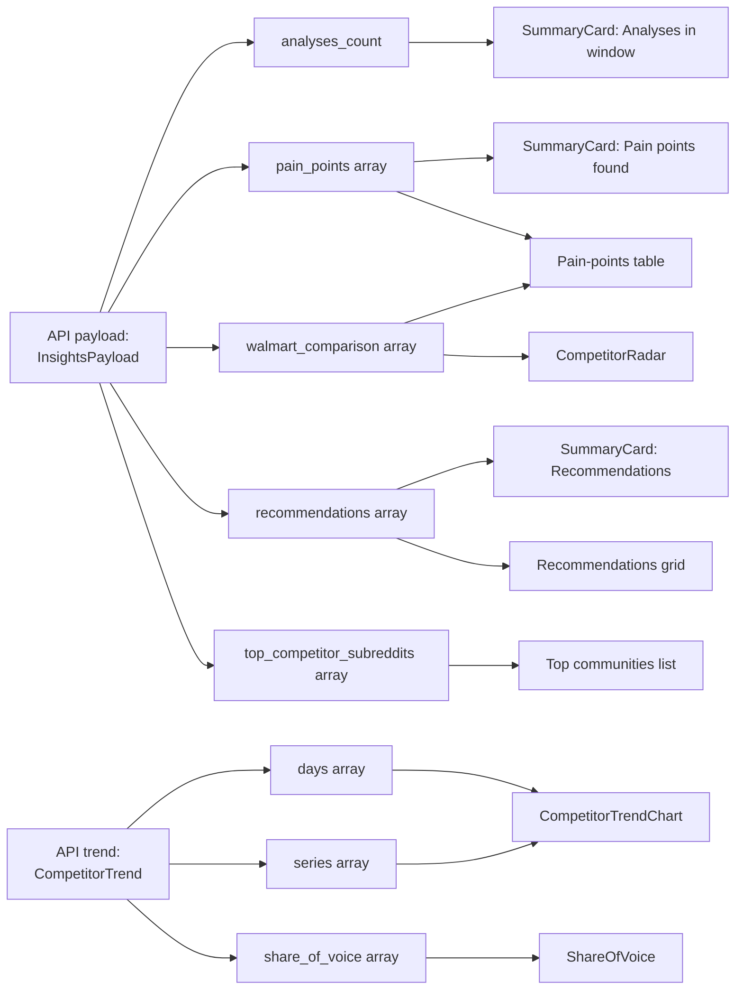
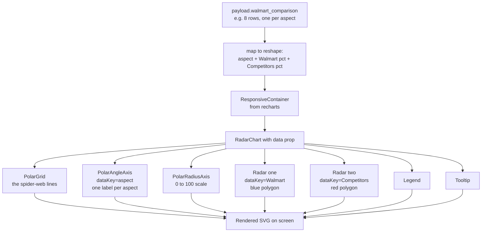
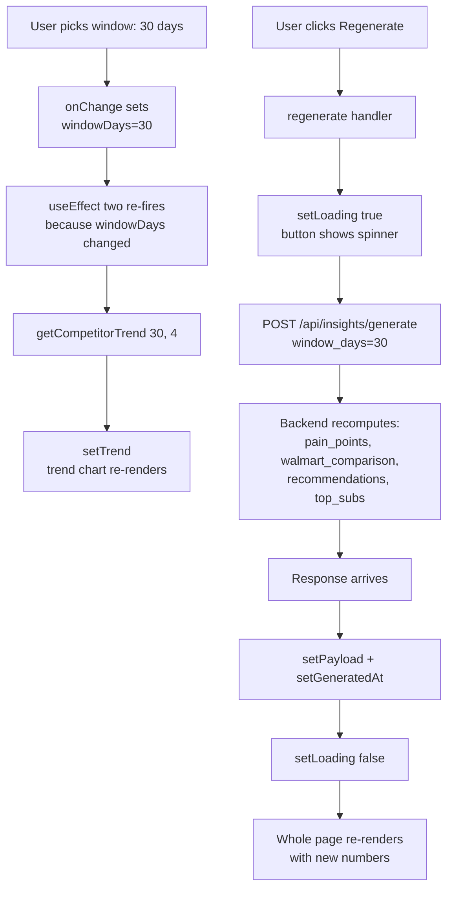
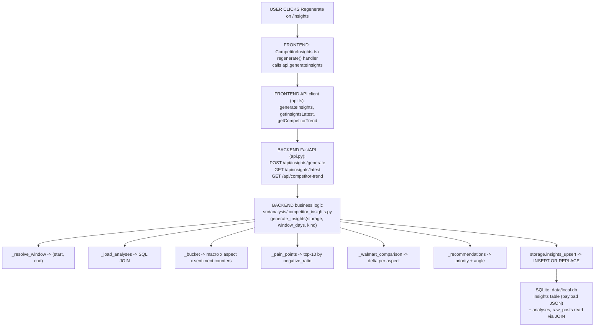

# Competitor Insights — Page Deep-Dive

Everything you need to explain the `/insights` page: which files render it, how components are called, how JSON flows from API → UI, formulas, thresholds, and questions reviewers commonly ask.

- **URL** — `http://localhost:3001/insights`
- **Frontend page** — [`frontend/src/pages/CompetitorInsights.tsx`](../../../frontend/src/pages/CompetitorInsights.tsx)
- **Frontend API client** — [`frontend/src/api.ts`](../../../frontend/src/api.ts)
- **Backend business logic** — [`src/analysis/competitor_insights.py`](../../../src/analysis/competitor_insights.py)
- **Backend API routes** — [`src/dashboard/api.py`](../../../src/dashboard/api.py)
- **Storage layer** — [`src/storage/store.py`](../../../src/storage/store.py)
- **DB file** — `data/local.db` (SQLite, WAL mode)

Everything below is self-contained — you should not need to open Lookup.md or scroll around to defend this page.

---

## Section 1 — Big-picture cheat sheet (read this first)

- The page shows **pain points** — retail aspects where competitor communities are unusually negative — and turns each one into a **priority-tagged recommendation** for Walmart.
- **Deterministic aggregation.** No LLM call at page-generation time. Every number here is just counting sentiment × aspect tags that were already attached to each post upstream by ModernBERT + DeBERTa-v3-NLI (or GPT-4o via the Walmart LLM Gateway for the gateway-analysed subset).
- **Denominator = "analyses in window"** — the count of analysed Reddit posts whose creation time falls in the selected window (1 / 3 / 7 / 14 / 30 / 60 / 90 days).
- **Two independent backend routes feed the page**: `POST /api/insights/generate` (or the cached `GET /api/insights/latest`) fills the pain-points / radar / recommendations; `GET /api/competitor-trend` fills the daily line chart + share-of-voice.

---

## Section 2 — File map (what's inside the page)

One file, one exported React page, plus four small local sub-components:

```
CompetitorInsights.tsx
├── CompetitorInsights()          ← the exported page (default export)
├── SummaryCard()                 ← one KPI tile
├── CompetitorTrendChart()        ← the multi-line trend chart
├── CompetitorRadar()             ← the aspect radar (octagon)
└── ShareOfVoice()                ← the horizontal bar chart
```

Clickable code references:

| Symbol | Line | Link |
|---|---:|---|
| `CompetitorInsights()` | 15 | [CompetitorInsights.tsx#L15](../../../frontend/src/pages/CompetitorInsights.tsx#L15) |
| `SummaryCard()` | 201 | [CompetitorInsights.tsx#L201](../../../frontend/src/pages/CompetitorInsights.tsx#L201) |
| `CompetitorTrendChart()` | 215 | [CompetitorInsights.tsx#L215](../../../frontend/src/pages/CompetitorInsights.tsx#L215) |
| `CompetitorRadar()` | 261 | [CompetitorInsights.tsx#L261](../../../frontend/src/pages/CompetitorInsights.tsx#L261) |
| `ShareOfVoice()` | 293 | [CompetitorInsights.tsx#L293](../../../frontend/src/pages/CompetitorInsights.tsx#L293) |

---

## Section 3 — What happens the moment the URL loads `/insights`

Two independent async calls fire in parallel. Neither blocks the other. React re-renders whenever either state changes.



Follow the code:

- Page mount + effect wiring — [CompetitorInsights.tsx#L51-L54](../../../frontend/src/pages/CompetitorInsights.tsx#L51-L54)
- `loadLatest()` handler — [CompetitorInsights.tsx#L22-L39](../../../frontend/src/pages/CompetitorInsights.tsx#L22-L39)
- `regenerate()` handler — [CompetitorInsights.tsx#L41-L49](../../../frontend/src/pages/CompetitorInsights.tsx#L41-L49)
- API client wrappers — [`frontend/src/api.ts`](../../../frontend/src/api.ts) → `getInsightsLatest`, `generateInsights`, `getCompetitorTrend`

---

## Section 4 — What React renders (branching logic)

The JSX inside `CompetitorInsights()` is one big conditional tree — top to bottom, it looks like this:



Everything under `{payload && ( … )}` is guarded — nothing shows until the API call comes back. Each chart is *additionally* guarded by "does the data actually have rows?" so an empty API response doesn't crash the chart library.

Jump to the exact JSX:

- Header + window dropdown + Regenerate — [CompetitorInsights.tsx#L58-L87](../../../frontend/src/pages/CompetitorInsights.tsx#L58-L87)
- Empty-state card — [CompetitorInsights.tsx#L89-L93](../../../frontend/src/pages/CompetitorInsights.tsx#L89-L93)
- SummaryCards row — [CompetitorInsights.tsx#L97-L101](../../../frontend/src/pages/CompetitorInsights.tsx#L97-L101)
- Recommendations grid — [CompetitorInsights.tsx#L121-L140](../../../frontend/src/pages/CompetitorInsights.tsx#L121-L140)
- Pain-points table — [CompetitorInsights.tsx#L148-L180](../../../frontend/src/pages/CompetitorInsights.tsx#L148-L180)
- Top communities list — [CompetitorInsights.tsx#L182-L196](../../../frontend/src/pages/CompetitorInsights.tsx#L182-L196)

---

## Section 5 — Which sub-component owns which piece of JSON

The `payload` object is the single source of truth for the aggregated view; `trend` is the source for the time-series view. Each visual reads a different slice:



**Mental rule:** one API field → one visual. If a field is empty, its visual is skipped.

Where each field is produced in Python:

- `analyses_count` — [competitor_insights.py#L227-L263](../../../src/analysis/competitor_insights.py#L227-L263) (`generate_insights`)
- `pain_points` — [competitor_insights.py#L147-L168](../../../src/analysis/competitor_insights.py#L147-L168) (`_pain_points`)
- `walmart_comparison` — [competitor_insights.py#L170-L189](../../../src/analysis/competitor_insights.py#L170-L189) (`_walmart_comparison`)
- `recommendations` — [competitor_insights.py#L191-L226](../../../src/analysis/competitor_insights.py#L191-L226) (`_recommendations`)
- `top_competitor_subreddits` — [competitor_insights.py](../../../src/analysis/competitor_insights.py) (inside `generate_insights`)
- `days`, `series`, `share_of_voice` — [api.py#L1684-L1770](../../../src/dashboard/api.py#L1684-L1770) (`competitor_trend`)

---

## Section 6 — How a single sub-component turns JSON into pixels

Take `CompetitorRadar()` as the case study:



The pattern is always the same:

1. **Reshape** the JSON slice into a flat array of rows.
2. **Wrap** in `<ResponsiveContainer>` so the SVG fits the parent width.
3. **Compose** chart primitives (`<LineChart>`, `<RadarChart>`, `<BarChart>`) as children.
4. **Bind** each series to a column via `dataKey`.

Actual source: [CompetitorRadar at CompetitorInsights.tsx#L261](../../../frontend/src/pages/CompetitorInsights.tsx#L261).

---

## Section 7 — What happens when the user changes the window or clicks Regenerate



Two important nuances:

- The **window dropdown** only re-fetches the **trend** (cheap GET, backed by inline SQL).
- The **Regenerate button** re-runs the **insights bundle** (expensive POST — aggregates + writes a row to the `insights` table).

That's why they're separate routes.

Follow the code:

- `regenerate()` handler — [CompetitorInsights.tsx#L41-L49](../../../frontend/src/pages/CompetitorInsights.tsx#L41-L49)
- `POST /api/insights/generate` — [api.py#L1668-L1680](../../../src/dashboard/api.py#L1668-L1680)
- `GET /api/competitor-trend` — [api.py#L1684-L1770](../../../src/dashboard/api.py#L1684-L1770)
- `storage.insights_upsert(...)` — [store.py#L340](../../../src/storage/store.py#L340)

---

## Section 8 — Full call chain (UI -> API -> business logic -> SQLite -> back)

If someone asks "where's the code that makes the page work?", walk them through this trail in order. Every hop is one file, and every file lists the symbol to jump straight to.



---

## Section 9 — One-line file map for the whole page

| Layer | File | Symbol | What it does |
|---|---|---|---|
| **UI page** | [frontend/src/pages/CompetitorInsights.tsx](../../../frontend/src/pages/CompetitorInsights.tsx) | `CompetitorInsights()` component | The React page — renders all cards and charts |
| **UI API client** | [frontend/src/api.ts](../../../frontend/src/api.ts#L964-L976) | `generateInsights`, `getInsightsLatest`, `getCompetitorTrend` | Thin wrappers around `fetch()` |
| **API — regenerate** | [src/dashboard/api.py](../../../src/dashboard/api.py#L1668-L1680) | `insights_generate()` — `POST /api/insights/generate` | Kicks off `generate_insights` on demand |
| **API — read latest** | [src/dashboard/api.py](../../../src/dashboard/api.py#L1652-L1660) | `insights_latest()` — `GET /api/insights/latest` | Reads the newest row from the `insights` table |
| **API — trend chart** | [src/dashboard/api.py](../../../src/dashboard/api.py#L1684-L1770) | `competitor_trend()` — `GET /api/competitor-trend` | Per-day `(pos − neg)/total` per subreddit + share-of-voice |
| **Aggregation logic** | [src/analysis/competitor_insights.py](../../../src/analysis/competitor_insights.py) | `generate_insights`, `_load_analyses`, `_bucket`, `_pain_points`, `_walmart_comparison`, `_recommendations` | Pure-Python aggregate; no LLM |
| **Window helper** | [src/analysis/competitor_insights.py](../../../src/analysis/competitor_insights.py#L54-L88) | `_resolve_window(window_days)` | Matches Brand Health's calendar-day floor |
| **Storage / SQL** | [src/storage/store.py](../../../src/storage/store.py#L340-L365) | `insights_upsert`, `insights_latest`, `insights_history` | CRUD on the `insights` table |
| **DB schema** | [src/storage/store.py](../../../src/storage/store.py#L140-L148) | `CREATE TABLE insights …` | id · kind · window_days · generated_at · payload (JSON) |
| **DB file** | `data/local.db` | Tables: `raw_posts`, `analyses`, `insights` | SQLite in WAL mode |

---

## Section 10 — What "Analyses in window" actually counts

The KPI card in the top-left says *Analyses in window*. It is:

- Rows that have completed the analysis pipeline (row exists in `analyses`).
- Whose **source post was created** in the last N days (`raw_posts.created_timestamp >= now − N days`, floored to midnight UTC — see Section 11).
- Both **Walmart-family** and **competitor** subreddits — no macro-segment filter here. The Walmart-vs-Competitor split happens *downstream* inside `_bucket()` to bucket the same rows into `walmart` and `competitor` groups.
- No trust filter, no priority filter, no sentiment filter — every analysed row in the window is in the pool.

Frontend — the KPI card:

```tsx
<SummaryCard label="Analyses in window" value={String(payload.analyses_count)} />
```
[CompetitorInsights.tsx#L99](../../../frontend/src/pages/CompetitorInsights.tsx#L99)

Backend — how `analyses_count` is populated:

```python
window_days = max(1, min(int(window_days), 90))
start, end = _resolve_window(window_days)
analyses = _load_analyses(storage, start, end)
...
payload = {
    "window_days":    window_days,
    "since":          start.isoformat(),
    "until":          end.isoformat(),
    "analyses_count": len(analyses),
    ...
}
```
[competitor_insights.py#L227-L263](../../../src/analysis/competitor_insights.py#L227-L263)

Backend — the SQL that loads those rows:

```python
sql = (
    "SELECT a.data AS adata, r.data AS rdata "
    "FROM analyses a "
    "JOIN raw_posts r ON r.id = json_extract(a.data, '$.post_id') "
    "WHERE CAST(json_extract(r.data, '$.created_timestamp') AS REAL) >= ? "
    "  AND CAST(json_extract(r.data, '$.created_timestamp') AS REAL) <  ? "
)
```
[competitor_insights.py#L54-L88](../../../src/analysis/competitor_insights.py#L54-L88)

---

## Section 11 — Window alignment with Brand Health

Before the fix, `_load_analyses()` used a floating window of exactly N × 24 h ending "now", while Brand Health floors the lower bound to midnight UTC. Same window label, slightly different rows — CI's count was consistently a few hundred rows higher than BH's `total_posts`. Fix in commit `2525702`:

```python
def _resolve_window(window_days: int) -> tuple[datetime, datetime]:
    now = datetime.now(timezone.utc)
    if window_days <= 1:
        start = now.replace(hour=0, minute=0, second=0, microsecond=0)   # BH "today"
    else:
        start = (now - timedelta(days=window_days - 1)).replace(         # BH "week"/"month"/…
            hour=0, minute=0, second=0, microsecond=0
        )
    return start, now
```

Verified live: `brand-health month total_posts = 29,080` **=** `competitor 30d analyses_count = 29,080`.

Source: [competitor_insights.py#L54-L88](../../../src/analysis/competitor_insights.py#L54-L88).

---

## Section 12 — What a Pain Point is (definition + formula)

A **pain point** is a retail **aspect** (from the 8-aspect taxonomy — `pricing`, `delivery/pickup`, `returns`, `product_quality`, `customer_service`, `store_experience`, `online/app`, `workforce_hr`) where **competitor communities are showing an unusually high share of negative posts** in the window. Purely deterministic aggregation — no LLM call, no ranking model. The insight comes entirely from *counting* the aspect × sentiment tags the pipeline already attached to every post.

For every aspect `a` seen in competitor posts in the window:

```text
negative_ratio(a) = negative_count(a) / total_count(a)
```

An aspect is a candidate pain point only if it has enough signal:

```text
total_count(a) ≥ MIN_POSTS_FOR_ASPECT       (= 8)
```

Candidates are sorted DESC by `negative_ratio`, tie-broken by `total_count` DESC, and the top 10 become the pain-points list.

**Live example** — this DB's current 30-day window (Competitor macro-segment only):

| rank | aspect            | total  | neg   | pos  | neu    | negative_ratio |
|------|-------------------|--------|-------|------|--------|----------------|
| 1    | delivery/pickup   | 3,546  | 1,377 | 128  | 2,041  | **0.388** |
| 2    | customer service  | 5,880  | 2,146 | 173  | 3,561  | **0.365** |
| 3    | online/app        | 15,704 | 5,249 | 598  | 9,857  | **0.334** |
| 4    | store experience  | 5,334  | 1,780 | 269  | 3,285  | **0.334** |
| 5    | product quality   | 936    | 282   | 103  | 551    | **0.301** |

"delivery/pickup" tops the list because 38.8 % of competitor posts tagged with that aspect are negative — the highest share of any aspect that cleared the 8-post threshold.

Source: [_pain_points at competitor_insights.py#L147-L168](../../../src/analysis/competitor_insights.py#L147-L168).

---

## Section 13 — Walmart comparison, priority tiers, and action angle

Each pain point is compared to Walmart's own `negative_ratio` on the same aspect (identical bucketing):

```text
delta(a) = competitor_negative_ratio(a) − walmart_negative_ratio(a)
```

Each pain point becomes a **priority-tagged recommendation**:

```text
competitor_negative_ratio ≥ 0.60   →   priority = "high"     (HIGH_PRIO_RATIO)
competitor_negative_ratio ≥ 0.40   →   priority = "medium"   (MEDIUM_PRIO_RATIO)
otherwise                          →   priority = "low"
```

The recommendation **angle** depends on the delta:

- `delta > +0.05` → **"Marketing angle"** — competitors are struggling more than Walmart. Message it.
- `delta < −0.05` → **"Investigate"** — Walmart is *worse* than competitors on this aspect. Root-cause it.
- otherwise      → **"Industry-wide friction"** — everybody hurts. Opportunity to differentiate.

Source:

- Walmart comparison — [competitor_insights.py#L170-L189](../../../src/analysis/competitor_insights.py#L170-L189) (`_walmart_comparison`)
- Priority + angle — [competitor_insights.py#L191-L226](../../../src/analysis/competitor_insights.py#L191-L226) (`_recommendations`)

---

## Section 14 — Pain-point pipeline in code

**Bucket rows by macro × aspect** — [_bucket at competitor_insights.py#L91-L145](../../../src/analysis/competitor_insights.py#L91-L145)

```python
buckets = {
    "walmart":    defaultdict(lambda: {"pos": 0, "neg": 0, "neu": 0, "total": 0, "examples": []}),
    "competitor": defaultdict(lambda: {"pos": 0, "neg": 0, "neu": 0, "total": 0, "examples": []}),
}
for a in analyses:
    sub   = a.get("_raw_subreddit") or a.get("subreddit") or ""
    macro = macro_segment_for(sub)               # 'walmart' or 'competitor'
    sentiment = a.get("sentiment", "neutral")
    for aspect_raw in (a.get("aspects") or []):
        aspect = aspect_raw["aspect"] if isinstance(aspect_raw, dict) else aspect_raw
        slot = buckets[macro][aspect]
        slot["total"] += 1
        if sentiment == "positive": slot["pos"] += 1
        elif sentiment == "negative":
            slot["neg"] += 1
            if len(slot["examples"]) < 3:
                slot["examples"].append({"subreddit": sub, "excerpt": text[:200]})
        else: slot["neu"] += 1
```

**Rank the top-10** — [_pain_points at competitor_insights.py#L147-L168](../../../src/analysis/competitor_insights.py#L147-L168)

```python
MIN_POSTS_FOR_ASPECT = 8

def _pain_points(competitor_bucket: dict) -> list[dict]:
    out = []
    for aspect, c in competitor_bucket.items():
        total = c["total"]
        if total < MIN_POSTS_FOR_ASPECT:            # ← the signal-floor filter
            continue
        neg_ratio = c["neg"] / total
        out.append({
            "aspect":         aspect,
            "total":          total,
            "negative":       c["neg"],
            "positive":       c["pos"],
            "neutral":        c["neu"],
            "negative_ratio": round(neg_ratio, 3),
            "examples":       c["examples"],
        })
    out.sort(key=lambda x: (-x["negative_ratio"], -x["total"]))
    return out[:10]
```

**Walmart comparison** — [_walmart_comparison at competitor_insights.py#L170-L189](../../../src/analysis/competitor_insights.py#L170-L189)

```python
for pp in pain_points:
    wmt = walmart_bucket.get(pp["aspect"], {"total": 0, "neg": 0, "pos": 0})
    wmt_ratio = (wmt["neg"] / wmt["total"]) if wmt["total"] else 0.0
    delta = pp["negative_ratio"] - wmt_ratio
    ...
```

**Priority + action** — [_recommendations at competitor_insights.py#L191-L226](../../../src/analysis/competitor_insights.py#L191-L226)

```python
HIGH_PRIO_RATIO   = 0.60
MEDIUM_PRIO_RATIO = 0.40

if ratio >= HIGH_PRIO_RATIO:    priority = "high"
elif ratio >= MEDIUM_PRIO_RATIO: priority = "medium"
else:                           priority = "low"

if delta > 0.05:    angle = "Marketing angle …"          # competitors worse than Walmart
elif delta < -0.05: angle = "Investigate root causes …"  # Walmart worse
else:               angle = "Industry-wide friction …"
```

---

## Section 15 — End-to-end pipeline in one text picture

```text
analyses (in window)
   │  Every row already carries: sentiment + aspects[] + subreddit
   ▼
_bucket()
   │  for each row → macro_segment_for(subreddit)  ('walmart' | 'competitor')
   │  for each aspect on the row →  bucket[macro][aspect].{total, pos, neg, neu, examples}
   ▼
_pain_points(competitor_bucket)
   │  keep only aspects with total ≥ 8
   │  compute negative_ratio = neg / total
   │  sort DESC by (negative_ratio, total)
   │  → top 10
   ▼
_walmart_comparison(pain_points, walmart_bucket)
   │  for each pain_point aspect → look up Walmart's own bucket
   │  → competitor_negative_ratio, walmart_negative_ratio, delta
   ▼
_recommendations(pain_points, comparison)
   │  priority ∈ {high, medium, low} from ratio thresholds  (0.60 / 0.40)
   │  angle    ∈ {marketing, investigate, industry-wide}    from delta  (± 0.05)
   ▼
payload  {analyses_count, pain_points[], walmart_comparison[], recommendations[]}
   ▼
POST /api/insights/generate  (persisted; also returned)
   ▼
Competitor Insights page — pain-points table + "What Walmart can learn" cards
```

---

## Section 16 — UI stack (libraries)

Nothing custom, everything is a small React component wired to one of two open-source libraries. No D3, no Chart.js, no MUI, no shadcn. The whole surface is **Recharts + Tailwind + a handful of icons**.

Top-level stack — from [frontend/package.json](../../../frontend/package.json):

| Concern | Library | Version |
|---|---|---|
| UI framework | **React** | 18 |
| Routing | **react-router-dom** | 6 |
| Charts | **Recharts** | 2.10 |
| Icons | **lucide-react** | 0.292 |
| Styling | **TailwindCSS** | 3.4 |
| Build | Vite + TypeScript | 5 |

---

## Section 17 — Per-visual component map

| Visual on the page | Library / component | Data field | File & symbol |
|---|---|---|---|
| 3 KPI summary cards | plain `<div>` (`SummaryCard`) | `analyses_count`, `pain_points.length`, `recommendations.length` | [CompetitorInsights.tsx#L201](../../../frontend/src/pages/CompetitorInsights.tsx#L201) |
| Sentiment trend chart | Recharts **`LineChart`** + `<Line>` × N + `<XAxis>`, `<YAxis>`, `<Tooltip>`, `<CartesianGrid>`, `<Legend>` | `trend.days`, `trend.series` | [CompetitorInsights.tsx#L215](../../../frontend/src/pages/CompetitorInsights.tsx#L215) `CompetitorTrendChart()` |
| Aspect radar | Recharts **`RadarChart`** + `Radar × 2` + `<PolarGrid>`, `<PolarAngleAxis>`, `<PolarRadiusAxis>` | `payload.walmart_comparison` | [CompetitorInsights.tsx#L261](../../../frontend/src/pages/CompetitorInsights.tsx#L261) `CompetitorRadar()` |
| Share of voice | Recharts **`BarChart layout="vertical"`** + `<Bar>` + `<XAxis>` + `<YAxis>` | `trend.share_of_voice` | [CompetitorInsights.tsx#L293](../../../frontend/src/pages/CompetitorInsights.tsx#L293) `ShareOfVoice()` |
| Recommendations grid | plain Tailwind cards + `<Lightbulb>` icon | `payload.recommendations` | [CompetitorInsights.tsx#L121-L140](../../../frontend/src/pages/CompetitorInsights.tsx#L121-L140) |
| Pain-points table | plain HTML `<table>` + `<TrendingUp>` icon | `payload.pain_points` + `payload.walmart_comparison` (for delta) | [CompetitorInsights.tsx#L148](../../../frontend/src/pages/CompetitorInsights.tsx#L148) |
| Top communities list | plain HTML list + `<Users>` icon | `payload.top_competitor_subreddits` | [CompetitorInsights.tsx#L182](../../../frontend/src/pages/CompetitorInsights.tsx#L182) |
| Range dropdown | native `<select>` | 1 / 3 / 7 / 14 / 30 / 60 / 90 | [CompetitorInsights.tsx#L71](../../../frontend/src/pages/CompetitorInsights.tsx#L71) |
| Regenerate button | plain `<button>` + `<RefreshCw>` icon | — | [CompetitorInsights.tsx#L79](../../../frontend/src/pages/CompetitorInsights.tsx#L79) |

---

## Section 18 — Zoom in on the aspect radar

This is the visual that maps directly onto the 8-aspect taxonomy.

```tsx
<RadarChart data={data} outerRadius="75%">
  <PolarGrid stroke="#e5e7eb" />
  <PolarAngleAxis dataKey="aspect"  tick={{ fontSize: 11, fill: '#041E42' }} />
  <PolarRadiusAxis angle={30} domain={[0, 100]}
                   tick={{ fontSize: 10, fill: '#6b7280' }} />
  <Radar name="Walmart"     dataKey="Walmart"     stroke="#0071DC"
         fill="#0071DC" fillOpacity={0.35} />
  <Radar name="Competitors" dataKey="Competitors" stroke="#DE1C24"
         fill="#DE1C24" fillOpacity={0.28} />
  <Legend />
  <Tooltip />
</RadarChart>
```

Key details:

- **Each axis of the radar is one aspect** — the retail aspects from the 8-aspect taxonomy (`pricing`, `delivery_pickup`, `returns`, `product_quality`, `customer_service`, `store_experience`, `online/app`, `workforce_hr`) come from the `walmart_comparison[]` array.
- **Two filled polygons** — blue Walmart (`#0071DC`), red competitors (`#DE1C24`). Bigger polygon = worse (more negative). Where **red sticks out past blue**, competitors are worse than Walmart on that aspect. Where **blue sticks out past red**, Walmart is worse.
- **Axis scale is 0 – 100** — the API returns the raw ratio in `[0, 1]`, the component multiplies by 100 for readability (`Math.round(c.walmart_negative_ratio * 100)`).
- **Data source:** `payload.walmart_comparison[]`, populated by [`_walmart_comparison()`](../../../src/analysis/competitor_insights.py#L170-L189).

Source: [CompetitorRadar at CompetitorInsights.tsx#L261](../../../frontend/src/pages/CompetitorInsights.tsx#L261).

---

## Section 19 — Zoom in on the sentiment trend chart

```tsx
<LineChart data={rows} margin={{ top: 5, right: 20, left: 0, bottom: 0 }}>
  <CartesianGrid strokeDasharray="3 3" />
  <XAxis dataKey="date" />
  <YAxis domain={[-1, 1]} />
  <Tooltip />
  <Legend />
  {trend.series.map((s, i) => (
    <Line key={s.label} dataKey={s.label}
          stroke={PALETTE[i % PALETTE.length]}
          dot={false} connectNulls />
  ))}
</LineChart>
```

- One line per subreddit series (Walmart baseline + top-4 competitors by volume).
- Y-axis bounded `−1 … +1` (the per-day-per-sub net-sentiment score: `(pos − neg) / total`).
- `connectNulls` skips days with zero posts instead of drawing a spurious zero.

Source: [CompetitorTrendChart at CompetitorInsights.tsx#L215](../../../frontend/src/pages/CompetitorInsights.tsx#L215).

---

## Section 20 — Common questions and one-line answers

**Q. Why negative-ratio and not raw negative count?**
Volume varies wildly across aspects — "online/app" has 15,704 posts, "product quality" has 936. A ratio makes them comparable. It answers "given someone's talking about this aspect on competitor subs, how likely is it to be a complaint?" instead of "how many complaints did we see?".

**Q. Why the 8-post floor?**
`negative_ratio` is a proportion — small denominators are noisy. Twelve out of twelve looks like 100 % but is just one bad hour on Reddit. 8 posts is the empirical floor where the ratio is stable enough to rank against other aspects; below that a single flip can move an aspect from mid-tier to the top of the list.

**Q. Where does the sentiment on an aspect come from?**
Two paths. The primary path is ModernBERT (whole-post sentiment) + DeBERTa-v3 NLI (aspect tags), then the aspect inherits the post-level sentiment. For gateway-analysed posts (GPT-4o via Walmart LLM Gateway), the JSON reply carries per-aspect `sentiment` overrides which take precedence over the post-level fall-back. Both paths land in the same `analyses.aspects[]` field, which is what `_bucket()` reads.

**Q. What if an aspect has zero Walmart posts?**
`walmart_ratio = 0`, so `delta = competitor_negative_ratio`. That correctly reads as "Walmart-family communities aren't talking about this at all yet — competitors are hurting, we're not touched". The recommendation angle flips to "Marketing angle" because `delta > 0.05`.

**Q. Priority thresholds — why 0.60 / 0.40?**
0.40 = "materially negative, worth reviewing" (roughly 2× the neutral baseline our classifier sees on retail Reddit). 0.60 = "clearly a problem" (majority-negative aspect). Both live as module-level constants so they can be tuned without a code change to callers.

**Q. Does the pain-point list change if I re-run without new data?**
No — deterministic aggregation. Regenerating the same window against the same DB always produces the same pain-points list; the only stochastic input is the ModernBERT-labelled sentiment already baked into each row.

**Q. Why is CI's "Analyses in window" slightly higher/lower than Brand Health's `total_posts`?**
Two possible reasons:
1. **Macro-segment filter on BH.** If you have "Walmart" or "Competitor" selected in the Brand Health dropdown, `total_posts` is narrowed to that macro-group; CI always includes both.
2. **(Historical, pre-`2525702`)** CI used to use `now − N × 24 h` while BH used calendar-day-floored midnight UTC. Fixed — both now use identical windows, so this can only be reason (1) going forward.

**Q. Show me where a click on 'Regenerate' turns into an SQL write.**
1. [CompetitorInsights.tsx#L41-L49](../../../frontend/src/pages/CompetitorInsights.tsx#L41-L49) → `regenerate()` handler.
2. [frontend/src/api.ts](../../../frontend/src/api.ts) → `generateInsights(windowDays)` → `POST /api/insights/generate`.
3. [api.py#L1668-L1680](../../../src/dashboard/api.py#L1668-L1680) → `insights_generate()` → `generate_insights(_storage, window_days=…)`.
4. [competitor_insights.py#L227-L263](../../../src/analysis/competitor_insights.py#L227-L263) → runs `_resolve_window` → `_load_analyses` (SELECT) → `_bucket` → `_pain_points` → `_walmart_comparison` → `_recommendations` → `storage.insights_upsert(...)`.
5. [store.py#L340](../../../src/storage/store.py#L340) → executes `INSERT OR REPLACE INTO insights (…)` against `data/local.db`.

**Q. What's actually stored in the DB after a Regenerate?**
One row appended to the `insights` table with:
- `id = f"{kind}_{window_days}d_{generated_at}"`
- `kind = "competitor_on_demand"` (from the Regenerate button) or `"competitor_daily"` (from the scheduled job)
- `window_days` = the user's window choice
- `generated_at` = ISO-8601 UTC
- `payload` = full JSON `{analyses_count, pain_points, walmart_comparison, recommendations, top_competitor_subreddits, since, until, window_days}`

Everything the frontend renders comes back out of that `payload` JSON via `insights_latest()`.

---

## Section 21 — 30-second elevator pitch

> "The page is a single React component with four small chart sub-components. On mount it fires two independent API calls — `insights/latest` for the aggregated bundle and `competitor-trend` for the daily lines. When both come back, React re-renders and each sub-component reads its own slice of the JSON: `walmart_comparison` feeds the radar, `series` feeds the line chart, `share_of_voice` feeds the bars, `recommendations` feeds the cards, `pain_points` feeds the table. Charts are all Recharts components wrapped in a `ResponsiveContainer`. The pain-points logic itself is a deterministic Python aggregation — bucket by aspect × sentiment on competitor subs, keep aspects with ≥ 8 posts, sort by negative_ratio, compare each to Walmart's own ratio to get the delta, then tag priority from the ratio and action angle from the delta. The Regenerate button triggers a fresh POST that recomputes and returns a new payload, which is also written to the `insights` SQLite table for the daily job to pick up."
