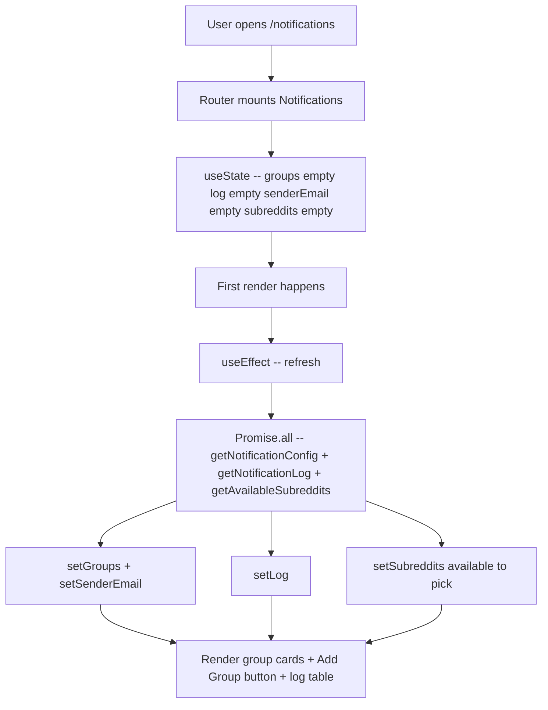
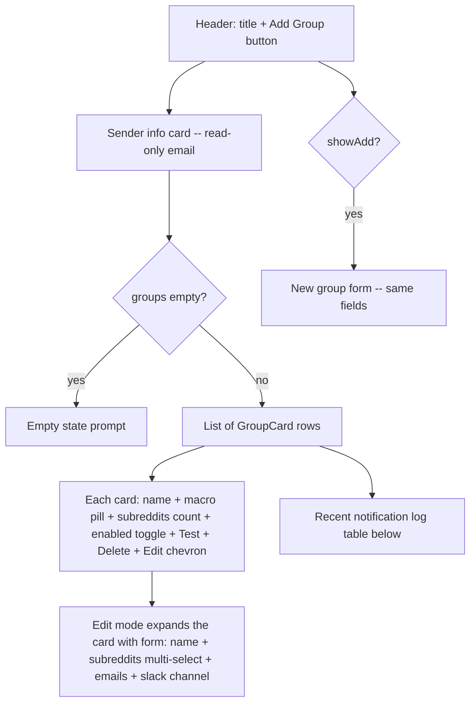
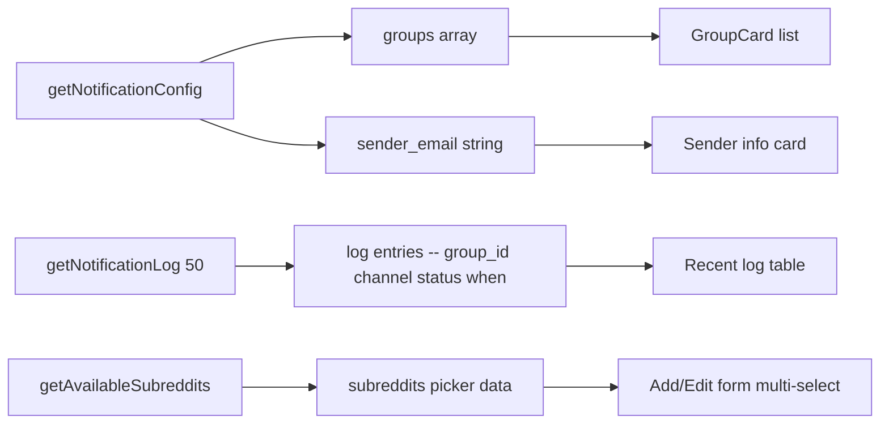
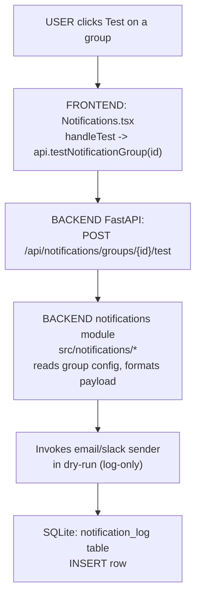

# Notifications — Page Deep-Dive

Configuration UI at `/notifications`. Analyst defines **groups** of subreddits + recipients + delivery channels. When a post enters the lifecycle at `reply_sent` / `issue_fixed`, notifications fire for any matching group.

- **URL** — `http://localhost:3001/notifications`
- **Frontend page** — [`frontend/src/pages/Notifications.tsx`](../../../frontend/src/pages/Notifications.tsx)
- **Backend routes** — [`src/dashboard/api.py`](../../../src/dashboard/api.py) → `/api/notifications/*`
- **Notifications module** — [`src/notifications/`](../../../src/notifications/)
- **DB tables** — `notification_groups`, `notification_log`

---

## Section 1 — Cheat sheet

- Groups list, each with: **name**, **subreddits[]**, **macro_group** (walmart / competitor / all), **email_recipients[]**, **slack_channel**, **enabled** toggle.
- **Test button** on each group sends a dry-run notification (no external delivery, log-only).
- **Sender email** shown at the top — read-only, sourced from config.
- **Recent log** at the bottom — last 50 events (group / channel / when / status).
- Dry-run is the default; real delivery only happens when the group has `enabled = true` and the runtime config permits.

---

## Section 2 — File map

```
Notifications.tsx
+-- Notifications()   -- exported page
+-- GroupCard()       -- one collapsible card per group with edit form (referenced but rendered inline)
+-- inline JSX        -- sender info + groups list + Add Group panel + recent log
```

---

## Section 3 — Page-load flow



---

## Section 4 — What React renders



---

## Section 5 — Data flow



---

## Section 6 — User actions

- **Add Group** — reveals a form, POST to `/api/notifications/groups` on save.
- **Edit** — inline form on the existing card, PATCH to `/api/notifications/groups/{id}`.
- **Toggle enabled** — quick `updateNotificationGroup(id, { enabled: !enabled })`.
- **Test** — POST `/api/notifications/groups/{id}/test`. Server crafts a fake payload and runs the delivery path in dry-run.
- **Delete** — DELETE with confirm() prompt.

Follow the code:

- Handlers (delete / toggle / test) — [Notifications.tsx#L34-L56](../../../frontend/src/pages/Notifications.tsx#L34-L56)
- Refresh Promise.all — [Notifications.tsx#L15-L30](../../../frontend/src/pages/Notifications.tsx#L15-L30)

---

## Section 7 — Full call chain (Test button -> API -> notifications module -> log)



---

## Section 8 — File map table

| Layer | File | Symbol |
|---|---|---|
| **UI page** | [Notifications.tsx](../../../frontend/src/pages/Notifications.tsx) | `Notifications()`, `GroupCard()` |
| **API client** | [frontend/src/api.ts](../../../frontend/src/api.ts) | `getNotificationConfig`, `getNotificationLog`, `getAvailableSubreddits`, `updateNotificationGroup`, `deleteNotificationGroup`, `testNotificationGroup` |
| **API routes** | [api.py](../../../src/dashboard/api.py) | `/api/notifications/*` |
| **Notifications** | [src/notifications](../../../src/notifications) | Formatters + delivery adapters |
| **DB tables** | `data/local.db` | `notification_groups`, `notification_log` |

---

## Section 9 — UI stack

- No Recharts on this page.
- **lucide-react** — `Loader2`, `Plus`, `Trash2`, `TestTube`, `Mail`, `ToggleLeft/Right`, `ChevronDown/Up`, `Bell`.
- **Tailwind** — cards, form controls, log table.

---

## Section 10 — Common questions

**Q. Why groups and not per-subreddit?**
One recipient list often covers multiple subreddits (e.g. all Walmart-family subs go to the same team). Groups keep the config compact and let you toggle a whole set on/off.

**Q. What triggers a notification?**
Lifecycle state entry into `reply_sent` or `issue_fixed`. See [pages/post_lifecycle.md](post_lifecycle.md#section-7--full-call-chain-state-transition-path).

**Q. Why dry-run by default?**
Prevents accidental real emails during dev or demos. Real delivery is gated by both `enabled` on the group AND the runtime config (`config/pipeline_config.yaml`).

**Q. Where's the sender email set?**
Server-side config; not editable in the UI. Shown so the analyst knows what "from" address recipients will see.

**Q. Can the same group send to multiple channels?**
Yes — `email_recipients[]` plus `slack_channel`. Both fire in parallel when a matching lifecycle event happens.
