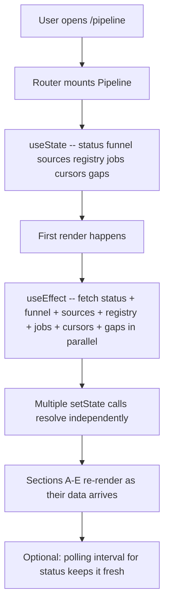
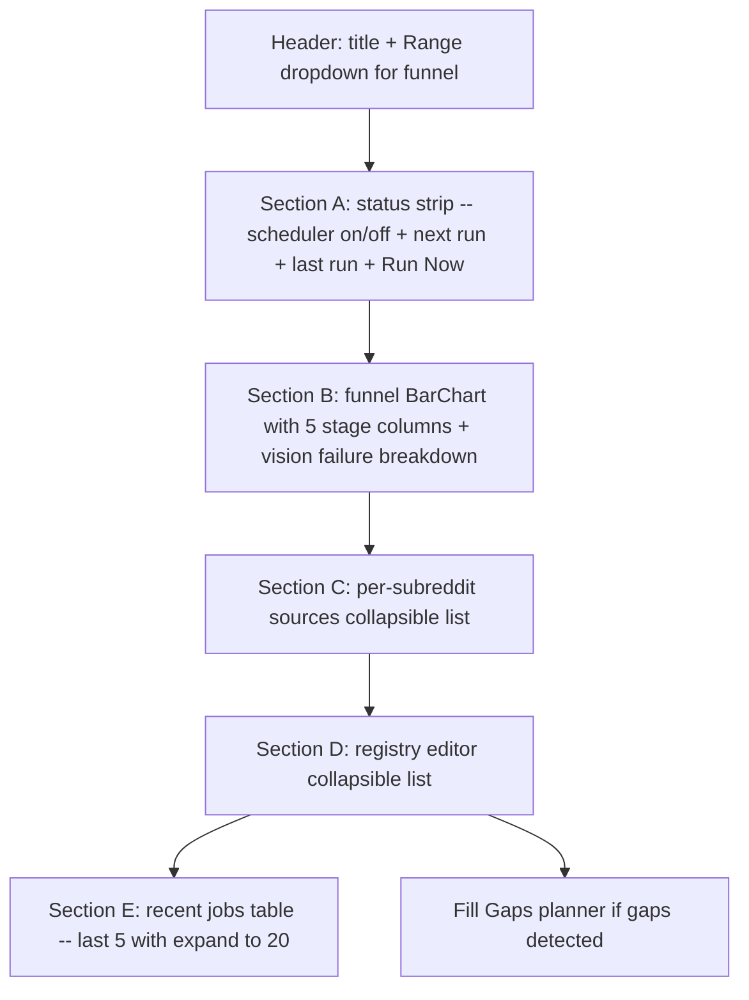
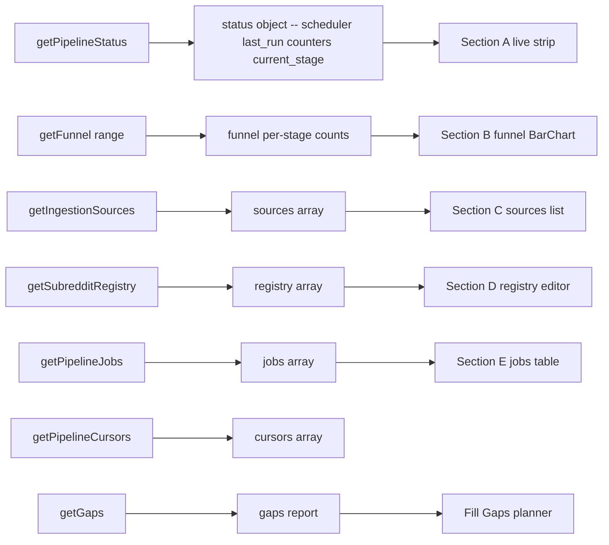
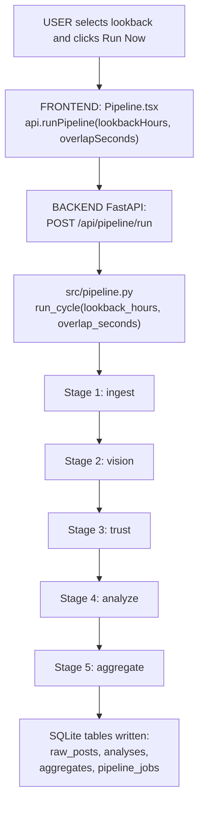

# Pipeline (Data Operations) — Page Deep-Dive

The operator console at `/pipeline`. Live status of the scheduler, funnel visualisation of the ingestion → analyse pipeline, per-subreddit source health, subreddit registry editor, recent job log, and gap-filling tools.

- **URL** — `http://localhost:3001/pipeline`
- **Frontend page** — [`frontend/src/pages/Pipeline.tsx`](../../../frontend/src/pages/Pipeline.tsx)
- **Backend routes** — [`src/dashboard/api.py`](../../../src/dashboard/api.py) → `/api/pipeline/*`
- **Pipeline module** — [`src/pipeline.py`](../../../src/pipeline.py) + `scripts/scheduler.py`

---

## Section 1 — Cheat sheet

- Five stages: **Ingest → Vision → Trust Score → Analyze → Aggregate**.
- Scheduler runs every 6 hours by default; can be triggered manually with a lookback window.
- Five sections on the page:
  - **A** Live status strip (on/off + next run + last run + Run Now)
  - **B** Funnel (five bars, one per stage) + vision failure breakdown
  - **C** Per-subreddit sources (collapsible)
  - **D** Registry editor (collapsible)
  - **E** Recent jobs log (last 5 / expandable to 20)
- Colour palette per funnel column: fetched blue, english light blue, long_enough mid blue, analyzed dark blue, trusted green.

---

## Section 2 — File map

```
Pipeline.tsx
+-- Pipeline()          -- exported page
+-- inline sub-sections A B C D E
+-- inline forms        -- Run Now dialog + Fill Gaps planner
```

Docstring at the top of the file explains the section layout: [Pipeline.tsx#L1-L14](../../../frontend/src/pages/Pipeline.tsx#L1-L14).

---

## Section 3 — Page-load flow



---

## Section 4 — What React renders



---

## Section 5 — Data flow



---

## Section 6 — User actions

- **Run Now** — POST to `/api/pipeline/run` with the chosen lookback window (1h / 6h / 24h / 7d / 30d / 90d / 6mo). Kicks off the pipeline synchronously; live status refreshes.
- **Scheduler toggle** — start/stop the 6h background scheduler.
- **Edit registry** — add/remove/modify subreddits + priority. Changes take effect on the next ingest cycle.
- **Fill Gaps** — pipeline detects missing hours per source and offers a plan; analyst can confirm and run.
- **Overlap seconds** — small setting that controls how much the ingest window overlaps to avoid missing edge posts.

Follow the code:

- Docstring — [Pipeline.tsx#L1-L14](../../../frontend/src/pages/Pipeline.tsx#L1-L14)
- Stage constants — [Pipeline.tsx#L48-L57](../../../frontend/src/pages/Pipeline.tsx#L48-L57)

---

## Section 7 — Full call chain (Run Now -> pipeline.py -> 5 stages -> SQLite)



---

## Section 8 — File map table

| Layer | File | Symbol |
|---|---|---|
| **UI page** | [Pipeline.tsx](../../../frontend/src/pages/Pipeline.tsx) | `Pipeline()` |
| **API client** | [frontend/src/api.ts](../../../frontend/src/api.ts) | `getPipelineStatus`, `getFunnel`, `getIngestionSources`, `getSubredditRegistry`, `getPipelineJobs`, `getPipelineCursors`, `getGaps`, `runPipeline`, `updateRegistry`, `startScheduler`, `stopScheduler`, `fillGaps` |
| **API routes** | [api.py](../../../src/dashboard/api.py) | `/api/pipeline/*` |
| **Pipeline** | [src/pipeline.py](../../../src/pipeline.py) | `run_cycle`, stage functions |
| **Scheduler** | [scripts/scheduler.py](../../../scripts/scheduler.py) | 6h loop |
| **DB tables** | `data/local.db` | `raw_posts`, `analyses`, `pipeline_jobs`, `pipeline_cursors`, `subreddit_registry` |

---

## Section 9 — UI stack

- **Recharts** — `BarChart` with `Bar` + `LabelList` + `Cell` (per-stage colours) for the funnel.
- **lucide-react** — `Activity`, `AlertCircle`, `CheckCircle2`, `Clock`, `Loader2`, `Play`, `Plus`, `RefreshCw`, `Square`, `Trash2`, `X`, `ChevronDown/Right`, `Eye/EyeOff`, `Info`.
- **Tailwind** — heavy use of collapsible sections and inline forms.

---

## Section 10 — Common questions

**Q. What does each pipeline stage do?**
- **Ingest** — Pull new posts from Reddit for each configured subreddit (with overlap window).
- **Vision** — For posts with images, generate captions (LLaVA / GPT-4o vision).
- **Trust Score** — Score credibility per post ([src/trust](../../../src/trust)).
- **Analyze** — ModernBERT sentiment + DeBERTa-v3 NLI aspect tagging (or LLM gateway for a small subset).
- **Aggregate** — Roll up daily aggregates for fast Brand Health queries.

**Q. What is the "overlap seconds" setting?**
Rendell fetches by `created_utc` range. A small overlap (default 300 s) avoids missing posts on the boundary where clocks / timestamps might disagree between server and Reddit API.

**Q. What are pipeline cursors?**
Per-source position pointers — "last time we ingested this subreddit up to X". Next cycle starts from `X - overlap`.

**Q. What does Fill Gaps do?**
Detects missing hourly buckets per source over a lookback window and proposes targeted runs to backfill. Runs the pipeline scoped to just those windows.

**Q. Why is the funnel bar chart useful?**
It shows drop-off: e.g. if `fetched = 1000` but `english = 400`, you're throwing away 600 non-English posts. If `trusted = 100` from `english = 400`, most fail the credibility filter. Immediate diagnostic.
