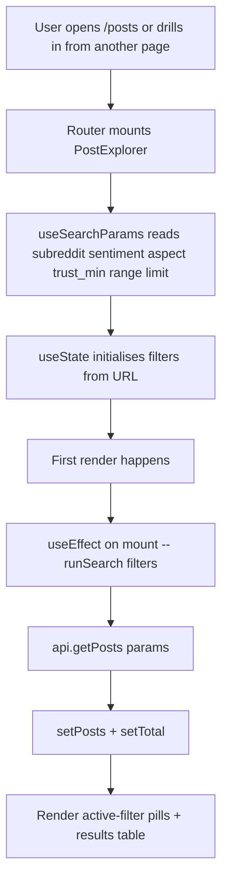
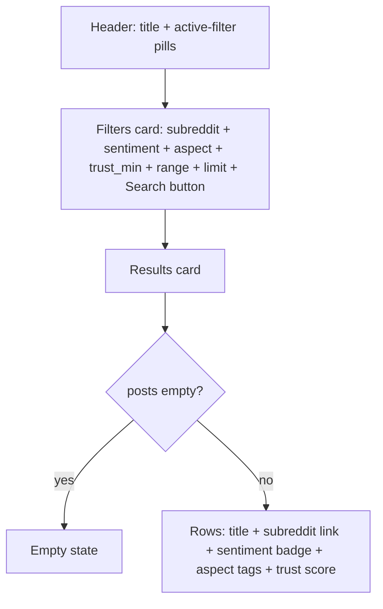
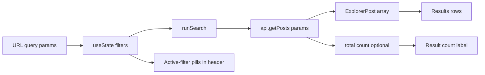
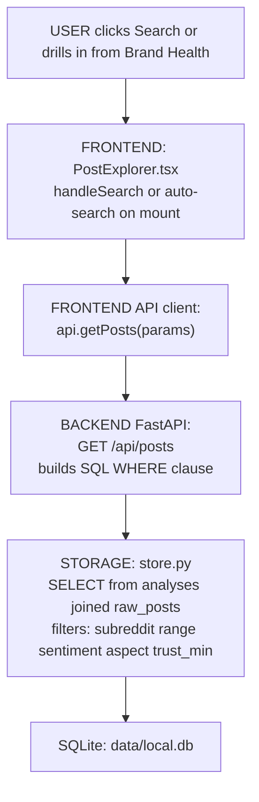

# Post Explorer — Page Deep-Dive

Free-form search UI at `/posts`. Filter the analysed-post archive by subreddit, sentiment, aspect, trust score, or range. Used as the drill-through target from Brand Health and Aspect Drilldown.

- **URL** — `http://localhost:3001/posts`
- **Frontend page** — [`frontend/src/pages/PostExplorer.tsx`](../../../frontend/src/pages/PostExplorer.tsx)
- **Backend route** — [`src/dashboard/api.py`](../../../src/dashboard/api.py) → `GET /api/posts`

---

## Section 1 — Cheat sheet

- Single API call: `getPosts({ limit, subreddit, sentiment, aspect, trust_min, range })`.
- All filter state lives in the URL query — shareable / bookmarkable.
- Auto-search fires on first mount (using URL params). After that, search is manual (Search button).
- Result row limit: 10 / 25 / 50 / 100 / 200 / 500 (dropdown).

---

## Section 2 — File map

```
PostExplorer.tsx
+-- PostExplorer()   -- exported page
+-- inline JSX       -- active-filter pills + filters card + results card
```

Uses the `Card` and `Button` components from `frontend/src/components/`.

---

## Section 3 — Page-load flow



---

## Section 4 — What React renders



---

## Section 5 — Data flow



---

## Section 6 — User actions

- **Search button** — writes current `filters` to the URL and re-runs `getPosts`.
- **Change any input** — updates local state only; user must click Search to apply.
- **Click sentiment badge / aspect tag** — could navigate to related view (not currently wired).

Follow the code:

- Auto-search on mount — [PostExplorer.tsx#L57-L60](../../../frontend/src/pages/PostExplorer.tsx#L57-L60)
- `runSearch` — [PostExplorer.tsx#L38-L55](../../../frontend/src/pages/PostExplorer.tsx#L38-L55)
- `handleSearch` — [PostExplorer.tsx#L62-L67](../../../frontend/src/pages/PostExplorer.tsx#L62-L67)

---

## Section 7 — Full call chain (URL params -> React -> API -> SQL -> back)



---

## Section 8 — File map table

| Layer | File | Symbol |
|---|---|---|
| **UI page** | [PostExplorer.tsx](../../../frontend/src/pages/PostExplorer.tsx) | `PostExplorer()` |
| **API client** | [frontend/src/api.ts](../../../frontend/src/api.ts) | `getPosts` |
| **API route** | [api.py](../../../src/dashboard/api.py) | `GET /api/posts` |
| **DB tables** | `data/local.db` | `raw_posts`, `analyses` |

---

## Section 9 — UI stack

- No charts.
- Native `<input>` / `<select>` for filters.
- Card + Button primitives.

---

## Section 10 — Common questions

**Q. Why manual Search instead of live-filter?**
Live-filter would hit the API on every keystroke. Analyst is usually building a specific query (e.g. "walmart + negative + delivery_pickup + last 7d") and wants to fire it once.

**Q. Why do URL query params drive state?**
Shareable links — the drill-through from Brand Health sends `/posts?sentiment=negative&range=today` and this page picks that up on first mount.

**Q. Is there full-text search on the post body?**
Not on this page. This is faceted search only. Full-text search over post bodies would require an FTS index on `raw_posts.data` — not built yet.
