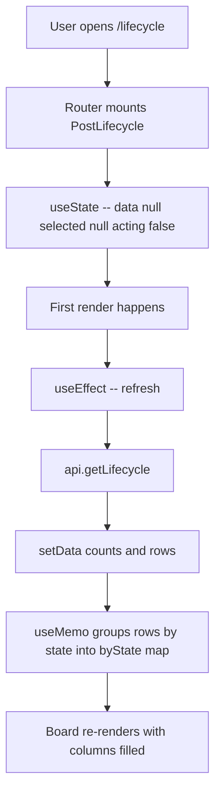
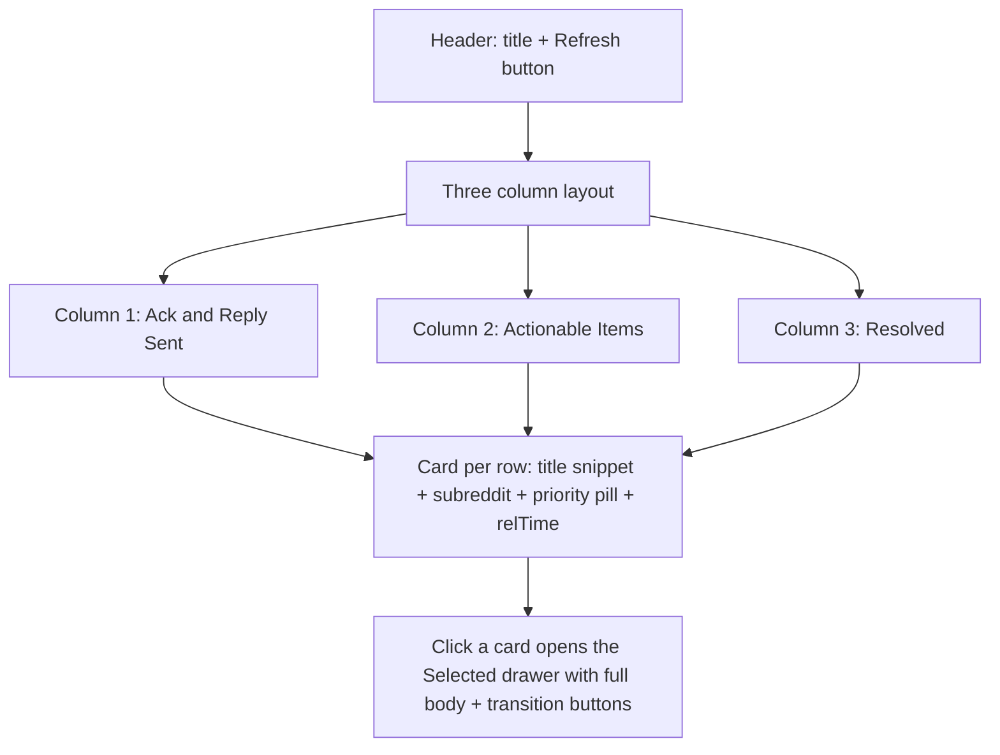
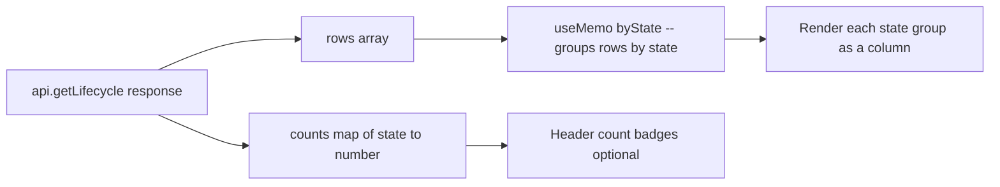
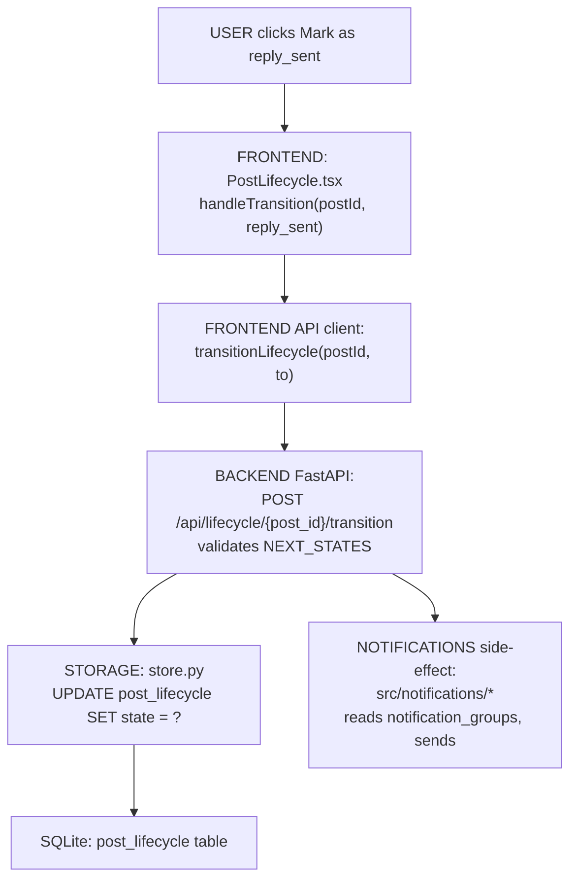

# Post Lifecycle — Page Deep-Dive

Kanban-style workflow board at `/lifecycle`. Auto-created rows for confidently-negative posts move through: **new → acknowledged → reply_sent → issue_fixed → resolved**. Slack + email notifications fire on state entry (dry-run by default).

- **URL** — `http://localhost:3001/lifecycle`
- **Frontend page** — [`frontend/src/pages/PostLifecycle.tsx`](../../../frontend/src/pages/PostLifecycle.tsx)
- **Backend routes** — [`src/dashboard/api.py`](../../../src/dashboard/api.py) → `/api/lifecycle`, `/api/lifecycle/{id}/transition`
- **Backend module** — [`src/notifications/`](../../../src/notifications/)
- **DB table** — `post_lifecycle`

---

## Section 1 — Cheat sheet

- Rows are auto-inserted by the pipeline when a post is classified negative with high confidence.
- Three visible columns on the board: **Ack & Reply Sent**, **Actionable Items**, **Resolved**. (`new` and `acknowledged` are internal states not shown as columns.)
- Each transition is a `POST /api/lifecycle/{id}/transition` with the target state — server validates the state machine.
- Notifications (Slack + email) are wired to the `reply_sent` and `issue_fixed` state entries.

State machine:

```text
new ---> acknowledged ---> reply_sent ---> issue_fixed ---> resolved
                     \                 \                /
                      +------> resolved <--------------+
```

---

## Section 2 — File map

```
PostLifecycle.tsx
+-- PostLifecycle()          -- exported page
+-- inline JSX               -- three column layout + card grid per column
+-- selected/resolveTarget   -- controlled modals for row drill-in + resolve confirm
```

---

## Section 3 — Page-load flow



---

## Section 4 — What React renders



---

## Section 5 — Data flow



The transition endpoint returns the updated lifecycle row, which is written straight into `selected`, and then `refresh()` reloads the whole board.

---

## Section 6 — User actions

- **Refresh button** — calls `refresh()` which re-hits `getLifecycle()`.
- **Click a card** — opens a drawer with the full post body + transition buttons based on `NEXT_STATES[state]`.
- **Transition button** — `api.transitionLifecycle(postId, to)` → server validates transition → row is updated + refresh fires.
- **Notifications side-effect** — server-side, on entry into `reply_sent` / `issue_fixed`, notification group config (`/notifications`) decides who is emailed / Slack-pinged.

Follow the code:

- Transition handler — [PostLifecycle.tsx#L74-L86](../../../frontend/src/pages/PostLifecycle.tsx#L74-L86)
- State machine map — [PostLifecycle.tsx#L20-L26](../../../frontend/src/pages/PostLifecycle.tsx#L20-L26)

---

## Section 7 — Full call chain (button click -> API -> DB -> notifications side-effect)



---

## Section 8 — File map table

| Layer | File | Symbol |
|---|---|---|
| **UI page** | [PostLifecycle.tsx](../../../frontend/src/pages/PostLifecycle.tsx) | `PostLifecycle()` |
| **API client** | [frontend/src/api.ts](../../../frontend/src/api.ts) | `getLifecycle`, `transitionLifecycle` |
| **API routes** | [api.py](../../../src/dashboard/api.py) | `GET /api/lifecycle`, `POST /api/lifecycle/{id}/transition` |
| **Notifications** | [src/notifications](../../../src/notifications) | Formatters + delivery |
| **DB table** | `data/local.db` -> `post_lifecycle` | id · post_id · state · updated_at |

---

## Section 9 — UI stack

- No Recharts — this is a card/board layout only.
- **lucide-react** — `Loader2`, `RefreshCw`, `ExternalLink`, `ChevronRight`, `Bell`, `MessageSquare`.
- **Tailwind** — column tints, priority pills, card shadows.

---

## Section 10 — Common questions

**Q. Where do the rows come from — user-created?**
No — the pipeline auto-creates a row for every negative post above a confidence threshold. The board is a *view* on that.

**Q. What state machine is enforced?**
`NEXT_STATES` map in the page component. Server re-validates the same rules — client sends target state, server refuses invalid transitions.

**Q. Are notifications actually sent?**
Dry-run by default (see `config/pipeline_config.yaml`). Real email/Slack fires only when the corresponding group is `enabled` on `/notifications`.

**Q. Why is `new`/`acknowledged` not shown as columns?**
They're pre-workflow states — as soon as an analyst touches a row it moves to `reply_sent`. Board shows what matters: what's been actioned vs what still needs action.
