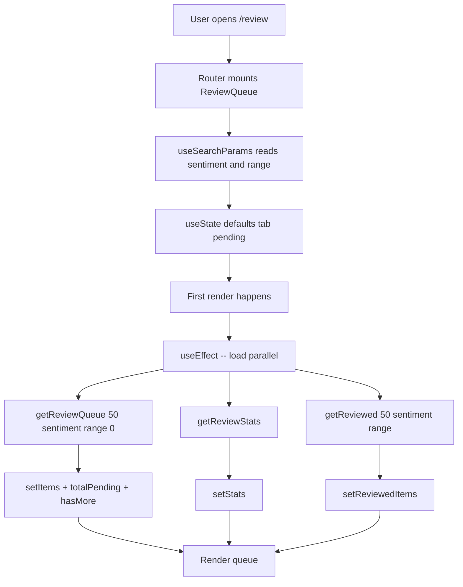
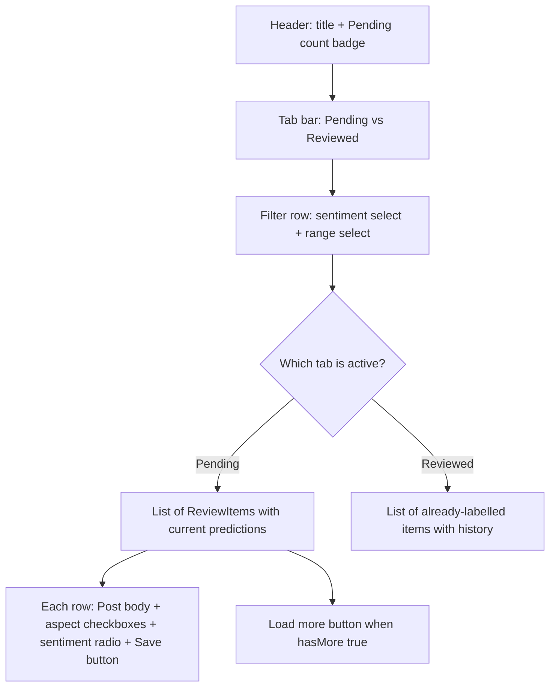
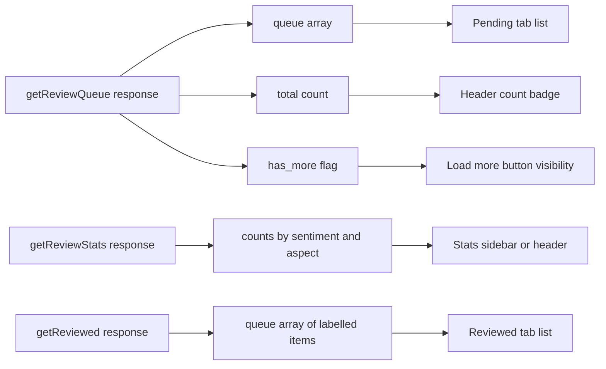
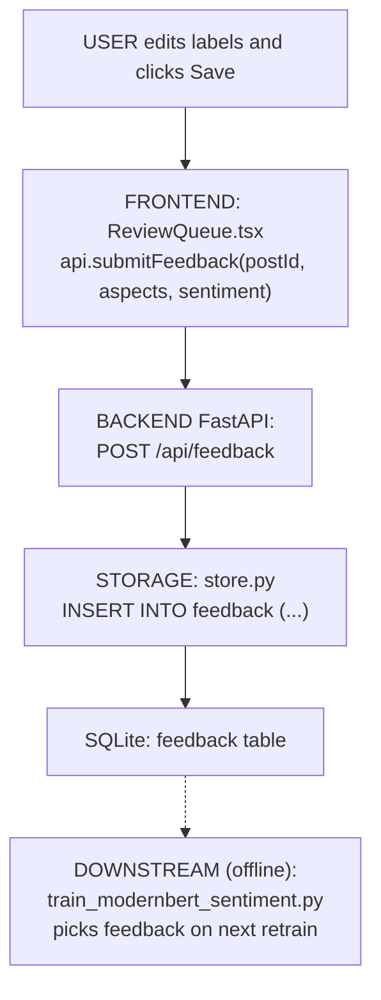

# Review Queue — Page Deep-Dive

Human-in-the-loop labelling UI at `/review`. Analyst reviews model predictions (aspects + sentiment), corrects them, and their edits are stored in the `feedback` table for the ModernBERT retraining loop.

- **URL** — `http://localhost:3001/review`
- **Frontend page** — [`frontend/src/pages/ReviewQueue.tsx`](../../../frontend/src/pages/ReviewQueue.tsx)
- **Backend routes** — [`src/dashboard/api.py`](../../../src/dashboard/api.py) → `/api/review/*`, `/api/feedback`
- **DB tables** — `feedback`, indirectly `analyses`

---

## Section 1 — Cheat sheet

- Two tabs: **Pending** (unreviewed) and **Reviewed** (already labelled).
- 12 aspect labels split into **customer-facing** (7) and **employee-facing** (5).
- Filters: sentiment (`positive/negative/neutral`) + range (1h through 90d + `all time`).
- Every submit is a `POST /api/feedback` with the corrected labels — no soft state, immediate DB write.
- Pagination: 50 items per page, `has_more` flag drives the "Load more" button.

---

## Section 2 — File map

```
ReviewQueue.tsx
+-- ReviewQueue()           -- exported page
+-- inline JSX              -- tab switcher + filter row + queue list + inline edit form
```

---

## Section 3 — Page-load flow



Three API calls fire in parallel via `Promise.all` — pending + stats + reviewed — so both tabs are ready when the analyst switches.

---

## Section 4 — What React renders



---

## Section 5 — Data flow



Aspect taxonomy on this page:

- **Customer-facing (7)**: `store_experience`, `online_app`, `delivery_pickup`, `product_quality`, `returns`, `customer_support`, `pricing`
- **Employee-facing (5)**: `workforce_hr`, `pay_benefits`, `management`, `safety_policy`, `workload`

---

## Section 6 — User actions

- **Tab switcher** — Pending vs Reviewed. Uses the pre-fetched arrays, no extra API call.
- **Sentiment filter** — Reloads via `load()` which re-hits all three endpoints.
- **Range filter** — Same as above.
- **Load more** — Appends the next 50 to `items` via `getReviewQueue(50, ..., items.length)` (offset-based pagination).
- **Save on a row** — `POST /api/feedback` with `{post_id, corrected_aspects, corrected_sentiment}`. Row moves from Pending to Reviewed on next refresh.

Follow the code:

- Parallel load — [ReviewQueue.tsx#L64-L82](../../../frontend/src/pages/ReviewQueue.tsx#L64-L82)
- Load more — [ReviewQueue.tsx#L84-L94](../../../frontend/src/pages/ReviewQueue.tsx#L84-L94)

---

## Section 7 — Full call chain (Save -> API -> feedback table -> retrain script)



---

## Section 8 — File map table

| Layer | File | Symbol |
|---|---|---|
| **UI page** | [ReviewQueue.tsx](../../../frontend/src/pages/ReviewQueue.tsx) | `ReviewQueue()` |
| **API client** | [frontend/src/api.ts](../../../frontend/src/api.ts) | `getReviewQueue`, `getReviewed`, `getReviewStats`, `submitFeedback` |
| **API routes** | [api.py](../../../src/dashboard/api.py) | `/api/review/queue`, `/api/review/reviewed`, `/api/review/stats`, `/api/feedback` |
| **DB tables** | `data/local.db` | `feedback`, `analyses` |
| **Retraining** | [scripts/train_modernbert_sentiment.py](../../../scripts/train_modernbert_sentiment.py) | Consumes `feedback` at next retrain |

---

## Section 9 — UI stack

- No charts — this is a form-heavy list.
- **Tailwind** — filter pills, form controls, list rows.
- **Card / Button** components from `frontend/src/components/`.

---

## Section 10 — Common questions

**Q. What happens if two reviewers edit the same post?**
Last-write-wins in `feedback` (unique by `post_id`). The retrain uses the latest row.

**Q. Do model predictions change immediately after Save?**
No — the current predictions on Brand Health / Insights are read from `analyses`. Feedback only informs the next retrain of ModernBERT. See [scripts/train_modernbert_sentiment.py](../../../scripts/train_modernbert_sentiment.py).

**Q. Why split customer vs employee aspects?**
Different reviewers own different aspect groups. Splitting the checkbox UI reduces mislabels between customer- and employee-side concerns (e.g. someone complaining about workload isn't a `customer_support` issue).

**Q. Where's the `postExplorer`-style search?**
Intentionally minimal here. Explorer-style search lives on `/posts` — this page is a labelling queue, not a data explorer.
