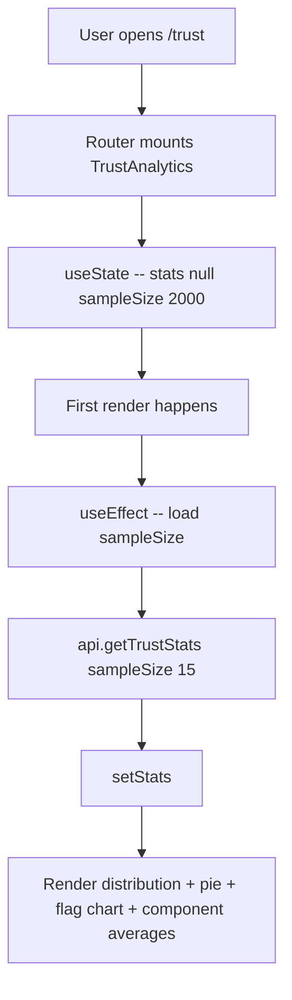
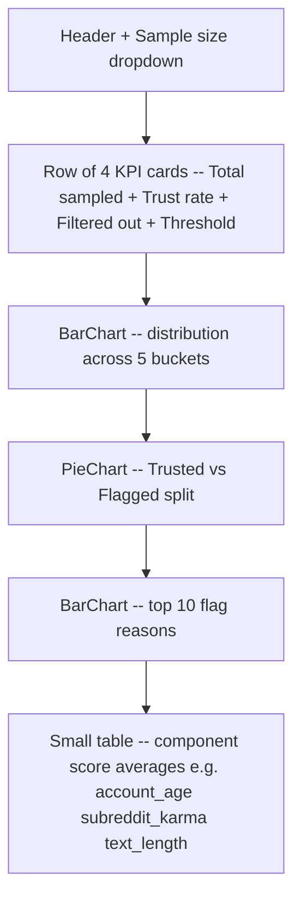
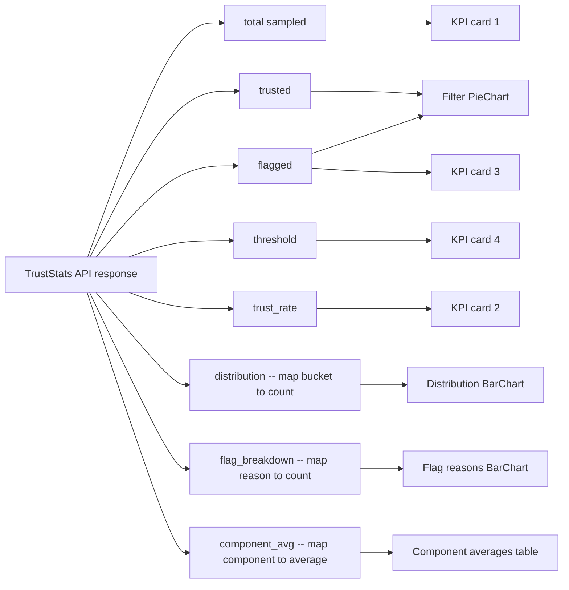
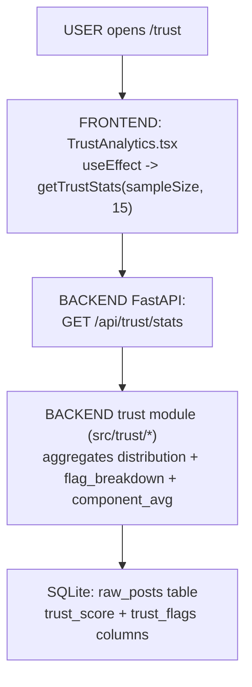

# Trust Analytics — Page Deep-Dive

Explains the credibility filter at `/trust`. Distribution of trust scores, filter rate, top flag reasons, component averages, and analyst-reviewable examples.

- **URL** — `http://localhost:3001/trust`
- **Frontend page** — [`frontend/src/pages/TrustAnalytics.tsx`](../../../frontend/src/pages/TrustAnalytics.tsx)
- **Backend route** — [`src/dashboard/api.py`](../../../src/dashboard/api.py) → `GET /api/trust/stats`
- **Trust module** — [`src/trust/`](../../../src/trust/)
- **Threshold config** — `config/pipeline_config.yaml`

---

## Section 1 — Cheat sheet

- Single API call: `getTrustStats(sampleSize, topN=15)`.
- Sample size dropdown: 500 / 1000 / 2000 / 5000 / 10000 recent posts.
- Threshold (default 0.60) is read from `config/pipeline_config.yaml` and shown on the KPI card.
- Trust rate = `trusted / total`. Filter rate = `flagged / total`.
- Distribution buckets are five equal-width bins over `[0.0, 1.0]`.

---

## Section 2 — File map

```
TrustAnalytics.tsx
+-- TrustAnalytics()   -- exported page
+-- StatCard()         -- local KPI tile component
+-- inline JSX         -- stat row + distribution BarChart + filter PieChart + flag reasons BarChart + component averages
```

---

## Section 3 — Page-load flow



---

## Section 4 — What React renders



---

## Section 5 — Data flow



Distribution buckets are hard-coded in the frontend colour map:

| Bucket | Colour | Meaning |
|---|---|---|
| 0.0-0.2 | #DC3545 red | Almost certainly bot / spam / novelty |
| 0.2-0.4 | #F0932B orange | Low-trust |
| 0.4-0.6 | #FFC220 yellow | Borderline (near threshold) |
| 0.6-0.8 | #8CC63F light green | Trusted |
| 0.8-1.0 | #00865A dark green | High-trust |

---

## Section 6 — User actions

- **Sample size dropdown** — triggers a full reload with the new N.
- No filters, no drill-through. This page is a diagnostic view of the trust filter itself.

Follow the code:

- Load effect — [TrustAnalytics.tsx#L21-L30](../../../frontend/src/pages/TrustAnalytics.tsx#L21-L30)

---

## Section 7 — Full call chain (React -> API -> trust module -> SQL -> back)



---

## Section 8 — File map table

| Layer | File | Symbol |
|---|---|---|
| **UI page** | [TrustAnalytics.tsx](../../../frontend/src/pages/TrustAnalytics.tsx) | `TrustAnalytics()`, `StatCard()` |
| **API client** | [frontend/src/api.ts](../../../frontend/src/api.ts) | `getTrustStats` |
| **API route** | [api.py](../../../src/dashboard/api.py) | `GET /api/trust/stats` |
| **Trust logic** | [src/trust](../../../src/trust) | Score computation + flag reasons |
| **Threshold** | [config/pipeline_config.yaml](../../../config/pipeline_config.yaml) | `trust.threshold` (default 0.60) |

---

## Section 9 — UI stack

- **Recharts** — `BarChart` (distribution + flag reasons), `PieChart` (trusted vs flagged), `Cell` (custom colours per bucket).
- **Tailwind** — Cards + typography.
- No icons on this page.

---

## Section 10 — Common questions

**Q. Why is trust computed only once, not per query?**
Trust is a per-post property that doesn't depend on the query. It's computed at ingestion time and stored on `raw_posts.trust_score`. Every downstream filter (Brand Health, Insights) reads this pre-computed column.

**Q. What lives in `component_avg`?**
The signal components that make up the composite trust score — account age, subreddit karma, text length, link count, etc. Values are the mean of each signal across the sampled subset, so you can see which signals are pulling the score up or down on average.

**Q. Can I change the threshold without a redeploy?**
Edit `config/pipeline_config.yaml` and the next pipeline run picks it up. The page shows the current threshold live from the config.

**Q. What if all posts pass — should I lower the threshold?**
Look at the distribution BarChart. If the leftmost bucket (0.0-0.2) is near-empty, either the ingested subs are self-moderated cleanly, or the trust model is too permissive. Compare `flag_breakdown` sum to `flagged` — if they match, the signals fire but the score doesn't cross threshold.
