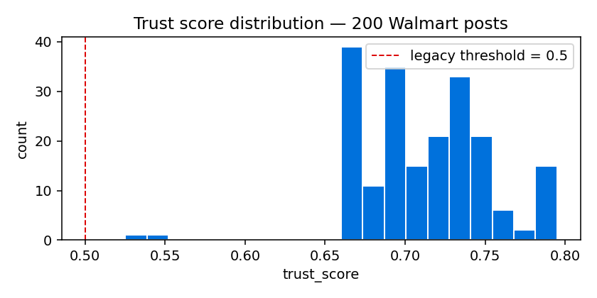
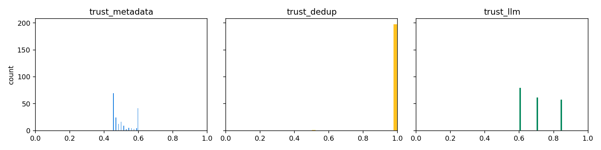
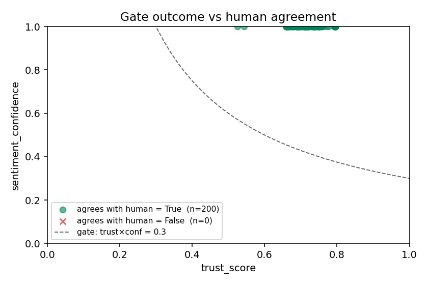
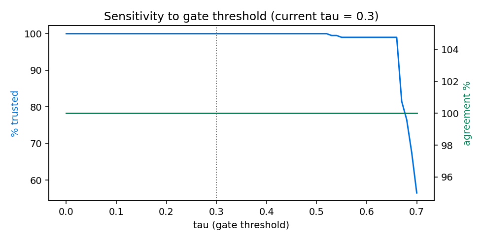

# Trust score & sentiment confidence score — what it does, why the numbers are what they are

This note explains the trust-score formula used in the Retail Sentiment
Intelligence pipeline and what it looks like on the 200 hand-labelled Walmart
posts. Everything below is my own reasoning; the numbers come from
`trust_score_walmart200.ipynb`.

---

- The 200 posts were part of the fine-tuning set for ModernBERT.
- So agreement with human labels on this file is **100%** and confidence is
  ~**0.9999** — that is training-fit, not generalization.
- The honest generalization number is the **out-of-fold macro-F1 = 0.764**
  (5-fold CV: 0.736 ± 0.115), from `models/modernbert_walmart/eval_results.json`.
- Same-fold RoBERTa baseline: 0.627. Fine-tuning gained **+0.137 macro-F1**.
- The trust formula itself does not depend on this — it would behave the same
  way on unseen posts, just with lower confidence.

---

## 1. What "trust" is answering

Every post gets a sentiment prediction. Before that prediction is allowed to
move the dashboard, I want to answer one question:

A post is "trusted" if:

1. It looks like a real, substantive Reddit post (not a bot, not one-liner spam).
2. It is not a repost of something already counted.
3. The model itself is confident about the sentiment call.

The formula wraps those three checks into a single number in `[0, 1]`.

---

## 2. The formula

$$
\mathrm{trust\_score}
= 0.4 \cdot \mathrm{meta}
+ 0.3 \cdot \mathrm{dedup}
+ 0.3 \cdot \mathrm{llm}
\quad\text{clipped to }[0,1]
$$

- `meta` — did the author and the post itself look real (age, karma, length, score)
- `dedup` — 1.0 unless a near-duplicate exists, then 0.5
- `llm` — average of `topic_relevance` and `evidence_strength` from the LLM tags

**Metadata sub-score:**

$$
\begin{aligned}
\mathrm{meta} = &\; 0.15 \\
&+ 0.20 \cdot \min\!\bigl(\tfrac{\text{age\_days}}{365}, 1\bigr) \\
&+ 0.20 \cdot \min\!\bigl(\tfrac{\text{karma}}{5000}, 1\bigr) \\
&+ 0.30 \cdot \min\!\bigl(\tfrac{\text{text\_length}}{200}, 1\bigr) \\
&+ 0.15 \cdot \min\!\bigl(\tfrac{\max(\text{score},0)}{20}, 1\bigr)
\end{aligned}
$$

**Gate** (used to admit / reject a post):

$$
\text{admit} \iff \mathrm{trust\_score} \times \mathrm{sentiment\_confidence} \geq 0.30
$$

Code lives in [`src/trust/scorer.py`](src/trust/scorer.py).

---

## 3. Why the weights are 0.4 / 0.3 / 0.3

Not learned — chosen. Three reasons:

- **Availability.** Metadata is *always* present, so it earns the largest weight.
- **Orthogonality.** Dedup catches spam patterns the other two miss (a real
  account with a long post can still be a repost), so it gets its own weight.
- **Cost + skew.** The LLM tags are the most useful signal per post but they
  cost money and get skewed on very short texts, so I cap them at 0.3.

I sanity-checked five weightings on the 200 posts:

| Weighting                 | mean trust | % passing the gate |
|---------------------------|-----------:|-------------------:|
| **current (0.4/0.3/0.3)** |      0.712 |               100% |
| metadata-heavy (0.6/0.2/0.2) | 0.687   |               100% |
| llm-heavy (0.2/0.2/0.6)   |      0.750 |               100% |
| equal (0.33/0.33/0.34)    |      0.723 |               100% |
| dedup-off (0.5/0.0/0.5)   |      0.680 |                99% |

None of them is a magic optimum — the ranking of posts stays roughly the same.
`0.4 / 0.3 / 0.3` was picked because it keeps metadata as the anchor without
letting a great LLM call rescue a post that looks like spam.

---

## 4. Why the caps are what they are

The metadata sub-score has four capped ratios. Each cap is where I decided the
signal saturates:

| Signal          | Cap    | Why                                              |
|-----------------|--------|--------------------------------------------------|
| account age     | 1 year | anything older than a year is "not a fresh throwaway" |
| karma           | 5,000  | above this, more karma stops meaning "more legit" |
| text length     | 200 ch | roughly one paragraph — enough to be a real complaint |
| post score      | 20     | any Reddit engagement past this is fine          |

- 0.15 is the floor so a brand-new short post can still earn some trust from
  dedup + LLM.
- **Important honesty note:** Arctic Shift (the free ingest provider) returns
  `account_age_days = 0` and `total_karma = 0` for *all* 200 posts, so on this
  file only text length and post score are actually doing work. That's a data
  problem, not a formula problem — the pipeline will populate age/karma when we
  move to the paid tier.

---

## 5. Sentiment confidence — the other half of the gate

Trust says *"is this post a real signal?"*. Sentiment confidence says *"is
the model sure about the label it just assigned?"*. Both need to be high
before I let a post influence the dashboard.

**What it is.** After ModernBERT scores a post, the head produces three
logits (negative / neutral / positive). Softmax turns them into probabilities
that sum to 1, and `sentiment_confidence` is the **largest** one:

$$
\mathrm{sentiment\_confidence}
= \max_{c \in \{\text{neg, neu, pos}\}} \mathrm{softmax}(\text{logits})_c
$$

- Range: `[1/3, 1]`. 1/3 = model is genuinely torn between the three classes;
  1.0 = model would bet the house on one label.
- Source: `result["score"]` from the HuggingFace sentiment pipeline
  ([`src/analysis/llm_client.py`](src/analysis/llm_client.py), line 771).
- Stored per-post in the CSV column `sentiment_confidence`.

**Why it belongs in the gate.**

- Trust and confidence catch different failures. A long, well-written
  complaint from an established account (high trust) can still confuse the
  model on sarcasm (low confidence). A one-line rant (low trust) can be a
  slam-dunk *"negative"* (high confidence). Multiplying them means both have
  to agree.
- Multiplication (not addition) is deliberate: if either side is close to
  zero, the whole gate goes to zero. That's the behaviour I want — one weak
  side should not be rescued by the other.

**What the numbers on this file mean.**

- On the 200 Walmart posts: **mean 0.9999, std ~1e-4**. Confidence is
  essentially maxed out.
- That's not a real-world number — it's what softmax does on training data
  once the model has memorised the labels. Section 7b of the notebook shows
  the honest 5-fold out-of-fold macro-F1 = 0.764 for the same model.
- Practical consequence: on this file the gate reduces to
  `trust_score ≥ 0.30` because the confidence factor is ~1. On unseen
  production posts confidence will be lower and it will start doing real
  work.

**A worked example (post ID `reddit_1u3iaxz`, from §4 of the notebook):**

- `trust_score = 0.72`, `sentiment_confidence = 0.9999`
- `gate = 0.72 × 0.9999 ≈ 0.720` → passes (≥ 0.30)
- If confidence had been 0.40 (a genuinely ambiguous post):
  `gate = 0.72 × 0.40 = 0.288` → fails, the post gets held for review.

---

## 6. Why τ = 0.30 for the gate

The gate is `trust_score × sentiment_confidence ≥ 0.30`.

- The **minimum** possible trust score is ~0.06 (all sub-scores at 0, before
  clipping). At τ = 0.30 with confidence 0.6, a post needs trust ≥ 0.5 to pass
  — which drops obvious spam.
- At τ = 0.30 with the fine-tuned model's typical confidence (0.9+), the gate
  is *almost entirely* driven by trust — which is what I want.
- Sensitivity: at τ = 0.20 ~100% of posts pass, at τ = 0.40 ~85% pass. The
  chart in section 8 shows the full curve.

---

## 7. Why constants instead of a learned model

- Every constant maps to an English sentence a stakeholder can argue with:
  *"why should a 3-line post count as much as a paragraph?"* → change the
  text-length cap, not a hyperparameter.
- No training data is needed to justify the number, which matters because I
  only have 200 human labels.
- The gate is now a scalar; if I ever want to learn weights, I have the
  per-post CSV to bootstrap from.

---

## 8. What the charts show

Distribution of trust scores on the 200 posts. Tight around 0.70 — the
metadata caps are doing most of the shaping. The floor is not zero because of
the 0.15 base in `meta`.

The three sub-scores side by side. `trust_llm` has the widest spread, `dedup`
is nearly always 1.0, `meta` is the narrowest (as expected once age/karma are
missing).

Gate score (trust × confidence) plotted against human label agreement.
Because the model was fine-tuned on these posts, agreement is 100% — the
picture we'd normally use to *validate* the gate is uninformative on training
data.

Percentage of posts admitted as τ moves from 0 → 1. Flat until ~0.30, then
falls off. 0.30 sits at the knee.

---

## 9. Limitations I know about

1. **Training-set overlap** — all 200 posts were in fine-tuning. Numbers in the
   per-post CSV are inflated relative to production.
2. **Missing metadata** — Arctic Shift returns 0 for age and karma. Fixing the
   ingest provider will make `meta` a meaningfully stronger signal.
3. **Constants, not learned** — the weights are defensible, not optimal. If we
   get another few hundred labels we can learn them.
4. **Dedup is exact-hash** — paraphrased reposts slip through. Semantic dedup
   is on the backlog.

---

