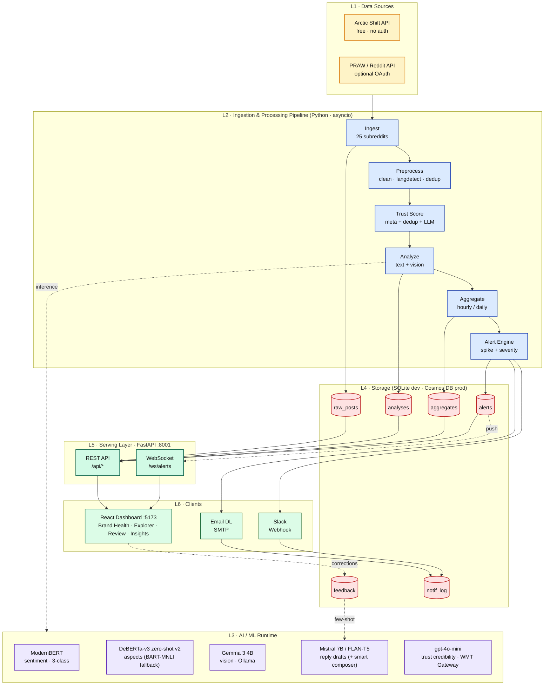
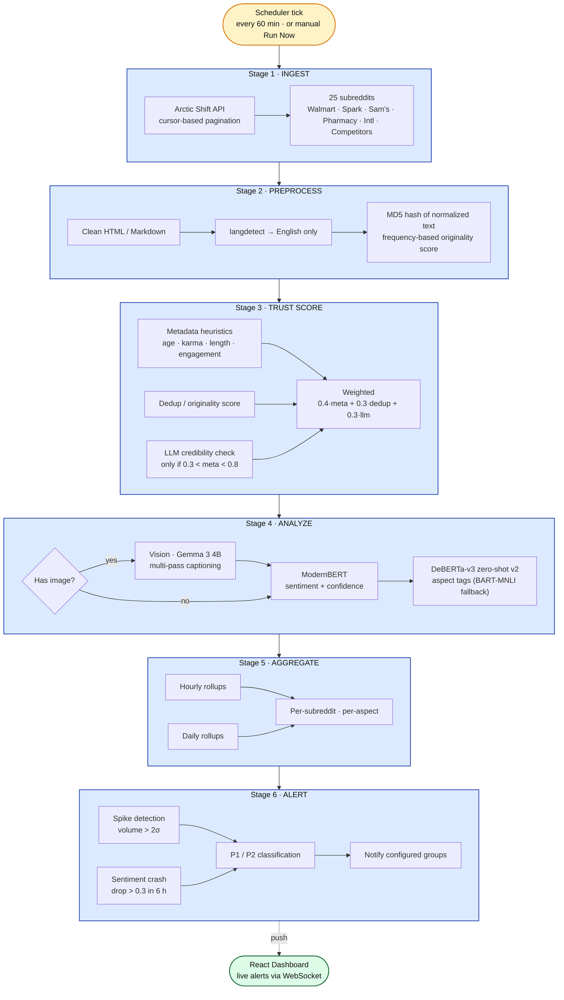
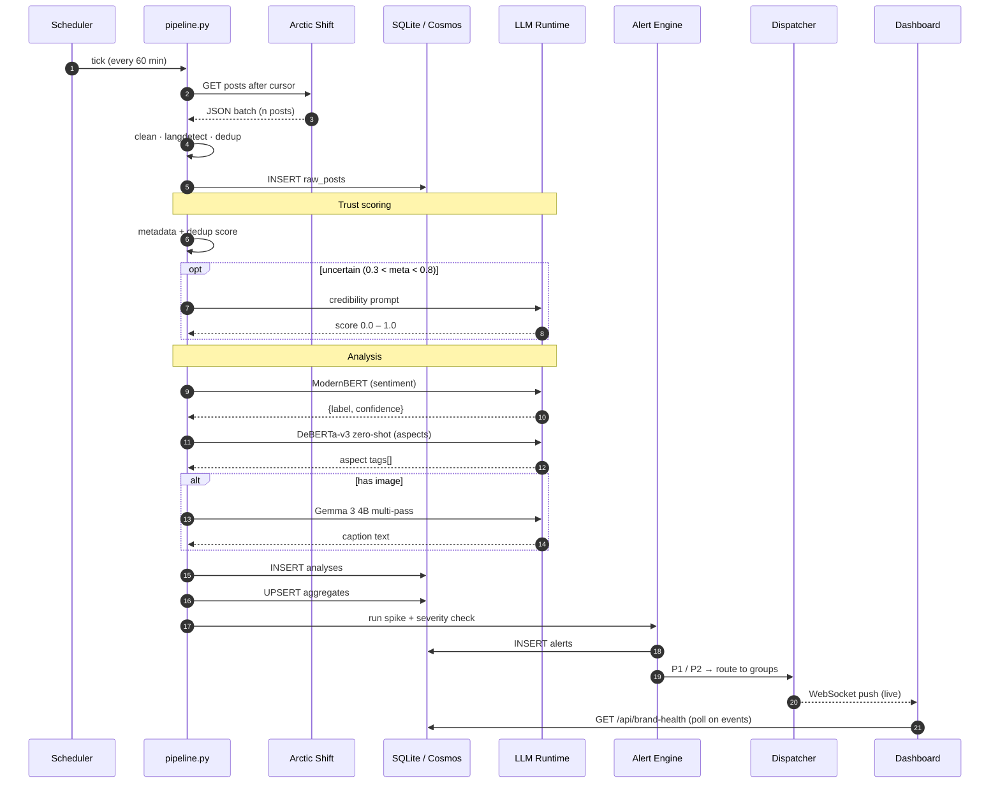
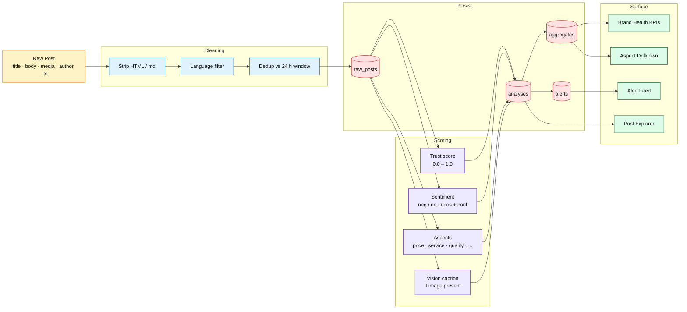

# Retail Sentiment Intelligence

### Real-Time Brand Health Monitoring via Reddit NLP Pipeline

**BITS ZG628T · Dissertation — Post Mid-Semester Progress Presentation**

**Vishal Singh** · ID No. **2020AA05641**
M.Tech in Artificial Intelligence & Machine Learning
Birla Institute of Technology & Science, Pilani (WILP)

*Dissertation work carried out at* **Walmart Global Tech, Bengaluru**
*Supervisor:* **Mr. Varunendra Pratap Singh** — Principal Software Engineer, Walmart Global Tech

---
layout: default
class: 'overflow-content !p-8'
---

# What We're Building & Where We Are

<div class="text-base opacity-70 -mt-1 mb-5">Project objective + progress checkpoint · <span class="text-[#0071ce] font-semibold">Part A delivered at mid-sem</span> · <span class="text-[#b8860b] font-semibold">Part B is today</span></div>

<div class="text-lg leading-relaxed border-l-4 border-[#ffc220] pl-5 py-4 bg-[#fff5cc] rounded-r mb-6 text-[#041e42]">
An <strong>automated, trust-aware pipeline</strong> that tracks Walmart-related conversations on Reddit, uses <strong>LLMs</strong> to extract sentiment, aspects & emerging themes, and surfaces them in a <strong>human-reviewed dashboard</strong> so Ops · PR · Product teams can respond at social speed.
</div>

<div class="grid grid-cols-4 gap-4 mb-6">
  <div class="p-4 rounded-lg border-t-4 border-[#0071ce] bg-[#e6f4fc] shadow-sm">
    <div class="flex items-center gap-2"><span class="text-3xl">👂</span><span class="font-bold text-[#041e42] text-base">01 · Listen</span></div>
    <div class="text-sm mt-2 text-[#041e42] opacity-80 leading-snug">25 Walmart / retail subreddits · hourly · Arctic Shift API.</div>
  </div>
  <div class="p-4 rounded-lg border-t-4 border-[#ffc220] bg-[#fff5cc] shadow-sm">
    <div class="flex items-center gap-2"><span class="text-3xl">🧠</span><span class="font-bold text-[#041e42] text-base">02 · Analyze</span></div>
    <div class="text-sm mt-2 text-[#041e42] opacity-80 leading-snug">ModernBERT · DeBERTa-v3 · Gemma 3 vision · Trust score.</div>
  </div>
  <div class="p-4 rounded-lg border-t-4 border-[#0071ce] bg-[#e6f4fc] shadow-sm">
    <div class="flex items-center gap-2"><span class="text-3xl">👁️</span><span class="font-bold text-[#041e42] text-base">03 · Review</span></div>
    <div class="text-sm mt-2 text-[#041e42] opacity-80 leading-snug">Analysts validate, correct & prioritize in a Kanban board.</div>
  </div>
  <div class="p-4 rounded-lg border-t-4 border-[#ffc220] bg-[#fff5cc] shadow-sm">
    <div class="flex items-center gap-2"><span class="text-3xl">🚀</span><span class="font-bold text-[#041e42] text-base">04 · Act</span></div>
    <div class="text-sm mt-2 text-[#041e42] opacity-80 leading-snug">Route to Ops · PR · Product via P1 / P2 / P3 with SLAs.</div>
  </div>
</div>

<div class="grid grid-cols-2 gap-6 mb-6">

  <div class="p-6 rounded-xl border-2 border-[#0071ce] bg-[#e6f4fc] shadow-sm">
    <div class="flex items-center gap-3 mb-4">
      <div class="text-4xl leading-none">✅</div>
      <div>
        <div class="font-bold text-[#041e42] text-xl leading-tight">Part A · Mid-Semester</div>
        <div class="text-xs text-[#0071ce] uppercase tracking-wide mt-0.5 font-semibold">Delivered · demoed to committee</div>
      </div>
    </div>
    <ul class="text-[15px] space-y-2.5 leading-snug list-none pl-0 text-[#041e42]">
      <li><span class="text-[#0071ce] font-bold text-lg">✓</span> End-to-end <strong>6-stage pipeline</strong> (Ingest → Alert)</li>
      <li><span class="text-[#0071ce] font-bold text-lg">✓</span> <strong>Vision pipeline</strong> — Gemma 3 4B on image-only posts</li>
      <li><span class="text-[#0071ce] font-bold text-lg">✓</span> <strong>Trust score</strong> — Metadata · Dedup · LLM credibility</li>
      <li><span class="text-[#0071ce] font-bold text-lg">✓</span> <strong>ModernBERT</strong> fine-tune — Macro F1 <strong>0.76</strong> (vs RoBERTa 0.63)</li>
      <li><span class="text-[#0071ce] font-bold text-lg">✓</span> <strong>Real-time dashboard</strong> — 22 API endpoints + WebSocket</li>
      <li><span class="text-[#0071ce] font-bold text-lg">✓</span> <strong>Notification system</strong> — P1/P2/P3 (Email · Slack · Teams)</li>
    </ul>
  </div>

  <div class="p-6 rounded-xl border-2 border-[#ffc220] bg-[#fff5cc] shadow-sm">
    <div class="flex items-center gap-3 mb-4">
      <div class="text-4xl leading-none">🟡</div>
      <div>
        <div class="font-bold text-[#041e42] text-xl leading-tight">Part B · Post Mid-Semester</div>
        <div class="text-xs text-[#b8860b] uppercase tracking-wide mt-0.5 font-semibold">In progress · presenting today</div>
      </div>
    </div>
    <ul class="text-[15px] space-y-2.5 leading-snug list-none pl-0 text-[#041e42]">
      <li><span class="text-[#b8860b] font-bold text-lg">☐</span> <strong>Review & Validate</strong> — Human-in-the-Loop workflow</li>
      <li><span class="text-[#b8860b] font-bold text-lg">☐</span> <strong>Post Explorer</strong> — Multi-facet filtering & search</li>
      <li><span class="text-[#b8860b] font-bold text-lg">☐</span> <strong>Kanban Lifecycle</strong> — Triaged → In-Review → Resolved</li>
      <li><span class="text-[#b8860b] font-bold text-lg">☐</span> <strong>Insights & Competitor</strong> — Cross-brand comparison</li>
      <li><span class="text-[#b8860b] font-bold text-lg">☐</span> <strong>Smart Reply Composer</strong> — Dual-draft (Rule + LLM)</li>
      <li><span class="text-[#b8860b] font-bold text-lg">☐</span> <strong>Learning loop</strong> — Feedback → future retraining</li>
    </ul>
  </div>

</div>

<div>
  <div class="flex items-center justify-between text-sm mb-2 text-[#041e42]">
    <span><strong>Overall Dissertation Progress</strong></span>
    <span>Phase 1 of 2 · <strong>~55% complete</strong></span>
  </div>
  <div class="w-full h-4 bg-[#e6f4fc] rounded-full overflow-hidden shadow-inner border border-[#cce7f5]">
    <div class="h-full bg-gradient-to-r from-[#041e42] via-[#0071ce] to-[#ffc220]" style="width: 55%"></div>
  </div>
  <div class="flex justify-between text-xs mt-1.5 text-[#041e42] opacity-70">
    <span>Start</span>
    <span class="text-[#0071ce] font-semibold">↑ Mid-sem checkpoint (55%)</span>
    <span>Final defence</span>
  </div>
</div>

---
class: 'overflow-content !p-5'
---

## High-Level System Architecture

> Layered view — external sources → pipeline core → AI runtime → storage → serving → clients



---

## 6-Stage Pipeline — Detailed Flow



- **Total latency:** ~3–5 min for 25 subreddits
- **25 tracked subreddits** across 6 groups (Walmart core, Spark, Pharmacy, Sam's Club, International, Retail Competitors)
- **Incremental:** cursor-based ingestion — only new posts fetched per run

---

## Request Sequence — End-to-End



---
class: 'overflow-content !p-6'
---

## Data Ingestion — Where the Plan Met Reality

<div class="text-sm text-[#041e42] opacity-70 -mt-1 mb-4">How we replaced <span class="text-[#0071ce] font-semibold">PRAW</span> with the Arctic Shift API and turned a broken plan into a stable 60-minute ingestion loop</div>

<div class="grid grid-cols-2 gap-4 mb-4">
  <div class="p-4 rounded-lg border-l-4 border-[#b8860b] bg-[#fff5cc] shadow-sm">
    <div class="text-xs uppercase tracking-wider text-[#b8860b] font-bold mb-1">Initially Planned</div>
    <div class="text-xl font-bold text-[#041e42] mb-2">🐍 PRAW · Reddit Dev API</div>
    <ul class="text-sm text-[#041e42] leading-relaxed space-y-1 list-disc pl-5">
      <li>Official Python client for Reddit</li>
      <li>OAuth-based, real-time listing & stream</li>
      <li>Canonical &quot;correct&quot; ingestion path</li>
    </ul>
    <div class="text-xs text-[#b8860b] mt-2 font-semibold">❌ Blocker — could not secure working Reddit dev-API credentials in time (app-registration + auth-flow friction). Live streaming path parked.</div>
  </div>

  <div class="p-4 rounded-lg border-l-4 border-[#0071ce] bg-[#e6f4fc] shadow-sm">
    <div class="text-xs uppercase tracking-wider text-[#0071ce] font-bold mb-1">Actually Shipped</div>
    <div class="text-xl font-bold text-[#041e42] mb-2">🧊 Arctic Shift API</div>
    <ul class="text-sm text-[#041e42] leading-relaxed space-y-1 list-disc pl-5">
      <li>Public Reddit archive endpoint — no auth</li>
      <li>Windowed pulls across 25 Walmart-relevant subs</li>
      <li>Same fetcher interface — PRAW pluggable later</li>
    </ul>
    <div class="text-xs text-[#0071ce] mt-2 font-semibold">✅ Mitigation — Arctic Shift keeps the pipeline unblocked. Zero downstream schema change; ingestion feeds the exact same <code>raw_posts</code> table.</div>
  </div>
</div>

<div class="grid grid-cols-[1fr_1fr] gap-4">

<div>

### Side-by-Side

| Dimension | 🐍 PRAW (planned) | 🧊 Arctic Shift (shipped) |
|-----------|-------------------|---------------------------|
| Auth | Reddit app + OAuth token | None — public HTTP |
| Access model | Live listings / stream | Windowed archive queries |
| Historical reach | ~1 000 posts / listing cap | Deep — years of history |
| Setup effort here | Blocked at approval | Working same day |
| Cost | Free · quota-bound | Free · community-hosted |

</div>

<div class="p-3 rounded-lg bg-[#041e42] text-white text-sm leading-relaxed">
  <div class="font-bold text-[#ffc220] mb-2">🎯 Outcome for the pipeline</div>
  <ul class="space-y-1.5 list-disc pl-5">
    <li><strong>No slippage</strong> — Stage 1 (Ingest) hits 25 subs · hourly in production.</li>
    <li><strong>Reversible choice</strong> — <code>src/ingestion/</code> abstracts source; PRAW can slot in when credentials clear.</li>
    <li><strong>Bonus win</strong> — Arctic&apos;s historical depth let us backfill the benchmark set (200 real posts) that ModernBERT trained on.</li>
  </ul>
  <div class="text-xs opacity-70 mt-2 pt-2 border-t border-white/20">Next in series → Step 2: Preprocess &nbsp;·&nbsp; Step 3: Trust &nbsp;·&nbsp; Step 4: Analyze &nbsp;·&nbsp; Step 5: Aggregate &nbsp;·&nbsp; Step 6: Alerts</div>
</div>

</div>

---

## Vision Pipeline — Why Gemma 3 4B

<div class="text-xs text-[#041e42] opacity-70 -mt-1 mb-2"><strong>3.9%</strong> of Reddit posts are image-only (empty body) — the complaint lives <strong>inside the image</strong>. Text-only pipeline drops these → we need a vision model to eliminate hallucination in multimodal retail analysis.</div>

<div class="grid grid-cols-[minmax(0,0.9fr)_minmax(0,1.1fr)] gap-4 items-start">

<div class="p-2 rounded-lg border border-[#cce7f5] bg-white shadow-sm">
  <div class="flex items-center justify-between mb-1">
    <div class="text-[10px] uppercase tracking-wider text-[#0071ce] font-bold">Real Reddit post · <span class="text-[#041e42]">r/samsclub</span></div>
    <div class="text-[9px] text-[#041e42] opacity-60">id: 1uacdy7</div>
  </div>
  <div class="text-[12px] font-semibold text-[#041e42] leading-snug">Title: "Accidental Membership Upgrade"</div>
  <a href="https://www.reddit.com/r/samsclub/comments/1uacdy7/accidental_membership_upgrade/" target="_blank" class="text-[9px] text-[#0071ce] hover:underline break-all block mb-1">↗ reddit.com/r/samsclub/comments/1uacdy7</a>
  
  <div class="text-[9px] text-[#041e42] opacity-60 mt-1 text-center">Body: <em>(empty)</em> — the complaint is a purple circle drawn on the cart</div>
</div>

<div class="flex flex-col gap-2">
  <div class="p-2 rounded-lg border-l-4 border-[#b8860b] bg-[#fff5cc]">
    <div class="text-[10px] uppercase tracking-wider text-[#b8860b] font-bold mb-0.5">❌ Text-only pipeline sees</div>
    <div class="text-[12px] text-[#041e42] leading-snug">Just the 3-word title. No item, no charge, no context. Sentiment ≈ neutral · Aspect = <code>unknown</code>. Silently dropped. <strong>Useless.</strong></div>
  </div>

  <div class="p-2 rounded-lg border-l-4 border-[#0071ce] bg-[#e6f4fc]">
    <div class="text-[10px] uppercase tracking-wider text-[#0071ce] font-bold mb-0.5">✅ Vision (Gemma 3 4B) extracts</div>
    <ul class="text-[12px] text-[#041e42] leading-snug list-disc pl-4 space-y-0">
      <li><strong>Sam's Club app cart</strong>, Jun 19 2026 · total <strong>$306.05</strong></li>
      <li>Circled · <strong>Sam's Plus Membership $11.01</strong> (purple ring = complaint anchor)</li>
      <li>Other items ignored: Blueberries $5.14, Mini Candy Cookies $7.78, Insulated Shopper $9.98</li>
      <li>Aspect = <code>fees / accidental charges</code> · Sentiment = <strong>negative</strong> · Conf <strong>0.88</strong></li>
    </ul>
  </div>

  <div class="p-2 rounded-lg bg-[#041e42] text-white text-[11px] leading-snug">
    <strong class="text-[#ffc220]">🎯 Signal recovered</strong> — a UX complaint about an easy-to-tap upgrade toggle now feeds the <em>fees</em> aspect KPI and triggers alerts if the pattern repeats.
  </div>
</div>

</div>

<div class="mt-3 p-2 rounded-lg bg-[#041e42] text-white">
  <div class="grid grid-cols-[auto_1fr_1fr] gap-4 items-center">
    <div class="text-center pr-3 border-r border-white/20">
      <div class="text-[10px] uppercase tracking-wider text-[#ffc220] font-bold">🧠 Vision model chosen</div>
      <div class="text-base font-bold leading-tight">Gemma 3 4B</div>
      <div class="text-[10px] opacity-80">3.3 GB · Ollama · Google</div>
    </div>
    <div>
      <div class="text-[10px] uppercase tracking-wider text-[#ffc220] font-bold mb-1">DocVQA · size · runtime</div>
      <table class="text-[11px] leading-tight w-full">
        <tr class="bg-[#ffc220] text-[#041e42]"><td class="px-1 font-bold">gemma3:4b</td><td class="px-1 text-right font-bold">83</td><td class="px-1 text-right">3.3 GB</td><td class="px-1">✅ Ollama</td></tr>
        <tr><td class="px-1">LLaVA-1.6 8B</td><td class="px-1 text-right">75</td><td class="px-1 text-right">5.5 GB</td><td class="px-1 opacity-70">larger, slower</td></tr>
        <tr><td class="px-1">PaliGemma 2 3B</td><td class="px-1 text-right">81</td><td class="px-1 text-right">~6 GB</td><td class="px-1 opacity-70">no Ollama</td></tr>
        <tr><td class="px-1">LLaVA-1.5 7B</td><td class="px-1 text-right">28</td><td class="px-1 text-right">4.7 GB</td><td class="px-1 opacity-70">3× worse OCR</td></tr>
      </table>
    </div>
    <div class="text-[11px] leading-snug">
      <div class="text-[10px] uppercase tracking-wider text-[#ffc220] font-bold mb-1">Why it wins</div>
      <ul class="list-disc pl-4 space-y-0.5">
        <li>Best DocVQA under 4 GB — reads receipts, app screens</li>
        <li>Google-maintained → Walmart policy compliant</li>
        <li>Reuses local Ollama (<code>localhost:11434</code>)</li>
        <li>4–6 s warm latency per image</li>
      </ul>
    </div>
  </div>
</div>

---

## Vision Pipeline · Deep-Dive — 75% Failure → Root Cause → Multi-Pass Fix

<div class="text-[10px] text-[#041e42] opacity-70 -mt-1 mb-1">First-cut Gemma 3 4B hallucinated on 1 in 2 images → root-caused → 5 papers reviewed (all China-blocked) → borrowed the <em>ideas</em> → 4-pass pipeline with a text-only final step.</div>

<div class="grid grid-cols-[minmax(0,0.95fr)_minmax(0,1.05fr)] gap-2 items-start">

<div class="p-2 rounded-lg border-l-4 border-[#d93025] bg-[#fce8e6]">
  <div class="flex items-baseline justify-between mb-1">
    <div class="text-[10px] uppercase tracking-wider text-[#d93025] font-bold">⚠️ 1 · First-cut test · n = 8</div>
    <div class="text-[9px] text-[#5f6368]">baseline single-pass</div>
  </div>
  <div class="flex flex-wrap gap-x-3 gap-y-0 text-[10.5px] text-[#041e42] mb-1">
    <span><strong class="text-[#d93025]">75%</strong> overall fail (6/8)</span>
    <span><strong class="text-[#d93025]">50%</strong> hallucination (4/8)</span>
    <span><strong class="text-[#d93025]">37.5%</strong> critical (fake receipts/prices)</span>
    <span><strong class="text-[#0071ce]">25%</strong> correct (memes only)</span>
  </div>
  <div class="text-[9.5px] text-[#041e42] opacity-90 leading-snug">
    <strong>Hallucinations seen:</strong> "receipt $39.99 w/ handwritten <em>Damaged Box</em>" (product page, no price, no handwriting) · "Order status PENDING" (word absent) · "12-pack Zero Sugar Dr Pepper" (single 42.3 fl oz regular bottle) → <strong class="text-[#d93025]">fabricated data corrupted dashboards.</strong>
  </div>
</div>

<div class="p-2 rounded-lg border-l-4 border-[#b8860b] bg-[#fff5cc]">
  <div class="text-[10px] uppercase tracking-wider text-[#b8860b] font-bold mb-1">🔍 2 · Root cause (5)</div>
  <ul class="text-[10.5px] text-[#041e42] leading-snug list-disc pl-4 space-y-0">
    <li><strong>768 px fixed resize</strong> → small text unreadable</li>
    <li><strong>4 B params</strong> → can't reason button + error + context</li>
    <li><strong>No dynamic resolution</strong> → one fixed scale for whole image</li>
    <li><strong>Hallucinates under uncertainty</strong> → invents rather than admits</li>
    <li><strong>No context awareness</strong> → confuses screenshots vs physical displays</li>
  </ul>
</div>

</div>

<div class="mt-2 p-2 rounded-lg border-l-4 border-[#0071ce] bg-[#e6f4fc]">
  <div class="grid grid-cols-[auto_1fr] gap-3 items-center">
    <div class="text-center pr-3 border-r border-[#0071ce]/30">
      <div class="text-[10px] uppercase tracking-wider text-[#0071ce] font-bold">📚 3 · Research 2023–25</div>
      <div class="text-sm font-bold text-[#0071ce] leading-tight">5 / 5 blocked</div>
      <div class="text-[9px] text-[#041e42] opacity-70">Walmart vendor policy</div>
    </div>
    <div class="text-[10px] text-[#041e42] leading-snug">
      <div class="flex flex-wrap gap-x-2 gap-y-0">
        <span>❌ <strong>UReader</strong> (Tencent) — shape-adaptive cropping</span>
        <span>❌ <strong>TextMonkey</strong> (USTC) — shifted window attention</span>
        <span>❌ <strong>DocOwl 1.5</strong> (Alibaba) — structure-aware parsing</span>
        <span>❌ <strong>InternVL2</strong> (Shanghai AI Lab) — tile-based</span>
        <span>❌ <strong>Qwen2.5-VL</strong> (Alibaba) — dynamic res + multimodal RoPE</span>
      </div>
      <div class="text-[9.5px] opacity-90 mt-0.5 border-l-2 border-[#0071ce] pl-2"><strong>Consensus:</strong> tile-based attention + dynamic/native resolution is THE fix. Fixed resize is the failure mode — <em>not</em> the model architecture.</div>
    </div>
  </div>
</div>

<div class="mt-2 p-2 rounded-lg bg-[#041e42] text-white">
  <div class="text-[10px] uppercase tracking-wider text-[#ffc220] font-bold mb-1">🧭 4 · Strategy — take the ideas, not the models (same gemma3:4b, smarter calling)</div>
  <table class="text-[10px] leading-tight w-full">
    <tr class="text-[#ffc220]"><td class="px-1 w-1/2">Paper technique</td><td class="px-1">We implement as</td></tr>
    <tr><td class="px-1">Tile-based processing (InternVL2)</td><td class="px-1">Split image into 2–4 crops ourselves, send each to gemma3:4b</td></tr>
    <tr><td class="px-1">Structure-first parsing (DocOwl 1.5)</td><td class="px-1">Pass 1 asks "what type of image?" before reading text</td></tr>
    <tr><td class="px-1">Focused text extraction (UReader)</td><td class="px-1">"Read ALL text verbatim" prompt per tile</td></tr>
    <tr><td class="px-1">Resolution preservation (Qwen2.5-VL)</td><td class="px-1">Tiling → 2–4× effective resolution without resizing</td></tr>
  </table>
</div>

<div class="mt-2 p-2 rounded-lg border border-[#0071ce] bg-white">
  <div class="text-[10px] uppercase tracking-wider text-[#0071ce] font-bold mb-1">⚙️ 5 · Multi-pass pipeline (the fix)</div>
  <div class="grid grid-cols-4 gap-1.5 text-[10px] text-[#041e42] leading-snug">
    <div class="p-1.5 rounded bg-[#e6f4fc] border-l-2 border-[#0071ce]">
      <div class="text-[9px] font-bold text-[#0071ce]">PASS 1 · STRUCTURE</div>
      <div class="text-[9px] opacity-70 mb-0.5">← DocOwl 1.5</div>
      "What TYPE?" → screenshot / photo / receipt / app / meme. Text-heavy → continue.
    </div>
    <div class="p-1.5 rounded bg-[#e6f4fc] border-l-2 border-[#0071ce]">
      <div class="text-[9px] font-bold text-[#0071ce]">PASS 2 · TILE</div>
      <div class="text-[9px] opacity-70 mb-0.5">← InternVL2</div>
      Split full image into 2–4 crops. Each crop = 2–4× effective resolution.
    </div>
    <div class="p-1.5 rounded bg-[#e6f4fc] border-l-2 border-[#0071ce]">
      <div class="text-[9px] font-bold text-[#0071ce]">PASS 3 · EXTRACT</div>
      <div class="text-[9px] opacity-70 mb-0.5">← UReader</div>
      Per tile: "Read ALL text verbatim" → quoted text, prices, errors, buttons.
    </div>
    <div class="p-1.5 rounded bg-[#fff5cc] border-l-2 border-[#b8860b]">
      <div class="text-[9px] font-bold text-[#b8860b]">PASS 4 · MERGE (no image)</div>
      <div class="text-[9px] opacity-70 mb-0.5">text-only LLM call</div>
      Combine text observations into 2–4 sentences. Model <strong>never sees image → cannot lie</strong>.
    </div>
  </div>
  <div class="text-[9.5px] text-[#041e42] opacity-90 mt-1 border-l-2 border-[#b8860b] pl-2"><strong>Anti-hallucination insight:</strong> removing the image from the final generation step makes it <em>physically impossible</em> for the model to invent visual details — it can only work with text actually extracted in Pass 3.</div>
</div>

---

## Vision Pipeline · Results — Hallucination Eliminated

### Initial 8-image validation

| Metric | Before (Single-Pass) | After (Multi-Pass) | Change |
|--------|---------------------|--------------------|--------|
| Hallucination rate | 50% (4/8) | **0% (0/8)** | **↓ 100%** |
| Overall failure rate | 75% (6/8) | 25% (2/8) | ↓ 67% |
| Correct text extraction | 25% (2/8) | 75% (6/8) | **3× better** |
| Fabricated claims | 8 total | **0** | Eliminated |
| Avg latency / image | ~5 s | ~15 s | 3× (acceptable) |

### Scaled validation — 25 images

| Verdict | Count | Percentage |
|---------|-------|------------|
| ✅ PASS (correct, no hallucination) | **22 / 25** | **88%** |
| ⚠️ PARTIAL (correct but sparse) | 3 / 25 | 12% |
| ❌ FAIL (missed critical info) | **0 / 25** | **0%** |

- Single-pass hallucinated on **44%** (11/25) of images at scale
- Multi-pass hallucinated on **0%** (0/25)
- **80%** of Walmart Reddit complaint images are screenshots/app screens — exactly the category where single-pass fails

---

## Trust Score — Formula · 3 Components · Credibility Signals

<div class="text-[10px] text-[#041e42] opacity-70 -mt-1 mb-1">How we validate post credibility. Each component ∈ <strong>[0, 1]</strong>, final score is clamped. Low-trust posts are <strong>flagged for review, never dropped</strong> (Req R5).</div>

<div class="p-2 rounded-lg bg-[#041e42] text-white text-center mb-2">
  <div class="text-[10px] uppercase tracking-wider text-[#ffc220] font-bold mb-0.5">Master formula</div>
  $\text{trust\_score} = 0.4 \times \text{metadata} + 0.3 \times \text{dedup} + 0.3 \times \text{llm\_credibility}$
</div>

<div class="grid grid-cols-3 gap-2 items-start">

<div class="p-2 rounded-lg border-l-4 border-[#0071ce] bg-[#e6f4fc]">
  <div class="text-[10px] uppercase tracking-wider text-[#0071ce] font-bold">1 · Metadata · w = 0.4</div>
  <div class="text-[9.5px] text-[#041e42] opacity-90 mb-1">$\text{meta} = w_{base} + w_{age} \cdot age + w_{karma} \cdot karma + w_{len} \cdot len + w_{eng} \cdot eng$</div>
  <table class="text-[10px] leading-tight w-full">
    <tr class="text-[#0071ce]"><td class="pr-1">Signal</td><td class="pr-1">Formula</td><td class="text-right">w</td></tr>
    <tr><td class="pr-1">Base floor</td><td class="pr-1">const</td><td class="text-right">0.15</td></tr>
    <tr><td class="pr-1">Account age</td><td class="pr-1"><code class="text-[9px]">min(age_d/365, 1)</code></td><td class="text-right">0.20</td></tr>
    <tr><td class="pr-1">Karma</td><td class="pr-1"><code class="text-[9px]">min(karma/5000, 1)</code></td><td class="text-right">0.20</td></tr>
    <tr><td class="pr-1">Length</td><td class="pr-1"><code class="text-[9px]">min((title+body)/200, 1)</code></td><td class="text-right">0.30</td></tr>
    <tr><td class="pr-1">Engagement</td><td class="pr-1"><code class="text-[9px]">min(max(score,0)/20, 1)</code></td><td class="text-right">0.15</td></tr>
  </table>
</div>

<div class="p-2 rounded-lg border-l-4 border-[#b8860b] bg-[#fff5cc]">
  <div class="text-[10px] uppercase tracking-wider text-[#b8860b] font-bold mb-1">2 · Dedup / Originality · w = 0.3</div>
  <ul class="text-[10.5px] text-[#041e42] leading-snug list-disc pl-4 space-y-0.5">
    <li>MD5 of normalized text (<code class="text-[9px]">lower + collapse ws</code>) vs rolling window of recent posts</li>
    <li>Frequency score: <strong>1st</strong> = 1.0 · <strong>2nd</strong> = 0.5 · <strong>3–5</strong> = 0.2 · <strong>&gt;5</strong> = 0.0 (bot/copypasta)</li>
    <li><strong>Roadmap:</strong> MiniLM-L6-v2 embeddings + cosine (<code class="text-[9px]">&gt; 0.92</code> = near-dup) — dep in <code class="text-[9px]">requirements.txt</code></li>
  </ul>
</div>

<div class="p-2 rounded-lg border-l-4 border-[#5f6368] bg-white shadow-sm">
  <div class="text-[10px] uppercase tracking-wider text-[#5f6368] font-bold mb-1">3 · LLM Credibility · w = 0.3</div>
  <ul class="text-[10.5px] text-[#041e42] leading-snug list-disc pl-4 space-y-0.5">
    <li>Invoked only when <code class="text-[9px]">0.3 &lt; meta &lt; 0.8</code> (ambiguous zone) — cost control</li>
    <li>Rule-based heuristic (free) <em>or</em> <strong>gpt-4o-mini via WMT LLM Gateway</strong></li>
    <li>Checks: promotional language · URL stuffing · ALL-CAPS · retail insider terms</li>
  </ul>
</div>

</div>

<div class="mt-2 p-2 rounded-lg border border-[#cce7f5] bg-white">
  <div class="text-[10px] uppercase tracking-wider text-[#041e42] font-bold mb-1">Credibility signals — score impact</div>
  <div class="grid grid-cols-2 gap-3 text-[10.5px] text-[#041e42] leading-snug">
    <div>
      <div class="text-[10px] font-bold text-[#d93025] mb-0.5">❌ Negative</div>
      <table class="w-full text-[10px] leading-tight">
        <tr><td class="pr-1">Promotional language (≥ 2 phrases)</td><td class="text-right font-bold text-[#d93025]">−0.25</td></tr>
        <tr><td class="pr-1">URL stuffing (≥ 3 links, short text)</td><td class="text-right font-bold text-[#d93025]">−0.20</td></tr>
        <tr><td class="pr-1">Karma/age mismatch (new acct, high karma)</td><td class="text-right font-bold text-[#d93025]">−0.20</td></tr>
        <tr><td class="pr-1">Excessive CAPS (&gt; 40% letters)</td><td class="text-right font-bold text-[#d93025]">−0.15</td></tr>
        <tr><td class="pr-1">New account + promotional</td><td class="text-right font-bold text-[#d93025]">−0.20</td></tr>
      </table>
    </div>
    <div>
      <div class="text-[10px] font-bold text-[#0071ce] mb-0.5">✅ Positive</div>
      <table class="w-full text-[10px] leading-tight">
        <tr><td class="pr-1">Retail insider terms (≥ 2: OGP, ASM, CAP2, Spark…)</td><td class="text-right font-bold text-[#0071ce]">+0.25</td></tr>
        <tr><td class="pr-1">Organic long-form (&gt; 200 chars · no links · no promo)</td><td class="text-right font-bold text-[#0071ce]">+0.10</td></tr>
        <tr><td class="pr-1">Single retail insider term</td><td class="text-right font-bold text-[#0071ce]">+0.10</td></tr>
      </table>
    </div>
  </div>
</div>

---

## ModernBERT — Why · 3-Stage Curriculum · Results

<div class="text-[10px] text-[#041e42] opacity-70 -mt-1 mb-1"><strong>Decision story:</strong> we started with RoBERTa because it is a strong sentiment baseline, but Reddit complaints are much longer than tweets. That made context length the bottleneck, so we moved to ModernBERT and fine-tuned it in 3 stages for Reddit + Walmart language — <strong>Macro F1 0.62 → 0.76 (+22%)</strong>, long-post F1 <strong>0.28 → 1.00</strong>.</div>

<div class="grid grid-cols-2 gap-2 items-start">

<div class="p-2 rounded-lg border-l-4 border-[#b8860b] bg-[#fff5cc]">
  <div class="text-[10px] uppercase tracking-wider text-[#b8860b] font-bold mb-0.5">❌ RoBERTa limits</div>
  <ul class="text-[10.5px] text-[#041e42] leading-snug list-disc pl-4 space-y-0">
    <li><strong>Good starting point</strong> — already strong for sentiment because it was trained on Twitter emotion / sentiment data</li>
    <li>Only <strong>512 tokens</strong> → truncates long Reddit posts</li>
    <li>Twitter language ≠ long-form Reddit complaint language</li>
    <li>No domain knowledge of retail / Walmart terminology</li>
  </ul>
</div>

<div class="p-2 rounded-lg border-l-4 border-[#0071ce] bg-[#e6f4fc]">
  <div class="text-[10px] uppercase tracking-wider text-[#0071ce] font-bold mb-0.5">✅ ModernBERT wins</div>
  <ul class="text-[10.5px] text-[#041e42] leading-snug list-disc pl-4 space-y-0">
    <li><strong>8 192 tokens</strong> (16× longer) — full posts, no truncation</li>
    <li>Modern arch: RoPE · GeGLU · alternating attention</li>
    <li>Still not enough out-of-the-box → we <strong>fine-tuned it in 3 stages</strong> for sentiment, Reddit register, and Walmart complaints</li>
  </ul>
</div>

</div>

<div class="mt-2 p-2 rounded-lg bg-[#041e42] text-white">
  <div class="grid grid-cols-[minmax(0,1.4fr)_minmax(0,1fr)] gap-3 items-start">
    <div>
      <div class="text-[10px] uppercase tracking-wider text-[#ffc220] font-bold mb-1">🎓 3-Stage curriculum training</div>
      <table class="text-[10px] leading-tight w-full">
        <tr class="text-[#ffc220]"><td class="pr-1">Stage</td><td class="pr-1">Dataset</td><td class="pr-1 text-right">Ep</td><td class="pr-1">Purpose</td></tr>
        <tr><td class="pr-1">1 · Generic Sentiment</td><td class="pr-1">TweetEval-sentiment (45 K tweets)</td><td class="pr-1 text-right">2</td><td class="pr-1">Polarity grounding</td></tr>
        <tr><td class="pr-1">2 · Reddit Register</td><td class="pr-1">GoEmotions-3class (54 K Reddit)</td><td class="pr-1 text-right">2</td><td class="pr-1">Reddit language</td></tr>
        <tr><td class="pr-1">3 · Domain Special.</td><td class="pr-1">Walmart-200 (5-fold CV)</td><td class="pr-1 text-right">≤15*</td><td class="pr-1">Retail fine-tune</td></tr>
      </table>
      <div class="text-[9px] opacity-70 mt-0.5">* patience = 3 · early stopping on <code>eval_macro_f1</code></div>
    </div>
    <div class="text-[10px] leading-snug">
      <div class="text-[10px] uppercase tracking-wider text-[#ffc220] font-bold mb-0.5">Training config</div>
      <ul class="list-disc pl-4 space-y-0">
        <li><code class="text-[9px]">max_length = 1024</code> (long-context lever)</li>
        <li>Effective batch <strong>32</strong> (BS 8 × grad-accum 4)</li>
        <li>Class weights <code class="text-[9px]">neg 0.52 · neu 1.03 · pos 8.33</code></li>
        <li>Minority oversample to ~100/class/fold</li>
        <li>Apple M-series · MPS backend</li>
      </ul>
    </div>
  </div>
</div>

<div class="mt-2 p-2 rounded-lg border-l-4 border-[#0071ce] bg-[#e6f4fc]">
  <div class="text-[10px] uppercase tracking-wider text-[#0071ce] font-bold mb-1">🏆 Final results — 5-fold OOF CV</div>
  <table class="text-[10.5px] leading-tight w-full">
    <tr class="text-[#0071ce]"><td class="pr-1">Metric</td><td class="pr-1 text-right">RoBERTa</td><td class="pr-1 text-right">ModernBERT v2</td><td class="pr-1 text-right">Δ</td></tr>
    <tr class="bg-[#ffc220]/50"><td class="pr-1 font-bold">Macro F1 (overall)</td><td class="pr-1 text-right">0.6272</td><td class="pr-1 text-right font-bold">0.7642</td><td class="pr-1 text-right font-bold text-[#0071ce]">+0.137 (+22%)</td></tr>
    <tr><td class="pr-1">F1 negative</td><td class="pr-1 text-right">0.7967</td><td class="pr-1 text-right">0.8779</td><td class="pr-1 text-right">+0.081</td></tr>
    <tr><td class="pr-1">F1 neutral</td><td class="pr-1 text-right">0.6087</td><td class="pr-1 text-right">0.7480</td><td class="pr-1 text-right">+0.139</td></tr>
    <tr><td class="pr-1">F1 positive</td><td class="pr-1 text-right">0.4762</td><td class="pr-1 text-right">0.6667</td><td class="pr-1 text-right">+0.190</td></tr>
    <tr class="bg-[#ffc220]/50"><td class="pr-1 font-bold">Long-post F1 (≥ 512 tok)</td><td class="pr-1 text-right">0.2778</td><td class="pr-1 text-right font-bold">1.0000</td><td class="pr-1 text-right font-bold text-[#0071ce]">+0.722 ✨</td></tr>
    <tr><td class="pr-1">Short-post F1 (n = 193)</td><td class="pr-1 text-right">0.6360</td><td class="pr-1 text-right">0.7619</td><td class="pr-1 text-right">+0.126</td></tr>
    <tr><td class="pr-1">Latency (ms/post, MPS)</td><td class="pr-1 text-right">6.5</td><td class="pr-1 text-right">11.9</td><td class="pr-1 text-right opacity-70">+5.4</td></tr>
  </table>
  <div class="text-[10px] text-[#041e42] opacity-90 mt-1 border-l-2 border-[#0071ce] pl-2"><strong>Long-context hypothesis proven:</strong> on posts ≥ 512 tokens, ModernBERT scores a perfect <strong>1.00</strong> vs RoBERTa's <strong>0.28</strong>.</div>
</div>

---

## ModernBERT · Training Evidence — Artifacts on Disk

> Proof that ModernBERT was actually fine-tuned in-house (not a downloaded checkpoint)

### Training pipeline

| Stage | Script / File | Output |
|-------|---------------|--------|
| Data collection | [`scripts/fetch_real_benchmark.py`](../../scripts/fetch_real_benchmark.py) | `data/benchmark_real_200.jsonl` — 200 real Reddit posts, body 300–3604 chars |
| Human labeling | [`scripts/label_benchmark.py`](../../scripts/label_benchmark.py) (interactive) | `human_sentiment` field per row (neg=127 · neu=65 · pos=8) |
| Curriculum trainer | [`scripts/train_modernbert_sentiment.py`](../../scripts/train_modernbert_sentiment.py) | 3-stage checkpoints under `models/modernbert_walmart/` |
| Honest evaluation | [`scripts/eval_sentiment_models.py`](../../scripts/eval_sentiment_models.py) | `models/modernbert_walmart/eval_results.json` |
| Thesis chapter | [`docs/MODEL_COMPARISON.md`](../MODEL_COMPARISON.md) | ~290-line write-up of methodology + results |

### Checkpoints produced (on disk today)

```
models/modernbert_walmart/
├── stage1_tweeteval/      # after Stage 1  — TweetEval, macro F1 = 0.7267
├── stage2_goemotions/     # after Stage 2  — GoEmotions, macro F1 = 0.7028
├── stage3_walmart/        # 5-fold CV artefacts (cv_results.json, per-fold checkpoints)
├── final/                 # production checkpoint (max_length=1024, trained on all 200)
├── final_max512/          # v1 ablation (max_length=512) — kept for comparison
└── eval_results.json      # aggregated CV metrics + per-length-bucket F1
```

### Reproduction command (offline)

```bash
HF_HUB_OFFLINE=1 TRANSFORMERS_OFFLINE=1 HF_DATASETS_OFFLINE=1 \
  /opt/miniconda3/bin/python scripts/train_modernbert_sentiment.py \
  --stages 1,2,3 --folds 5 --max-length 1024 --batch-size 8
```

### Why not just use RoBERTa? — Decision matrix

| Criterion | RoBERTa (`cardiffnlp/twitter-roberta-base`) | ModernBERT (`answerdotai/ModernBERT-base`) | Winner |
|-----------|--------------------------------------------|---------------------------------------------|--------|
| Context length | 512 tokens | **8192 tokens** (16×) | ModernBERT |
| Training corpus | Twitter (short, casual) | Web + code + long docs | ModernBERT |
| Long-post F1 (≥512 tok) | 0.2778 | **1.0000** | **ModernBERT** |
| Overall Macro F1 | 0.6272 | **0.7642** | ModernBERT |
| Latency (MPS) | **6.5 ms** | 11.9 ms | RoBERTa |
| Off-the-shelf quality | Strong baseline | Weak without fine-tuning | RoBERTa |
| Fine-tuning cost | Same | Same | Tie |

**Decision:** ModernBERT wins on the metrics that matter (accuracy + long-context). We accept +5 ms latency for +0.137 macro F1. RoBERTa is retained as fallback in [`config/models.yaml`](../../config/models.yaml) if the local checkpoint is missing.

### Pipeline wiring (production)

- [`config/models.yaml`](../../config/models.yaml) — `sentiment.model = models/modernbert_walmart/final`, `max_length: 1024`
- [`src/analysis/llm_client.py`](../../src/analysis/llm_client.py) — `HuggingFaceSentimentClient` loads from the registry (with RoBERTa fallback)
- Smoke test at integration time: **5/5 correct** on first 5 real benchmark posts (`model_used = models/modernbert_walmart/final`)

---

## Trust · Confidence Score — Model Certainty

**Confidence** = softmax probability of the predicted class.

### How it's calculated

1. ModernBERT outputs **logits** for `[negative, neutral, positive]`
2. **Softmax** converts to probabilities: P(neg), P(neu), P(pos)
3. `confidence = max(P(neg), P(neu), P(pos))`

### Thresholds used in the system

| Threshold | Value | Source |
|-----------|-------|--------|
| Analysis confidence | ≥ 0.7 | `config/models.yaml` |
| Notification P1 | trust ≥ 0.70 **AND** confidence ≥ 0.80 | dispatcher.py |
| Notification P2 | trust ≥ 0.50 **AND** confidence ≥ 0.60 | dispatcher.py |

### Combined Priority Formula

```
P1 = (trust_score ≥ 0.70) ∧ (confidence ≥ 0.80)   → immediate action
P2 = (trust_score ≥ 0.50) ∧ (confidence ≥ 0.60)   → review-worthy
< P2 → no notification triggered (still visible in dashboard)
```

> Dashboard displays **both** trust and confidence per post for analyst transparency.

---

## Notification System — Architecture · Config Page · API

> Group-based routing for P1 / P2 priority posts — email + Slack, per-team ownership

<div class="grid grid-cols-2 gap-3 mt-2 text-[10.5px]">

<div class="border-l-4 border-[#0071ce] pl-2">

**Priority classification & routing**

- **P1** — `trust ≥ 0.70` AND `confidence ≥ 0.80` → immediate action
- **P2** — `trust ≥ 0.50` AND `confidence ≥ 0.60` → review-worthy
- Routing model: **per-subreddit-set** — different teams own different subreddits
- Each group has its own email DL, Slack channel, and priority filter (P1, P2, or both)

<div class="mt-1 p-1 bg-[#e6f4fc] font-mono text-[9.5px] leading-tight rounded">
Pipeline → classify_priority(trust, conf)<br/>
&nbsp;&nbsp;├── Not P1/P2 → skip<br/>
&nbsp;&nbsp;└── P1 / P2 → find matching notification groups<br/>
&nbsp;&nbsp;&nbsp;&nbsp;&nbsp;&nbsp;&nbsp;&nbsp;├── group matches subreddit + priority filter?<br/>
&nbsp;&nbsp;&nbsp;&nbsp;&nbsp;&nbsp;&nbsp;&nbsp;│&nbsp;&nbsp;&nbsp;&nbsp;&nbsp;&nbsp;├── email DL configured → send email<br/>
&nbsp;&nbsp;&nbsp;&nbsp;&nbsp;&nbsp;&nbsp;&nbsp;│&nbsp;&nbsp;&nbsp;&nbsp;&nbsp;&nbsp;└── Slack channel configured → send Slack<br/>
&nbsp;&nbsp;&nbsp;&nbsp;&nbsp;&nbsp;&nbsp;&nbsp;└── log to notification_log (audit trail)
</div>

</div>

<div class="border-l-4 border-[#ffc220] pl-2">

**Config UI at `/notifications`** — admin workflow

- Create groups (name, subreddits, email DL, Slack)
- Quick-add subreddits by category (Walmart core, Spark, Pharmacy, International, Sam's, Competitors)
- Priority filter: P1, P2, or both per group
- Enable / disable via toggle
- **Test (dry-run)** — simulate notification without sending
- View delivery log — full audit trail of sent notifications
- Delete groups

</div>

</div>

<div class="mt-2 border-l-4 border-[#041e42] pl-2 text-[10px]">

**API endpoints (8 total)**

| Method | Path | Purpose | Method | Path | Purpose |
|--------|------|---------|--------|------|---------|
| GET | `/api/notifications/config` | Overall config + groups | POST | `/api/notifications/groups` | Create new group |
| GET | `/api/notifications/groups` | List all groups | PUT | `/api/notifications/groups/{id}` | Update group |
| DELETE | `/api/notifications/groups/{id}` | Delete group | POST | `/api/notifications/test/{id}` | Dry-run test |
| GET | `/api/notifications/log` | Delivery audit | GET | `/api/notifications/subreddits` | Available subreddit list |

</div>

---

# Post Mid-Semester Work — Review · Explorer · Lifecycle · Insights · Results

> All 5 areas built after mid-sem: human-in-the-loop workflows → competitor insights → consolidated metrics + tech stack

<div class="grid grid-cols-5 gap-2 mt-1 text-[9px] leading-tight">

<div class="border-t-4 border-[#0071ce] pt-1 px-1">

**1 · Review & Validate**

Analysts correct AI labels + draft replies.

- Queue sorted by priority (P1 first)
- Correct sentiment + aspects
- Click "Generate Drafts" → **dual draft**
  - **A** Smart Composer — deterministic phrase pool + keyword extraction
  - **B** Reply LLM — Mistral 7B (Ollama, primary) · FLAN-T5-base (HuggingFace fallback)
- Analyst picks → edit → post to Reddit
- **Learning loop**: replies → `feedback` table → few-shot examples for future drafts (tone matching improves without retraining)

</div>

<div class="border-t-4 border-[#0071ce] pt-1 px-1">

**2 · Post Explorer**

Browse all analyzed posts with rich filtering.

- **Filters**: sentiment · confidence slider · trust slider · subreddit (25) · aspect (8-label) · date (today/week/month/custom) · full-text
- **Aspects**: pricing · product quality · customer service · store experience · online/app · delivery/pickup · returns · app_website
- **Card**: title + excerpt · sentiment badge · confidence % · trust indicator · aspect tags · subreddit · time
- **Actions**: Review · Add to Lifecycle · View Details · Reddit link

</div>

<div class="border-t-4 border-[#0071ce] pt-1 px-1">

**3 · Post Lifecycle (Kanban)**

4-state board with 2-step resolve modal.

<div class="mt-1 mb-1 font-mono text-[8.5px] leading-tight bg-[#e6f4fc] p-1 rounded">
TRIAGED → ACKNOWLEDGED → IN&nbsp;PROGRESS → RESOLVED<br/>
new P1/P2 &nbsp;&nbsp;assigned &nbsp;&nbsp;&nbsp;&nbsp; reply drafted &nbsp;posted
</div>

- **Step 1**: save action note + LLM-drafted reply → "Save & open Reddit" (copies + opens thread) OR "Resolve (no reply)"
- **Step 2**: paste reply on Reddit → return → "Mark Resolved"
- All transitions timestamp-logged → SLA tracking

</div>

<div class="border-t-4 border-[#0071ce] pt-1 px-1">

**4 · Insights & Competitor**

AI-generated strategic intelligence.

- **Issue Rankings** — volume × severity × recency, per aspect, trend arrows (up/down)
- **Competitor Pulse** — Walmart vs **Costco / Target / Amazon**, cross-mentioned posts, subreddit breakdown
- **LLM Summaries** — weekly themes, suggested action items, emerging-topic detection (new clusters in ≥5 posts / 2 hrs)
- **Aspect Drilldown** — 8-label taxonomy from `config/models.yaml`; per-aspect sentiment trend + volume + word cloud + representative posts

</div>

<div class="border-t-4 border-[#ffc220] pt-1 px-1">

**5 · Results — Key achievements**

| Area | Achievement |
|---|---|
| **ModernBERT** | 0.6272 → **0.7642** F1 (+22%) |
| **Long-post** | 0.28 → **1.00** F1 (+722%) |
| **Vision** hallucination | 50% → **0%** |
| **Vision** extraction | 25% → **75%** |
| **Pipeline** | 25 subs · hourly |
| **Dashboard** | 7 pages · WS alerts |
| **Notifications** | Group-based P1/P2 |
| **Lifecycle** | Full Kanban + 2-step |

<div class="text-[8px] text-gray-600 mt-1">Evidence: 5-fold OOF CV · 7 posts ≥512 tok · 8+25 img validation</div>

</div>

</div>

<div class="mt-2 border-l-4 border-[#041e42] pl-2 text-[9.5px]">

**Technical stack summary**

| Layer | Technology | Key decision |
|---|---|---|
| Backend | Python 3.13 · FastAPI · SQLite | Free · local-first · modular |
| Frontend | React 18 · TS · Vite · Tailwind | Modern SPA · responsive |
| Sentiment | ModernBERT (fine-tuned · 1024-tok) | Domain-specialized · offline |
| Aspects | DeBERTa-v3 zero-shot-v2 (BART-MNLI fallback) | No training needed |
| Vision | Gemma 3 4B via Ollama (multi-pass) | Policy compliant · no hallucination |
| Reply Gen | Mistral 7B (Ollama) + FLAN-T5-base (HF fallback) + Smart Composer | Dual draft · local-first · learning loop |
| Trust LLM | gpt-4o-mini via WMT LLM Gateway (ambiguous-zone only) | Cost-controlled cloud call · rule-based fallback |
| Trust · Scheduling · Observability | Metadata+Dedup+LLM · APScheduler 60 min + manual · structlog + JSONL cost ledger | Flag-don't-drop · cursor-based · per-call cost |

</div>

---

## Data Flow — From Raw Post to Dashboard KPI

> How a single Reddit post transforms into a scored, stored, and surfaced artefact



---
layout: cover
background: '#041e42'
class: text-white
---

<div class="h-full w-full px-10 py-8 flex flex-col justify-between bg-[radial-gradient(circle_at_top_right,_rgba(255,194,32,0.18),_transparent_28%),linear-gradient(135deg,_#041e42_0%,_#0b2f63_55%,_#114a8b_100%)]">

<div>
  <div class="inline-flex items-center gap-2 rounded-full border border-white/20 bg-white/8 px-3 py-1 text-[10px] uppercase tracking-[0.22em] text-[#ffc220]">
    Final Takeaway
  </div>
  <h1 class="mt-5 text-[34px] leading-tight font-extrabold max-w-[980px] text-white">
    From Reddit Noise to Decision-Ready Retail Intelligence
  </h1>
  <p class="mt-3 max-w-[980px] text-[15px] leading-relaxed text-white/82">
    RSI turns raw community chatter into trusted signals for Ops, PR, and Product through a local-first AI pipeline, credibility gating, and human-in-the-loop review.
  </p>
</div>

<div class="grid grid-cols-[1.15fr_0.85fr] gap-6 items-stretch my-5">
  <div class="rounded-2xl border border-white/15 bg-white/8 backdrop-blur-sm p-6 shadow-2xl">
    <div class="text-[11px] uppercase tracking-[0.18em] text-[#ffc220] font-bold">Why This System Is Different</div>
    <div class="mt-4 grid grid-cols-2 gap-4 text-[13px] leading-snug text-white/92">
      <div class="rounded-xl bg-black/12 border border-white/10 p-4">
        <div class="text-[11px] uppercase tracking-wide text-[#9fd3ff] font-bold mb-2">Trust First</div>
        <div>Metadata + originality + credibility scoring reduce noisy or manipulative posts before they affect business decisions.</div>
      </div>
      <div class="rounded-xl bg-black/12 border border-white/10 p-4">
        <div class="text-[11px] uppercase tracking-wide text-[#9fd3ff] font-bold mb-2">Retail Aware</div>
        <div>ModernBERT, DeBERTa-v3, and Gemma 3 capture long complaints, aspect-level issues, and receipt or screenshot evidence.</div>
      </div>
      <div class="rounded-xl bg-black/12 border border-white/10 p-4">
        <div class="text-[11px] uppercase tracking-wide text-[#9fd3ff] font-bold mb-2">Human Controlled</div>
        <div>Analysts validate labels, choose replies, and close the loop so the system learns without unsafe auto-posting.</div>
      </div>
      <div class="rounded-xl bg-black/12 border border-white/10 p-4">
        <div class="text-[11px] uppercase tracking-wide text-[#9fd3ff] font-bold mb-2">Operationally Useful</div>
        <div>P1/P2 routing, dashboards, lifecycle tracking, and group-based alerts convert model output into team action.</div>
      </div>
    </div>
  </div>

  <div class="grid grid-rows-4 gap-3">
    <div class="rounded-2xl border border-[#ffc220]/40 bg-[#ffc220]/12 p-4">
      <div class="text-[11px] uppercase tracking-wide text-[#ffc220] font-bold">Sentiment uplift</div>
      <div class="mt-1 text-[28px] font-extrabold text-white">+22%</div>
      <div class="text-[12px] text-white/78">Macro F1 improved from 0.6272 to 0.7642</div>
    </div>
    <div class="rounded-2xl border border-[#9fd3ff]/40 bg-white/8 p-4">
      <div class="text-[11px] uppercase tracking-wide text-[#9fd3ff] font-bold">Vision reliability</div>
      <div class="mt-1 text-[28px] font-extrabold text-white">0%</div>
      <div class="text-[12px] text-white/78">Hallucination after switching to Gemma 3 multi-pass analysis</div>
    </div>
    <div class="rounded-2xl border border-[#ffc220]/40 bg-white/8 p-4">
      <div class="text-[11px] uppercase tracking-wide text-[#ffc220] font-bold">Coverage</div>
      <div class="mt-1 text-[28px] font-extrabold text-white">25</div>
      <div class="text-[12px] text-white/78">Retail communities monitored hourly with live aggregation</div>
    </div>
    <div class="rounded-2xl border border-[#9fd3ff]/40 bg-white/8 p-4">
      <div class="text-[11px] uppercase tracking-wide text-[#9fd3ff] font-bold">Action loop</div>
      <div class="mt-1 text-[28px] font-extrabold text-white">P1 / P2</div>
      <div class="text-[12px] text-white/78">Prioritized alerts, analyst review, and lifecycle closure</div>
    </div>
  </div>
</div>

<div class="flex items-center justify-between gap-6 rounded-2xl border border-white/12 bg-black/14 px-5 py-4">
  <div>
    <div class="text-[11px] uppercase tracking-[0.18em] text-[#ffc220] font-bold">Closing Message</div>
    <div class="mt-1 text-[16px] font-semibold text-white">The thesis is not just that sentiment can be measured. It is that it can be measured credibly, explained clearly, and routed into action fast enough to matter.</div>
  </div>
  <div class="shrink-0 text-right">
    <div class="text-[11px] uppercase tracking-wide text-white/60">Pipeline arc</div>
    <div class="mt-1 text-[15px] font-bold text-white">Listen -> Understand -> Validate -> Act</div>
  </div>
</div>

</div>
